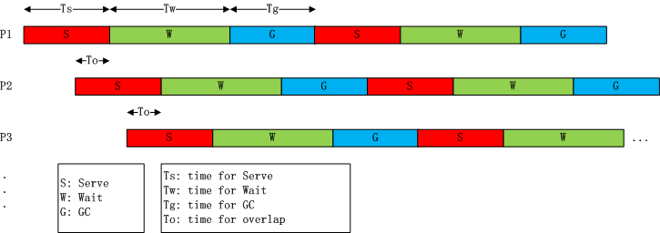
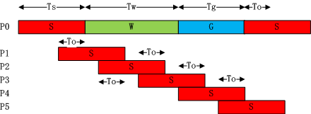

# BFE的进程机制

# 1. 背景

在2014年初启动了基于Go语言重构BFE转发引擎的工作。当时Go版本为1.3，GC延迟的问题非常严重，BFE的实测效果，在100万并发连接的情况下，GC延迟达到了400ms，完全无法满足转发服务的延迟要求。为此，当时在BFE中引入了“多进程轮转”的机制，以降低GC延迟对于转发流量的影响。GC延迟的问题在2017年初发布的Go
1.8中有了较好的解决，大部分的GC延迟都降低在1ms内，可以满足业务的要求，于是在2017年从BFE中去掉了多进程轮转机制。

虽然目前这个方案已经废弃，但是其中的一些设计具有一定的通用性，可能未来在类似的场景下可以借鉴使用。

# 2. 模型

## 2.1 多进程轮转

让我们先回顾一个经典的高性能服务器设计模式：Prefork模式，如附图-1。该模式下，程序启动后会fork出多个子进程，父子进程间共享socket，父进程执行listen操作，子进程执行accept操作。父进程一般完成一些管理功能，比如重启子进程等；子进程完成外部请求的处理，多个子进程能力是等价的。

附图2-1 Prefork模式

Go-bfe虽然是基于golang开发的，golang的服务模型主要是多线程模型，但是，我们可以实现上述工作模型。上述模型的好处是：多个进程同时服务，每个进程承担的请求数量就会变小，进而可以缓解gc时带来的延迟。但是问题还是存在！

如果控制Prefork模式中多个子进程，让它们轮流工作和gc：当一个进程需要进行gc时，将请求分配给其他进程，让它“休息”一下（进行gc），由下一个子进程工作。在实现时我们可以干脆关闭gc，让子进程在“工作”时，提供最好的性能。当子进程需要gc时，再打开gc开关，主动执行gc。那么，看起来多个子进程形成一个类似“车轮大战”的局面，如附图-2。

附图2-2 多个子进程轮流工作

## 2.2 参数定义

Go-bfe每个子进程都有4个状态，如附图2-3：

-   Init

    -   子进程初始化状态

-   Serve

    -   子进程接受新的连接（执行accept操作），处理请求

    -   该状态下，程序主动关闭gc

-   Wait

    -   子进程不再接受新的连接（不执行accept操作），仅处理内存中剩余的请求；这个状态的行为类似“排空”行为

    -   长连接上的请求会继续处理

-   Gc

    -   打开gc，主动执行gc

    -   当退出该状态时，再次关闭gc

附图2-3 子进程的状态

Go-bfe多进程在运行时，每个进程的状态随时间变更，多进程的状态相互交叠，构成如附图2-4的格局，图中给出模型的主要参数。

附图2-4 go-bfe多进程的相关参数定义

-   4个时间参数：

    -   Ts：Serve阶段的持续时间

    -   Tw：Wait阶段的持续时间

        -   应该保证大部分Request可以服务完毕

    -   Tg：GC阶段的持续时间

        -   应该大于GC的延迟时间，保证在Tg内可以执行gc完毕

    -   To：两个go-bfe进程在Serve阶段重叠（overlap）的时间

        -   在任何时间点上都必须保证，**至少有一个go-bfe进程处于Serve阶段**

        -   To的大小取决于时间精度的控制能力。控制能力越强，所需要的To就越小

# 3. 计算

## 3.1 进程数

附图3-1 go-bfe进程数的计算

-   定义所需要的go-bfe进程数为N

-   N的计算公式为：

    -   其中，对于 (Tw+Tg+To)/(Ts-To) 要向上取整

-   解释：

    -   考虑一个Go-bfe进程的服务周期（如附图3-1所示）

    -   需要其他Go-bfe进程在Tw+Tg+To的时间内提供服务

    -   由于有To的存在，每个go-bfe进程可以覆盖的时间为（Ts - To）

-   举例：

    -   Ts = 5s，Tw = 20s，Tg = 3s，To = 1s

    -   N = 1 + (20 + 3 + 1) / (5 - 1) = 7

## 3.2 内存消耗

-   主动关闭gc时，需要消耗大量的内存

    -   每个go-bfe进程在gc前，所申请的内存都无法释放；如果不考虑自己做buffer的情况，则进程消耗的内存会持续增长

-   这里对go-bfe多进程gc机制下的内存消耗做一个估算

-   定义内存的最大消耗量为M

    -   M = (Ts + Tw + Tg) \* 内存消耗速度

-   举例：

    -   Ts = 5s，Tw = 20s，Tg = 3s

    -   内存消耗速度（根据实验环境测算，2wqps下，每分钟约20G）

    -   M = (5 + 20 + 3) \* 20 / 60 = 9.4G
