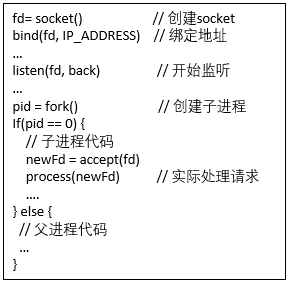
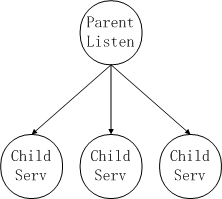
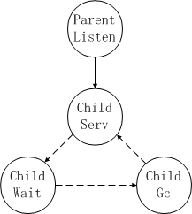
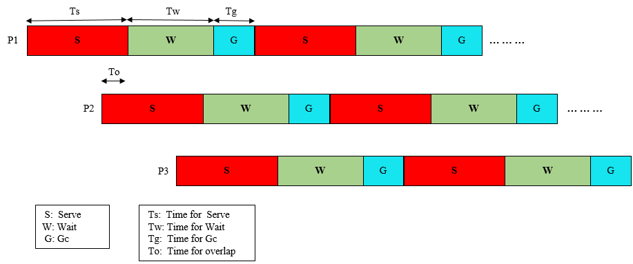
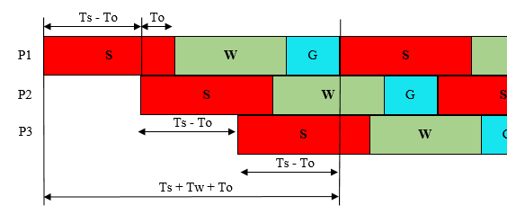

# BFE的进程机制

# 1. 背景

在2014年初启动了基于Go语言重构BFE转发引擎的工作。当时Go版本为1.3，GC延迟的问题非常严重，BFE的实测效果，在100万并发连接的情况下，GC延迟达到了400ms，完全无法满足转发服务的延迟要求。为此，当时在BFE中引入了“多进程轮转”的机制，以降低GC延迟对于转发流量的影响。GC延迟的问题在2017年初发布的Go
1.8中有了较好的解决，大部分的GC延迟都降低在1ms内，可以满足业务的要求，于是在2017年从BFE中去掉了多进程轮转机制。

虽然目前这个方案已经废弃，但是其中的一些设计具有一定的通用性，可能未来在类似的场景下可以借鉴使用。

# 2. 模型

## 2.1 多进程轮转

让我们先回顾一个经典的高性能服务器设计模式：Prefork模式。该模式下，程序启动后先创建socket，然后fork出多个子进程。根据linux的进程模型，fork后子进程直接继承了父进程创建的socket对象。
父进程执行listen操作，子进程执行accept操作。从操作系统的角度看，形成了一个负载均衡的典型格局：
父进程一般完成一些管理功能，比如重启子进程等；子进程完成外部请求的处理，多个子进程能力是等价的，如伪代码1所示原理。值得一提的是：Linux在内核3.9版本开始，支持一种叫reuseport的机制，可以达到相同的效果。

伪代码1

附图2-1 Prefork模式

Go-bfe虽然是基于golang开发的，golang的服务模型主要是多线程模型，但是，我们可以实现上述工作模型。上述模型的好处是：多个进程同时服务，每个进程承担的请求数量就会变小，进而可以缓解gc时带来的延迟。但是问题还是存在！

如果控制Prefork模式中多个子进程，让它们轮流工作和gc：当一个进程需要进行gc时，将请求分配给其他进程，让它“休息”一下（进行gc），由下一个子进程工作。在实现时我们可以干脆关闭gc，让子进程在“工作”时，提供最好的性能。当子进程需要gc时，再打开gc开关，主动执行gc。那么，看起来多个子进程形成一个类似“车轮大战”的局面，如附图-2。

附图2-2 多个子进程轮流工作

## 2.2 状态与参数

在程序运行过程中，Go-bfe每个子进程都有4个状态，如附图2-3：

-   Init

    -   子进程初始化状态

    -   完成初始化后，进入Serve状态

-   Serve

    -   子进程接受新的连接（执行accept操作），处理请求

    -   该状态下，程序主动关闭gc

    -   该状态服务一段时间后，内存中积累了相当数量的对象等待释放。下面开始准备做Gc，但真正进行Gc前，先进入Wait状态

-   Wait

    -   子进程不再接受新的连接（不执行accept操作），仅处理内存中剩余的请求；这个状态的行为类似“排空”行为

    -   长连接上的请求会继续处理

    -   在Wait状态等待一段时间（通常是2-3秒）后，当前进程已经彻底不接收新的连接，仅处理挂在它上面的长连接请求。此时，正式进入Gc状态

-   Gc

    -   打开gc，让go执行gc；一般在这个阶段留出几秒时间，抱着gc可以充分运行

    -   当退出该状态时，再次关闭gc，重新进入Serve状态

附图2-3 子进程的状态

Go-bfe多进程在运行时，忽略初始化的过程，每个进程的状态按照时间维度展开，多进程的状态会相互交叠，构成如附图2-4的格局，图中给出模型的主要参数。

附图2-4 go-bfe多进程的相关参数定义

-   4个时间参数：

    -   Ts：Serve状态的持续时间

    -   Tw：Wait状态的持续时间

    -   Tg：GC状态的持续时间

    -   To：两个go-bfe进程在Serve状态重叠（overlap）的时间

下面我们逐个参数进行讨论：

-   Serve状态和Ts：关闭Gc，持续接收新建连接，并进行服务的时间段。这个时间将受到系统可用内存和请求个数的影响，这段时间内进程占用的内存将不断上涨。所以，这个时间段需要非常小心的控制，否则非常容易出现内存溢出。

-   Wait状态和Tw：该时间段其实是一个过渡阶段，我们完全可以不要该阶段，立即开始Gc，但是此时Go-bfe进程上可能还有大量请求，那么Gc时还会影响这些请求。实际上，在互联网应用中，大量的请求都是所谓的“短连接”请求：先建立连接，再发起请求，收到返回后关闭连接。所以，我们让Go-bfe先暂停接收新的连接，继续为已经建立连接的客户继续服务，那么，绝大部分“短连接”请求都会完成。此时剩下的，绝大多数是一些相对的“长连接”，这类请求数量是比较少的。

-   GC状态和Tg：在该状态下，内存中堆积了大量需要被回收的对象，打开Gc开关后，go程序会自动开始执行Gc操作。由于部分长连接的客户端依然和Go-bfe保持连接，此时依然有可能有新的请求到达，这些请求将会受Gc带来的影响。这个时间段Tg是比较短的，一般2-3秒就足够了。

-   To：多个进程一起工作时，在任何一个时间点，我们都应该保证至少有一个Go-bfe进程运行在Serve状态，所以我们会让Go-bfe的进程两两之间都有一个重合的Serve时间段。这个时间段To越长，进程间切换会越平稳，多进程控制起来会相对容易一些。

# 3. 计算

## 3.1 进程数

多进程的模型有了，那么实际运行时，到底需要多少个进程，相关的时间参数如何配置呢？如果将多个进程，按照时间轴间错排开，可以得到下图所示的格局：

附图3-1 go-bfe进程数的计算

-   定义所需要的go-bfe进程数为N

-   N的计算公式为：

    -   其中，对于 (Tw+Tg+To)/(Ts-To) 要向上取整

-   解释：

    -   考虑一个Go-bfe进程的服务周期（如附图3-1所示）

    -   需要其他Go-bfe进程在Tw+Tg+To的时间内提供服务

    -   由于有To的存在，每个go-bfe进程可以覆盖的时间为（Ts - To）

-   举例：

    -   Ts = 5秒，Tw = 20秒，Tg = 3秒，To = 1秒

    -   N = 1 + (20 + 3 + 1) / (5 - 1) = 7

## 3.2 内存消耗

-   主动关闭gc时，需要消耗大量的内存

    -   每个go-bfe进程在gc前，所申请的内存都无法释放；如果不考虑自己做buffer的情况，则进程消耗的内存会持续增长

-   这里对go-bfe多进程gc机制下的内存消耗做一个估算

-   定义内存的最大消耗量为M

    -   M = (Ts + Tw + Tg) \* 内存消耗速度

-   举例：

    -   Ts = 5秒，Tw = 20秒，Tg = 3秒

    -   内存消耗速度（根据实验环境测算，2wqps下，每分钟约20G）

    -   M = (5 + 20 + 3) \* 20 / 60 = 9.4G
