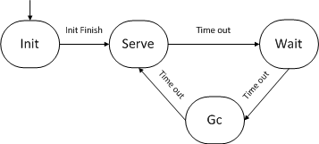
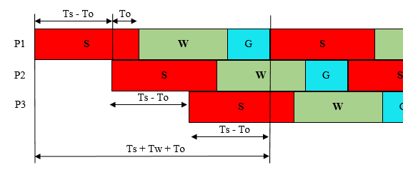

# BFE的多进程GC机制

# 1. 背景

在2014年初启动了基于Go语言重构BFE转发引擎的工作。当时Go版本为1.3，GC（Garbage Collection, 垃圾回收）延迟的问题非常严重，BFE的实测效果，在100万并发连接的情况下，GC延迟达到了400ms，完全无法满足转发服务的延迟要求。为此，当时在BFE中引入了“多进程轮转”的机制，以降低GC延迟对于转发流量的影响。GC延迟的问题在2017年初发布的Go1.8中有了较好的解决，大部分的GC延迟都降低在1ms内，可以满足业务的要求，于是在2017年从BFE中去掉了多进程轮转机制。

虽然目前这个方案已经废弃，但是其中的一些设计具有一定的通用性，可能未来在类似的场景下可以借鉴使用。

# 2. 模型

## 2.1 多进程轮转

让我们先回顾一个经典的高性能服务器设计模式：Prefork模式。该模式下，程序启动后先创建socket，然后fork出多个子进程。根据linux的进程模型，fork后子进程直接继承了父进程创建的socket对象。如伪代码1所示，父进程执行listen操作，子进程执行accept操作。父进程一般完成一些管理功能，比如重启子进程等；子进程完成外部请求的处理，多个子进程能力是等价的。

从内核3.9版本开始，Linux支持一种叫reuseport的机制，可以达到相同的效果。

```c
fd = socket()				// 创建socket
bind(fd, IP_ADDRESS)		// 绑定地址
...
listen(fd, back)			// 开始监听
...
pid = fork()				// 创建子进程
if (pid == 0) {
    // 子进程代码
    newFd = accept(fd)
    process(newFd)			// 处理请求逻辑
    ...
} else {
    // 父进程代码
    ...
}
```


图2-1 Prefork模式

针对Go语言版本BFE所存在的GC延迟问题，初期我们曾经尝试使用以上的多进程机制来降低GC延迟的影响。在使用多个子进程同时服务的情况下，每个子进程承担的请求数量就会变小，进而可以缓解GC时带来的延迟。

以上的机制虽然可以降低GC延迟的绝对值，但是实测下来GC延迟仍然有几十甚至上百毫秒，对于转发业务还是无法接受。

为了解决上述问题，在多进程模式的基础上，增加了“多进程轮转”的机制。"多进程轮转"的基本想法是：控制Prefork模式中多个子进程，让它们轮流处于”服务”或“GC”状态。当进程处于“服务”状态时，可以接受新到来的连接，并处理请求，为了避免GC延迟的影响会关闭GC；当进程处于“GC”的状态时，停止接受新的连接，开启GC以释放不使用的内存。

“多进程轮转”机制的本质是通过增加内存的消耗来换取延迟的降低。由于子进程GC处理的延后，子进程会消耗更多的内存，具体的消耗量取决于停止GC持续的时长、及在这段时间内服务流量的吞吐量。在使用“多进程轮转”机制时，需要对内存的使用量有充分的预估。

“多进程轮转”机制所基于的一个重要假设是：当时BFE所服务的流量主要为HTTP请求，多为短连接，在一个TCP连接内发送的请求大多为2-3个。对于大多数连接来说，通过选择合适的状态切换时间参数，大部分请求的处理会在“服务”状态内完成，只有少量的请求会落在“GC”状态。在“服务”状态和“GC”状态之间还增加了“等待”状态，在这个状态中不接受新的连接，也会关闭GC，以降低GC延迟对于已建立连接中HTTP请求的影响。

## 2.2 子进程状态定义

在“多进程轮转”模式下，BFE的每个子进程都有4个状态（如图2-2）：

-   Init（初始）

    -   子进程初始化状态

    -   完成初始化后，进入Serve状态

-   Serve（服务）

    -   子进程接受新的连接（执行accept操作），处理请求

    -   子进程主动关闭GC

-   Wait（等待）

    -   子进程不再接受新的连接（不执行accept操作），仅处理已存长连接中新到达的请求

    -   在这个状态，仍然关闭GC

-   Gc（回收）

    -   子进程不接受新的连接，但仍会处理已存长连接中新到达的请求
-   在这个状态，会让系统执行GC



图2-2 子进程的状态

在Server、Wait、GC这3个状态之间，使用超时作为状态切换的触发机制。

当子进程处在Serve和Wait状态时，子进程所服务的连接中的请求不会受到GC延迟的影响；当子进程处于GC状态时，如果这时所服务的连接中有请求在处理，则请求有可能受到GC延迟的影响（取决于请求到达时间和内存回收执行时间的重合关系）。

# 3. 相关参数的确定

将“多进程轮转”机制使用到实际程序中，还有细节问题需要解决，包括：

+ 3个状态间切换时间参数的选择
+ 子进程数量的确定
+ 内存的需求量

下面对这些问题进行讨论。

## 3.1 切换时间参数的选择


图3-1 BFE多进程切换的时间参数定义

图3-1展示了多个子进程并存场景下状态切换的时序关系。其中展示了子进程状态切换的3个时间参数：

-   Ts：Serve状态的持续时间
-   Tw：Wait状态的持续时间
-   Tg：GC状态的持续时间

对于多个子进程来说，在任何时刻都至少要有一个子进程处于Server状态。考虑到控制进程状态切换的时间误差问题，在相邻的2个子进程间，要求它们在Serve状态有一定的重叠（overlap），以保证不会出现Server状态出现空缺。引入一个参数To用于表示两个子进程在Serve状态重叠（overlap）的时间。


下面我们来讨论这几个时间参数如何选择。

- Ts的选择：

  Ts的取值越大，子进程在GC前所消耗的内存就越多；Ts的取值越小，所需要的子进程数就越多。在实践中，一般将Ts设为5秒。

- Tw的选择：

  Tw的取值应尽量大，以保证在这个时间区间内对于大部分连接都可以完成其中HTTP请求的处理；但同时要考虑到，Tw的取值越大，子进程在GC前所消耗的内存就越多。在实践中，一般将Tw设为30秒。

- Tg的选择：

  GC的处理需要消耗一定的时间。Tg应该足够大，以保证GC的处理可以在下一个Serve状态到来前完成；但是如果Tg太大，又会导致系统所需要进程数的增加。在实践中，一般将Tg设置为2-3秒。

- To的选择：

  To只要能够保证多个子进程间不会出现“服务的空档”即可。在实践中，一般将To设置为1秒。

## 3.2 子进程数的计算

根据给定的时间参数，可以计算出所需要的子进程数量。



图3-2 BFE子进程数的计算

定义所需要的BFE子进程数为N，N的计算公式为：


-   其中，对于 (Tw+Tg+To)/(Ts-To) 要向上取整

-   解释：

    -   考虑一个BFE进程的服务周期（如附图3-2所示，包括Serve、Wait和GC这3个状态）

    -   需要其它子进程在To+Tw+Tg的时间内提供服务

    -   由于有To的存在，每个子进程可以覆盖的时间为（Ts - To）

-   举例：

    -   Ts = 5秒，Tw = 20秒，Tg = 3秒，To = 1秒

    -   N = 1 + (20 + 3 + 1) / (5 - 1) = 7

## 3.3 内存消耗的计算

在“多进程轮转”机制下，由于在Serve和Wait状态主动关闭GC，需要消耗大量的内存。这里对“多进程轮转”机制下BFE的内存消耗量做一个估算。

-   定义内存的最大消耗量为M

    -   M = (Ts + Tw + Tg) \* 内存消耗速度
    -   其中内存消耗速度只能依靠线下压力测试或线上实测数据来获得

-   举例：

    -   Ts = 5秒，Tw = 20秒，Tg = 3秒

    -   假设经观测获得内存消耗速度为每分钟20GB

    -   M = (5 + 20 + 3) \* 20 / 60 = 9.4GB

## links
上一章：[第三十四章 如何开发BFE扩展模块](../../develop/how_to_write_module/how_to_write_module.md)  