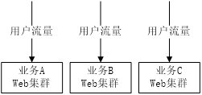
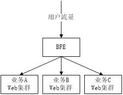
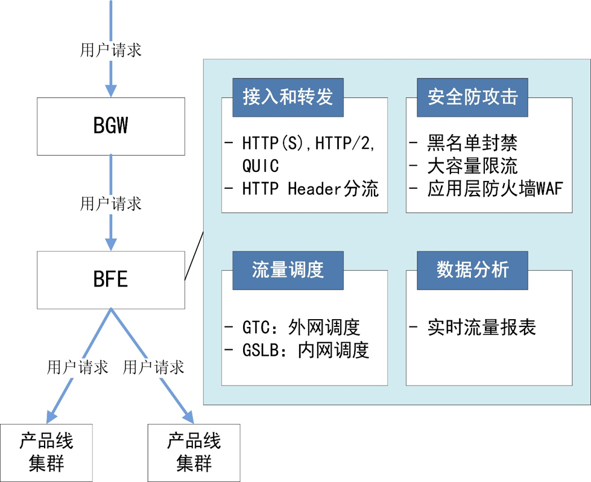
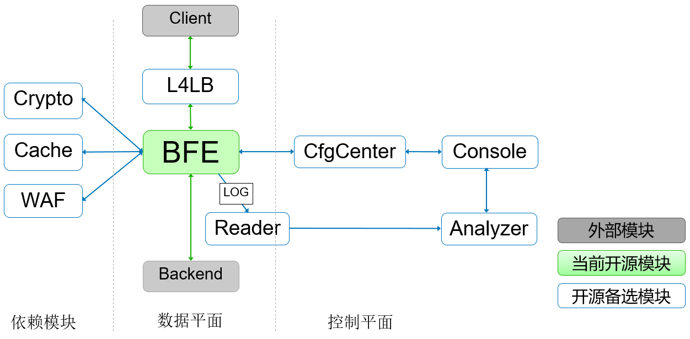

# BFE简介

## 什么是BFE？

BFE最初是Baidu Front End的缩写（中文名为“百度统一前端”），是百度统一的七层负载均衡接入转发平台。BFE平台从2012年开始建设。截至2020年底，BFE平台每日转发的请求超过1万亿，日峰值请求超过1000万QPS。

2014年，BFE平台的核心转发引擎基于Go语言重构，并于2015年1月在百度全量上线。在中国范围内，BFE是较早将Go语言用于负载均衡场景、及大规模使用的项目。

2019年初，BFE平台成功的支持了百度春晚红包项目。在本次项目中，BFE平台提供了亿级别的转发能力，在海量的流量下支持了HTTPS卸载、精确限流等关键能力，保证了活动的顺利进行。

2019年7月，BFE的转发引擎对外开源。因为BFE项目在业界的巨大影响力，开源项目名称仍保持为BFE，但改名为Beyond Front End。希望通过BFE的开源，能够推动负载均衡技术的发展。

2020年6月，BFE被CNCF（云原生计算基金会）接受为“沙盒项目”（Sandbox Project）。

BFE开源项目的地址为 https://github.com/bfenetworks/bfe

## BFE平台

### 为什么需要BFE平台？

在传统的方案中，并不存在统一的七层负载均衡接入层。在存在多个服务的场景下，各业务流量在经过四层负载均衡的转发后，直接到达业务的Web服务集群。

这种方案存在以下问题：

(1) 功能重复开发

​        在协议处理、安全等方面，有很多重要的功能是都需要支持的。考虑到各种业务集群在语言、技术栈上的差异，在多个不同的业务集群上支持相同的功能会带来很高的研发成本。

(2) 运维成本高

​        在某些场景下，需要对于多个业务同时上线相同的安全策略。在缺乏统一七层负载均衡接入层的情况下，需要在多个业务集群反复上线。这不仅仅带来大量的上线工作成本，而且也使得策略的上线时间很长。

(3) 流量统一控制能力低

​       由于各业务集群的分散，从公司的层面，缺乏对于流量情况的统一观察和控制能力。这也阻碍了对于网络资源的统一控制，及对网络服务质量的统一管理。

在引入BFE平台后，所有流量都经过BFE的接入转发后才到达业务集群，从而带来了以下优点：

(1) 功能统一开发

​       无论业务集群的技术差异，各种相关功能只需要在BFE做一次开发即可。

(2) 运维统一管理

​       对于需要普遍使用的安全策略，只需要在平台上统一上线即可。

(3) 增强流量控制能力

​       和四层负载均衡相比，七层负载均衡可以“看到”流量中更多的内容，可以在流量转发、安全、数据统计等方面提供更强的能力。

### BFE平台的主要功能

作为一个综合的大型七层负载均衡流量转发平台，BFE平台包括以下4个主要功能：

(1) 接入和转发

​     BFE平台可以接收处理HTTP、HTTPS、HTTP/2、QUIC等多种协议的流量，并基于HTTP Header的信息做分流转发。

(2) 流量调度

​     BFE平台包括内网流量调度和外网流量调度所组成的两层流量调度体系。

(3) 安全防攻击

​     BFE平台支持多种安全能力，包括黑名单封禁、大容量限流、WAF（应用层防火墙）等。

(4) 数据分析

​      BFE平台可以基于转发日志生成实时报表，反映业务的流量变化情况及下游业务集群的健康状态（错误数、延迟等）

## BFE开源项目

### BFE平台的转发相关模块

BFE平台是由很多模块构成的一个比较复杂的分布式系统，可以分为数据平台和控制平台，及一些相关的依赖模块。

数据平面的主要模块包括：

+ 转发引擎（Forwarding Engine）：提供流量的基础转发功能
+ 日志单机模块（Log Reader）：负责在单个节点上对转发日志进行处理

控制平面的主要模块包括：

+ 日志分析模块（Log Analyzer）：在日志单机模块的基础上，对日志数据进行集群化集中处理
+ 配置中心（Config Center）：集中管理BFE的转发配置
+ 管理控制台（Console）：供人员管理配置，查看平台状态

和转发的相关依赖模块包括：

+ 加解密模块（Crypto）：可以对HTTPS处理中的部分高消耗计算提供远程服务，从而降低对CPU资源的消耗
+ 缓存模块（Cache）：提供转发所需要的缓存功能，如对HTTPS中所使用的session cache
+ 应用层防火墙（WAF）：提供对恶意请求进行检查的功能

### BFE开源项目的内容

目前BFE开源项目中的内容为BFE平台中的转发引擎，包括核心框架和大部分的功能，具体功能包括：

+ 主流接入协议的支持

  包括：HTTP，HTTPS，SPDY，HTTP/2，Web Socket，TLS

+ 灵活的模块框架

  在BFE开源项目中已经包含了很多扩展模块，也支持开发第三方扩展模块

+ 基于请求内容的路由

  提供BFE专有的“条件表达式”（Condition Expression）能力，可以灵活的定制转发规则

+ 多种负载均衡策略
  
  支持“集群-子集群-实例”的多层级负载均衡能力，可以支持多机房、集群粒度的负载均衡，支持过载保护

+ 丰富的监控探针
  
  在BFE中内置了丰富详尽的监控指标，配合第三方监控系统（如：Zabbix，Prometheus）可以充分掌握系统的状态

以上这些内容，将在后面的章节中做详细的介绍。

  

  

  

  

## links
下一章：[第二章 网络前端接入技术简介](../frontend_principle/introduction/introduction.md)