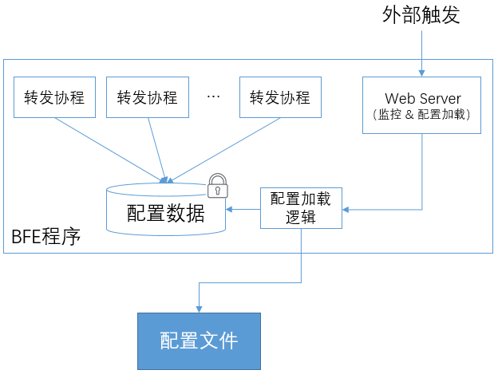

# 配置管理

## BFE配置文件的分布

配置文件都位于[/conf](https://github.com/bfenetworks/bfe/tree/master/conf)目录下。为便于维护, 配置文件按功能分类存放在相应目录。

+ BFE主逻辑的主要配置文件如下：

| 功能类别     | 配置文件目录位置        | 配置文件                | 说明                                                         |
| ------------ | ----------------------- | ----------------------- | ------------------------------------------------------------ |
| 服务基础配置 | /conf/                  | bfe.conf                | 包括BFE的服务基础配置，如：服务端口、缺省超时配置、扩展模块加载等；还包括TLS的基础配置，如：HTTPS的加密套件，Session Cache的配置等。 |
| 接入协议配置 | /conf/tls_conf/         | server_cert_conf.data   | 服务端的证书和密钥配置。                                     |
| 接入协议配置 | /conf/tls_conf/         | session_ticket_key.data | TLS Session Ticket Key配置。                                 |
| 接入协议配置 | /conf/tls_conf/         | tls_rule_conf.data      | 按照租户粒度区分的TLS协议参数。                              |
| 流量路由配置 | /conf/server_data_conf/ | vip_rule.data           | 各租户的VIP列表。                                            |
| 流量路由配置 | /conf/server_data_conf/ | host_rule.data          | 各租户的域名列表。                                           |
| 流量路由配置 | /conf/server_data_conf/ | route_rule.data         | 各租户的分流转发规则信息。                                   |
| 流量路由配置 | /conf/server_data_conf/ | cluster_conf.data       | 各集群的转发配置，包括集群基础配置、GSLB基础配置、健康检查配置、后端基础配置等。 |
| 流量路由配置 | /conf/server_data_conf/ | name_conf.data          | 服务名字和服务实例的映射关系。                               |
| 负载均衡配置 | /conf/cluster_conf/     | cluster_table.data      | 各后端集群包含的子集群，及各子集群中包含的实例信息。         |
| 负载均衡配置 | /conf/cluster_conf/     | gslb.data               | 用于配置各集群内的多个子集群之间分流比例。                   |

+ BFE扩展模块的配置文件

  出于便于管理的目的，BFE各扩展模块的配置文件和BFE主逻辑的配置文件分开存放。对于每个扩展模块，有一个独立的配置文件目录，位于"/conf/mod_<name>/"目录下。如：/conf/mod_block/目录下是mod_block的配置文件。

## 常规配置 vs 动态配置

在BFE中，将配置分为“常规配置”和“动态配置”：

+ 常规配置

  仅在程序启动时生效。在BFE中，常规配置一般基于INI格式，常规配置文件名一般使用".conf"的后缀。

+ 动态配置

  可在程序执行过程中动态加载。在BFE中，动态配置一般基于JSON格式，兼顾程序读取和人工阅读的需求。

  动态配置文件名一般使用“.data”的后缀。

## 动态配置的实现机制

BFE中动态配置的实现机制如下图所示，主要包括“配置加载”和“配置生效”两方面。



### 配置加载

在“[监控机制](../monitor/monitor.md)”中介绍过，在BFE程序中嵌入一个Web Server，用于外部读取BFE内部的状态信息。这个Web Server也用于触发配置的动态加载。

例如：通过访问 http://127.0.0.1:8421/reload/gslb_data_conf，可以触发gslb.data的重新加载。

出于安全的考虑，仅当从部署BFE程序的同服务器发起对这个接口的访问时，才会通过。这个限制位于Web Monitor的[实现代码](https://github.com/baidu/go-lib/blob/master/web-monitor/web_monitor/web_monitor.go)中：

```
// source ip address allowed to do reload
var RELOAD_SRC_ALLOWED = map[string]bool{
	"127.0.0.1": true,
	"::1":       true,
}
```

如果从这个范围外的地址发起访问，则会返回类似下面这样的错误

```
{
    "error": "reload is not allowed from [xxx.xxx.xxx.xxx:xxx]"
}
```

通过在嵌入Web Server中注册的回调函数，配置加载逻辑会执行以下逻辑：

+ 配置文件的读取
+ 配置文件的解析和正确性检查
+ 运行态配置信息的更新

### 配置生效

在BFE中，程序并行处理基于Go语言提供的"Go协程"（Go routine）。BFE使用的是“单进程内多协程”的机制，不需要考虑考虑多进程通信，只需要考虑协程间的共享数据。在多协程间的共享数据方面，和多线程机制类似，可以访问位于同一进程内的共享数据，并可以使用“锁”来做互斥访问。由于协程和线程实现机制的不同，“协程锁”的开销要远远小于“线程锁”。

在BFE中，从文件加载的配置信息会被保存在一个受到协程锁保护的临界区中。负责转发的协程在使用配置数据时，需要通过特定的接口来从临近区中读取；配置加载逻辑在更新配置信息时，也通过特定的接口来操作。

以mod_block为例，其中的[ProductRuleTable](https://github.com/bfenetworks/bfe/blob/master/bfe_modules/mod_block/product_rule_table.go)用于保存各租户的配置信息。为了读取配置信息，提供了如下接口：

```
func (t *ProductRuleTable) Search(product string) (*blockRuleList, bool) {
	t.lock.RLock()
	productRules := t.productRules
	t.lock.RUnlock()

	rules, ok := productRules[product]
	return rules, ok
}
```

为了更新配置信息，提供了如下接口：

```
func (t *ProductRuleTable) Update(conf productRuleConf) {
	t.lock.Lock()
	t.version = conf.Version
	t.productRules = conf.Config
	t.lock.Unlock()
}
```

以上这两个接口，使用读写锁来保护。并且，在临界区中的操作都尽量简单，以降低对多个处理协程间并行度的影响。