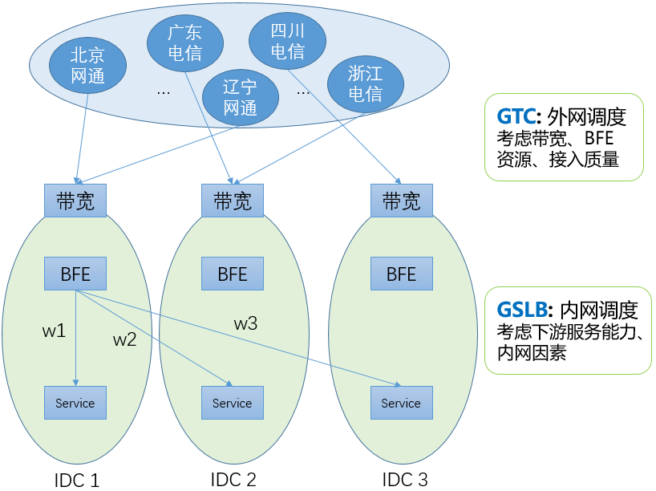
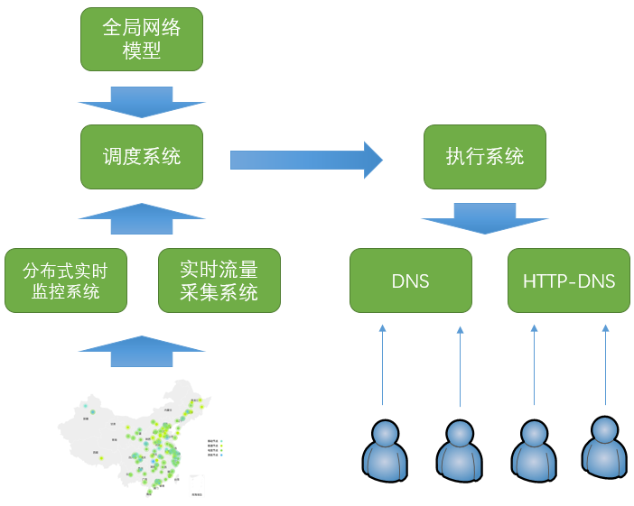
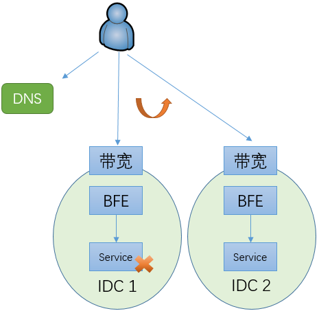
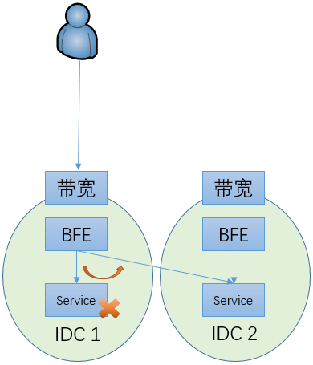
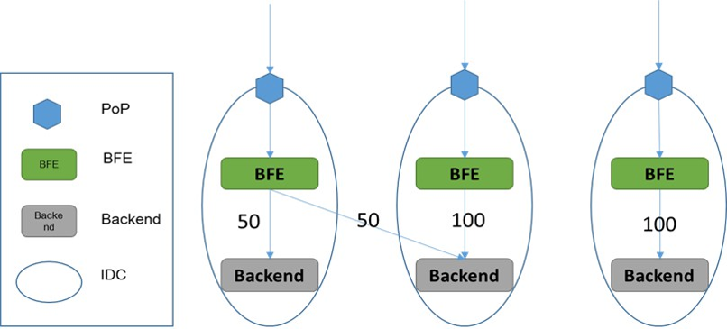
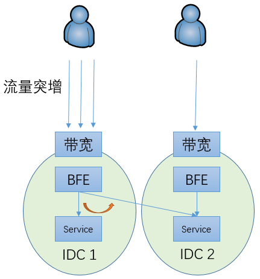
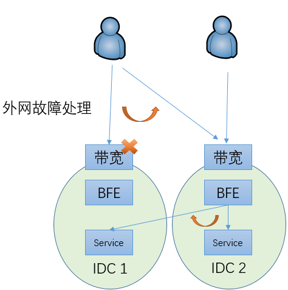
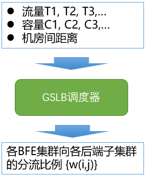

# BFE的内网流量调度机制

## 背景

### 全局流量调度解决方案

经过多年的建设，对于由IDC服务的业务流量，百度形成了两层的全局流量调度系统。包括：

+ GTC：外网流量调度

  基于DNS生效，将各省、运营商的用户流量引导到合适的网络入口。在调度计算中，GTC要考虑外网带宽（容量和使用情况）、BFE平台的转发资源（容量和使用情况）、用户到各带宽出口的接入质量（连通性、访问延迟）等因素。

+ GSLB：内网流量调度

  基于BFE生效，将到达各BFE集群的流量，按照权重转发到位于各数据中心的子集群。

### 外网流量调度

GTC负责在各网络入口间进行流量调度。GTC包括以下3个主要步骤：

+ 实时监控

  由位于各地的监控节点，持续向各外网接入点发送探测信号，对各地和接入点之间的连通性和质量进行监控。如果发现异常，分布式的实时监控系统会在1分钟内将故障信号上报给调度系统。

+ 调度计算

  实时流量采集系统从路由器获取实时的带宽使用情况，从七层负载系统获取实时的每秒请求情况。调度系统根据实时流量数据和实时监控情况，配合全局网络模型，在1分钟内计算出新的调度方案。

+ 下发执行

  调度系统将调度方案下发给DNS和HTTPDNS执行。由于DNS缓存的因素，客户端的生效需要一定的时间。百度大部分域名的DNS TTL设置为300秒（即5分钟）。一般在下发后，要经过8-10十分钟才能完成90%以上用户的生效。

和前一代外网调度系统相比，GTC有以下两方面的提升：

+ 加快了外网故障处理的速度

  通过“实时监控+自动调度计算”，从故障发生到启动DNS下发的时间压缩至2分钟以内。

+ 降低了配置维护的成本

  不需要针对域名维护复杂的预案。

业内很多类似的系统采用“预案”机制。例如，存在A和B两个备选的外网IP。预案会这么写：如果A出问题了，就把流量切换到B；如果B出问题了，就把流量切换到A。对于每个直接分配了IP地址的域名（也就是写为A记录的域名），都需要写这么一个预案。

预案机制的最大问题就是维护成本很高。首先，维护成本和外网出口的数量成指数关系。2个出口的情况是非常简单的；如果有5个甚至10个出口，预案是非常不好写的，需要考虑各种可能性。另外，维护成本和域名的数量成线性关系。如果有几千个域名，这时如果要对带宽出口做一个调整（增加、或删除一个出口），所要付出的工作量是惊人的。

外网流量调度主要适用于以下场景：

+ 网络入口故障

  由于网络入口本地、或运营商网络的故障，导致用户无法访问网络入口

+ 网络入口由于攻击导致拥塞

  大规模的DDoS攻击可以达到数百G，甚至达到T级别，可以直接将网络入门的入向带宽打满

+ 网络接入系统故障

  如四层负载均衡系统或七层负载均衡系统的故障

+ 分省连通性故障

  虽然从总体看网络入门可以访问，但是从某个运营商的某个地区无法访问。这部分是由于用户所在的地区出现网络局部异常，也可能是由于服务所使用的IP在局部地区被误封禁。

### 为什么需要内网流量调度

在多数据中心的场景下，如果没有内网流量调度机制，当一个数据中心内的服务发生故障时，只能通过改变域名对应的IP地址将流量调度到另外一个数据中心。如上文所说，在改变权威DNS的配置后，需要8-10分钟才能完成90%以上用户的生效。在完成切换之前，原来由故障IDC所服务的用户都无法使用服务。而且，运营商的Local DNS数量很大，可能会存在有故障或不遵循DNS TTL的Local DNS，从而导致对应的用户使用更长的时间完成切换，甚至一直都不切换。

在引入内网流量调度机制后，可以通过修改BFE的配置将流量从故障的服务集群切走。在百度内部，配合自动的内网流量调度计算模块，在感知故障后，可以在30秒内完成流量的调度。和完全依赖外网流量调度的机制相比，故障止损时间有很大的降低，从8-10分钟降低至30秒内。而且，由于执行调度的BFE集群都在内部，内网流量调度的可控性也比基于DNS的外网力量调度要好的多。

## 内网流量调度

### 基本工作机制

内网流量调度的工作机制如上图所示，其基本原理非常简单。在每个BFE集群，针对一个服务集群的每个后端子集群分配一组权重。在流量转发时，BFE按照这个权重来决定请求的目标子集群。

另外，对每个服务集群，还包含一个虚拟的子集群，称为BLACKHOLE（黑洞）。在黑洞集群对应的权重不为0的情况下，分给黑洞子集群的流量会被BFE主动丢弃。在到达BFE流量超过服务集群总体容量的情况下，可以通过启用黑洞集群用来防止服务集群的整体过载。

内网流量调度适用于和内部服务相关的场景，包括：

+ 内部服务故障

  在某些场景下（如：服务的灰度发布），可能单个服务子集群出现故障，从而导致服务容量下降、甚至完全无法提供服务。这时候可以通过内网流量调度快速完成止损处理。

+ 内部服务压力不均

  包括以下两种可能的场景：

  + 某个地区的用户流量突增，导致单个数据中心内的子集群服务压力超过容量

    这时可以将部分流量调度到其它子集群来服务

  + 由于外网故障处理，在外网将部分流量从一个网络入口调度到另外一个网络入口，从而导致相关的子集群压力超过容量

    这是也可以部分流量调度到其它子集群来服务

### 内网自动流量调度

内网流量调度的权重可以手工设置。但实际上这个权重不应该是固定的，而应随着用户流量、服务集群的容量及机房间的连通性情况等因素的变化而调整。为此，在百度内实现了一个内网流量的调度器，用于对分流的权重比例进行计算。

内网流量调度的总体机制为：

+ 流量采集：基于BFE的访问日志，实时获取到达各BFE集群的各服务的流量
+ 权重计算：根据流量、各服务集群的容量、各数据中心网络连通性/距离等因素，计算各BFE集群向各服务集群的分流权重
+ 下发执行：由各BFE集群按照分流权重执行转发

目前在BFE开源项目中，支持内网流量调度权重的手工设置，未包含内网自动流量调度的相关模块。

## 示例场景

- 示例场景如下图所示，包含：

  - 两个IDC：IDC_1和IDC_2

  - 两个BFE集群：BFE_1和BFE_2

  - 后端集群有两个子集群：SubCluster_1和SubCluster_2
- 可以针对BFE集群，设置子集群的分流比例，如：

  - BFE_1集群的分流配置为：{SubCluster_1: W11，SubCluster_2: W12, Blackhole: W1B}

  - BFE_2集群的分流配置为：{SubCluster_1: W21，SubCluster_2: W22, Blackhole: W2B}
- BFE实例根据上述配置做WRR调度（加权轮询），向子集群转发请求

  - 例如，当BFE_1的分流配置{W11，W12, W1B}为{45，45，10}时，BFE_1转发给SubCluster_1、SubCluster_1、Blackhole的流量比例依次为：45%、45%、10%。
- 通过修改上述配置，可以将流量在不同的子集群之间切换，实现负载均衡、快速止损、过载保护等目的。

