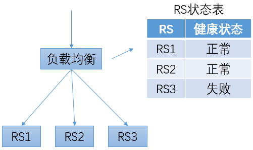
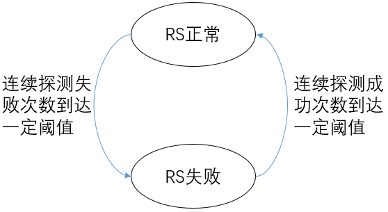
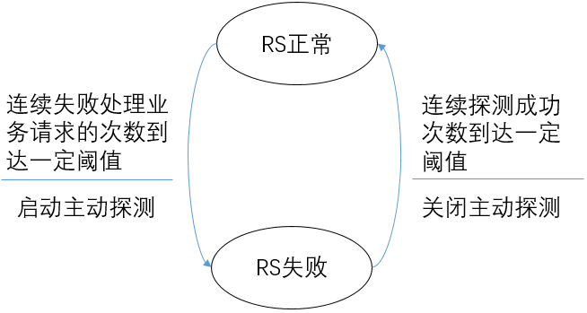
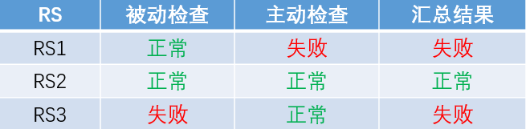
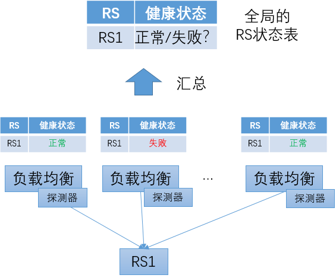
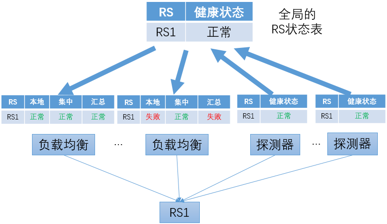
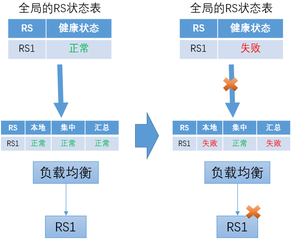
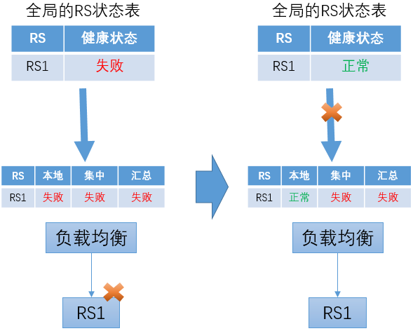

# 健康检查机制

## 健康检查的原理

在负载均衡系统内，会维护一个RS的状态表，用于保存每个RS的健康状态。在转发流量时，只会将流量转发给健康状态为“正常”的RS。

为了获得RS的健康状态，负载均衡系统会定期向RS发送探测请求，并根据收到响应的情况来修改对应RS的健康状态。

## 主动健康检查 vs 被动健康检查

### 主动健康检查

“**主动健康检查**”的机制可以简要描述如下：

+ 负载均衡系统**持续**向RS发送探测请求
+ 在RS为“正常”的状态下，如果连续探测失败的次数到达一定的阈值，则改变RS的健康状态为“失败”
+ 在RS为“失败”的状态下，如果连续探测成功的次数到达一定的阈值，则改变RS的健康状态为“正常”

主动健康检查中RS的状态变化可以用一个简单的有限状态机来描述。

对于健康检查来说，一个重要的指标是“响应时间”，即：当RS的状态发生改变后，经过多长时间负载均衡系统才能感知到变化。如果不能及时感知到RS的失败，可能会导致请求发送到失败的RS节点上，从而导致服务的失败；如果不能及时感知到RS的恢复，可能会使其它正常的RS节点压力过大。

对于主动健康检查来说，降低响应时间的方法是提高发送探测请求的频率。但这个方案也是有代价的。一方面，它会增大负载均衡系统发送探测请求的压力；另外一方面，也会增大RS的压力。第二个问题在软件负载均衡场景中变得更为突出。

### 被动健康检查

在前面章节“[网络前端技术的发展趋势](../../frontend_principle/trend/trend.md)”中提到，“软件化”是网络前端接入系统的重要趋势。软件负载均衡的一个重要特征是支持负载均衡节点的大规模横向扩展部署。在传统硬件负载均衡场景，最常见是“主+备”的部署模式，RS的上游一般是2个负载均衡节点。而在软件负载均衡场景下，一个负载均衡集群可能由几十个节点构成。尤其是对于七层负载均衡场景，单个负载均衡节点的容量较小，单个集群可达到数百个节点。在这种情况下，如果继续使用“主动健康检查”的机制，持续的健康检查探测请求会对下游的RS产生很大的压力。

为了解决上面的问题，可以使用"**被动健康检查**"的机制，简要描述如下：

+ 在RS为“正常”的状态下，负载均衡系统不会主动向RS发送探测请求
+ 在RS为“正常”的状态下，如果RS**处理业务请求**连续失败的次数超过一定阈值，则改变RS的健康状态为“失败”
+ 在RS为“失败”的状态下，负载均衡系统向RS发送探测请求
+ 在RS为“失败”的状态下，如果连续探测成功的次数到达一定的阈值，则改变RS的健康状态为“正常”

被动健康检查中RS的状态变化及主动探测的启停可以用一个下面的有限状态机来描述。

### 主动和被动的结合

和主动健康检查相比，被动健康检查的一个显著的差异是：使用正常的业务请求来“捎带”的进行探测。这样做的好处是：

+ 在RS正常的情况下，不需要额外的发送探测请求，从而降低了负载均衡系统和RS的处理成本
+ 在RS处理正常请求的频度较高（即，正常请求的频度远高于健康检查探测请求的频度）的情况下，被动健康检查可以更快的发现RS的异常

被动健康检查也有它的缺点：

+ 如果无法对业务请求进行失败重试，在RS失败的情况下，可能导致正常请求的失败
+ 在业务请求频度较低（如：对某个RS，几分钟才有一个请求）的情况下，可能导致无法及时发现RS的失败

综合主动方式和被动方式的优缺点，建议在实践中采用主动和被动相结合的方式：

+ 启用被动健康检查，可以帮助请求频度较高的RS快速发现失败的情况，而不需要承担高频探测请求的成本
+ 同时启动“低频”（如：30秒或60秒一次）的主动健康检查，用于及时发现请求频度较低RS的失败

在使用主动和被动结合机制时，RS的健康状态由两种检查结果汇总得到。如果两者之一的检查结果为失败，则RS的状态为失败；仅当两种检查的结果都为成功时，RS状态才是成功。

## 集中式健康检查 vs 分布式健康检查

在使用主动健康检查机制时，按照探测器部署的位置，可以分为“分布式健康检查”和“集中式健康检查”。

在**分布式健康检查**方式中，探测器和负载均衡转发程序同机部署。每个负载均衡转发实例都根据自己的探测结果维护独立的RS状态表。对于同一个RS，每个负载均衡转发实例由于服务器状态、网络状态（如TOR、路由、机房连通性）等方面的差异，可能关于健康状况得到不同的判断结果。这也恰恰是分布式健康检查的优势：它可以最准确的反映出每个负载均衡转发实例所“看到”的RS状况。

分布式健康检查方式的一个问题是：如何得到全局的RS状态表。运维人员通常都需要在管理控制台上集中查看RS的状态信息。在分布式健康检查方式下，仅从一个负载均衡转发实例获取RS状态信息显然是不合理的，很可能出现“以偏概全”的情况；而如果从所有的负载均衡转发实例读取状态信息来汇总，在转发实例数量比较多的情况下，是一种很不经济的方案；如果只选取部分转发实例的信息，选择的策略也不是很简单的，需要考虑多种因素。

分布式健康检查方式的另外一个问题是：即使发送探测请求的频度比较低，在转发实例数量比较大（如，上百个）、而下游RS的数量比较少（如，仅有几个）的时候，仍然会对RS产生很大的压力。

为了解决以上问题，可以使用"**集中式健康检查**"，要点描述如下：

+ 探测器程序独立部署

  和数量较大的负载均衡转发实例相比，探测器的实例数相对较少。比如：在每个数据中心内部署几个探测器实例。

  在探测器的部署方面，可以有一定的考虑，比如：将探测器分布在数据中心不同的网络汇聚节点下及不同的TOR下。

+ 通过对探测器的状态汇总得到全局的RS状态表

+ 主动探测的结果会下发至各负载均衡转发实例

+ 负载均衡转发实例综合本地被动健康检查的结果和从中心获得的主动健康检查结果，汇总得到RS的状态

负载均衡转发实例在使用从中心获得的主动健康检查结果时，要采取一定的容错机制，以防止无法及时获得主动健康检查结果的更新。可以考虑以下两种情况：

+ 上次主动健康检查RS状态为“正常”，之后来自中心的更新中断

  在这种情况下，如果后续RS转变为“失败”，负载均衡转发实例可以根据本地的被动健康检查来发现，并不会导致严重的问题。

  

+ 上次主动健康检查RS状态为“失败”，之后来自中心的更新中断

  在这种情况下，如果后续RS转变为“成功”，负载均衡转发实例继续使用之前获得的“失败”信息，从而继续判断RS为失败。这会导致始终无法将RS恢复为正常状态。

  对这个问题，可以在负载均衡转发节点增加超时机制来解决。对于从中心点获得的状态信息，在一定时间后失效。如果没有新的更新信息，则退化为只依靠本地的被动健康检查结果。

  

## BFE的健康检查

BFE开源项目目前只支持被动健康检查。基于BFE开源项目所实现的商业版产品中包含了集中式的主动健康检查。

未来将在BFE开源项目中增加分布式的主动健康检查。