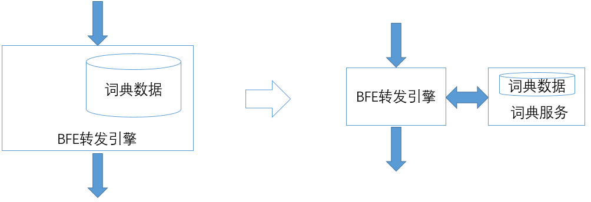

# BFE的设计思想

## BFE引擎重构的缘起

百度的BFE转发平台最早于2012初上线使用。那时所基于的转发引擎是一个名为Transmit的内部系统。Transmit基于C语言实现，是多进程+libevent的模型。

到2013年底的时候，有了要重构转发引擎的想法。主要的驱动力如下：

+ 平台化的需要

  BFE平台在上线初期，只有十多个业务使用。到2013年底的时候，已经有几十个业务了。原有的系统中，没有多租户机制，不易做多业务的配置管理。另外，配置的格式是非结构化的，不易使用程序来生成和处理；原来的系统在配置热加载方面的机制也比较复杂。

+ 网络协议栈的维护成本

  Transmit中的HTTP协议栈是百度自研的，在使用过程中发现了一些协议一致性方面的细节问题，维护成本较高。另外，2013年底，百度已经启动了对于HTTPS的调研，需要在转发引擎上增加对HTTPS的支持。网络协议栈是反向代理系统的重要模块。从长期来看，维护完全自研的网络协议栈成本很高。

+ 状态监控能力欠缺

  对于一个工业级水平的转发系统来说，需要有很强的状态监控能力。Transmit原有的监控信息较少，增加新的监控状态也比较困难。

+ 转发配置的维护难度较高

  Transmit的转发配置主要使用正则表达式来描述。在实践中，发现正则表达式存在可维护性方面的问题。

2014年初，确定基于Go语言来重构BFE转发引擎。2014年4月份，开始编写代码，2014年底完成开发，2015年初Go版本的转发引擎在百度完成全量上线。

## BFE为什么要基于Go语言

在2014年初对BFE重构做技术选型时，曾经考虑过两种技术路线：

+ 基于Nginx。这是业界普遍使用的方案，绝大多数企业的七层负载均衡是基于Nginx搭建的。
+ 基于Go语言。

回到2014年，Go语言在国内的使用案例还比较少。这么多年来，不断的有人在问，你们为什么要选用Go语言。下面是当时的一些考虑：

+ 研发效率

  对C和Python都使用过的人应该有这样的体会，Python的研发效率要远高于C。我们的一个基本判断是，在未来很多年内，七层负载均衡仍然有很多功能需要开发。Go语言的研发效率接近Python，这对于快速交付功能提供了非常大的优势。

+ 稳定性

  负载均衡的稳定性要求很高。如果负载均衡转发引擎崩溃了，无论数据中心内其它服务的稳定性由多高，用户根本无法访问服务。对于使用C语言研发的系统来说，内存访问错误占据非常高的比例，部分错误可以直接导致系统的崩溃；而且C语言对于错误缺乏保护机制。而对于Go语言来说，内存的回收是系统负责，无需开发者关心，这大大降低了问题发生的概率；另外，在Go语言中可以使用Recover机制来捕捉可能发现的Panic。

+ 安全性

  从理论上讲，C语言编写的程序都具有缓冲区溢出的隐患，而这是很多恶意攻击可以成功的基础。Go的内存管理机制使得缓冲区溢出方面的安全风险大大降低。

+ 代码可维护性

  Go语言相对于C语言（及Nginx中常用的Lua语言），代码的可读性和可维护性都更好。另外，在编写高并发程序方面，Go Routine使得可以类似多线程的模型来编写程序，而不需要设计复杂的状态机。这使得编写程序的难度降低。

+ 网络协议栈

  对于一个负载均衡软件来说，网络协议栈是重要的考虑因素。BFE利用了Go系统库中成熟稳定的网络协议栈，这来源于谷歌在网络协议栈方面的强大实力。近年来的很多网络协议栈升级都由谷歌发起，如HTTP/2、QUIC。Go系统库中也会很快提供新协议的支持。

从实践来看，2014年所做的选择是非常正确的。基于Go语言重构的BFE引擎及时响应了百度内部业务对七层负载均衡的各种需求，并且长期保持稳定。自2015年初全量上线以来，BFE引擎从来没有在线上环境中发生过crash。

当然，Go语言也有它的短板。和Nginx相比，基于Go实现的BFE引擎性能要差一些。这种性能方面的差距主要来自于两方面：

+ BFE没有在内存拷贝方面做极致的优化

  Nginx在内存拷贝方面做了端到端的极致优化，而内存拷贝是性能消耗的主要来源之一。出于对网络协议栈一致性方面的考虑，BFE尽量保持Go系统库网络协议栈实现的原貌，所以在内存拷贝方面多了一些消耗。

+ BFE无法利用CPU Affinity

  Nginx可以通过“绑定CPU”的方式来减少进程切换代理的性能损耗。对于BFE来说，开发者只能控制Go Routine，底层的线程是被系统所控制的，无法利用CPU Affinity来优化性能。

这里还有一点要重点说明的是Go语言的GC（Garbage Collection，垃圾回收）延迟对于BFE研发的影响。在2014年时Go版本为1.3，GC延迟的问题非常严重，BFE的实测效果，GC延迟达到了400ms，完全无法接受。为此，当时在BFE中引入了“多进程轮转”的机制，以降低GC延迟对于转发流量的影响（这个机制的详情见附1）。GC延迟的问题在2017年初发布的Go 1.8中有了较好的解决，大部分的GC延迟都降低在1ms内，可以满足业务的要求，于是在2017年从BFE中去掉了多进程轮转机制。

## BFE引擎的主要设计思想

基于Go来重写BFE转发引擎，绝对不仅仅是换了一种编程语言。在新版BFE中，有以下设计考虑：

+ 对转发模型做了较大的修改

  在引擎中明确引入了租户概念，可以基于hostname来区分租户（在各功能模块的配置中，也引入了对租户的区分）。另外，基于之前所发现的正则表达式的问题，尽量减少正则表达式的使用，为此设计了“条件表达式”（Condition Expression）机制。

+ 降低动态配置加载的难度

  配置的动态加载，这是负载均衡软件的一个重要需求。除了升级可执行程序的场景，软件应可以持续运行，以保证流量转发的持续性。新版的BFE区将配置分为“常规配置”和“动态配置”：常规配置仅在程序启动时生效；动态配置可在程序执行过程中动态加载。动态配置统一使用JSON格式，兼顾了程序读取和人工阅读的需求。另外，系统提供了统一的动态加载机制，在实现新的模块时可以直接使用。

+ 增强服务状态监控能力

  在重构BFE时，同时编写了web-monitor框架：每个BFE运行实例可以通过独立的HTTP服务向外展现内部的执行状态；增加新的内部状态非常简单，只需要一行代码。

+ 将大存储功能转移到外部

  在原有的实现中，类似“词典查找”这样的功能也包含在BFE内部。这样的模块在启动时，需要使用较长的时间来加载词典数据，不利于BFE程序的快速启动。而BFE程序的快速启动能力，对于系统的稳定性至关重要。在发生故障的时候，一个需要几分钟才能启动的程序，其故障的恢复时间要长的多。为此，在重构BFE时将词典查找功能改写为独立的“词典服务”，由BFE远程调用。这保证了BFE可以在数秒内完成重启。

以上这些内容将在后续中的章节中给出详细的说明。

