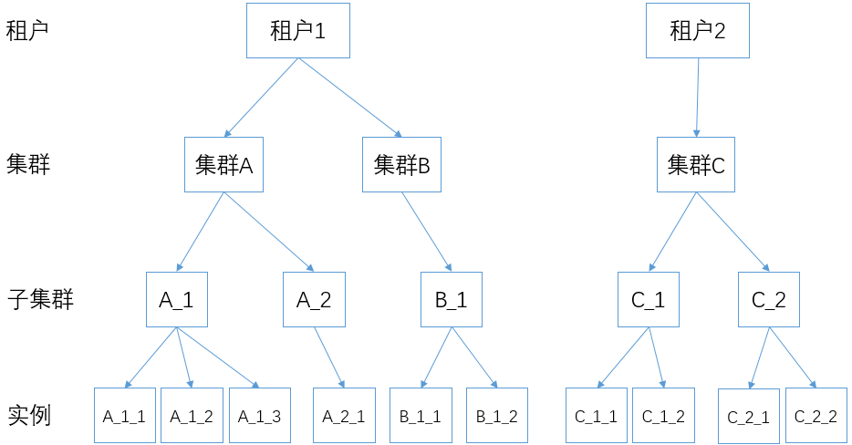
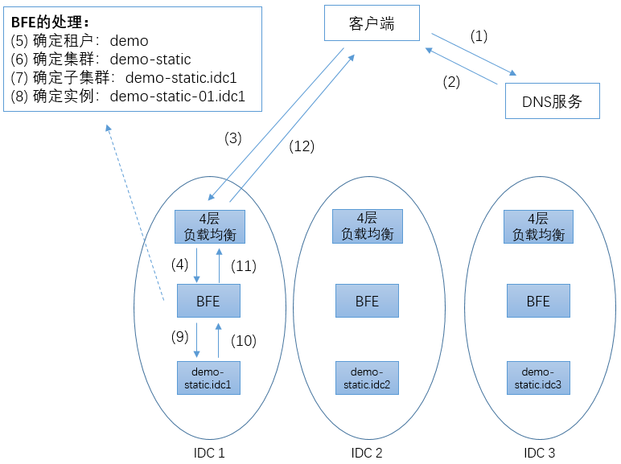

# BFE的转发模型

对于一个七层负载均衡软件来说，转发模型是它的核心。本章首先对BFE的转发模型做一个概要的介绍。在后面的章节中，会详细介绍BFE的路由转发机制和内网流量调度机制。

## 基本概念

在BFE中，有以下基本概念：

+ 租户（Tenant）

  使用BFE转发的业务，可以基于“租户”的单位来区分。BFE引擎中的配置，比如转发策略、各扩展模块的配置等，都是以租户为单位来区分的。

  由于历史原因，在BFE中，租户也被称为“产品线”（Product）。

+ 集群（Cluster）

  具有同类功能的后端定义为一个集群(Cluster)。对于一个租户，可以定义多个集群。在某些场景，集群也被称为服务（Service）。

  在一个租户内，可以使用租户的路由转发表将流量转发给合适的集群。详细的机制可以参考后面章节中关于BFE路由转发机制的说明。

+ 子集群（Sub Cluster）

  在多数据中心场景下，集群可以划分为多个子集群(Sub Cluster)。通常，可以将集群中处于同一IDC（Internet Data Center）中的后端定义为一个子集群。在某些场景，子集群也被称为实例组（Instance Group）。

  子集群概念的引入，主要是为了处理多数据中心场景下的流量调度。详细的机制可以参考后面章节中关于BFE内网流量调度机制的说明。
  
+ 实例（Instance）

  每个子集群可包含多个后端服务实例（Instance）。每个后端实例通过“IP地址 + 端口号”标识。

下图用一个例子对以上这些概念之间的关系给出了说明。其中包含2个租户。租户1配置了2个集群（集群A和集群B），这2个集群分别有2个子集群和1个子集群。各子集群有1-3个实例。租户2只配置了一个集群（集群C），集群C有2个子集群，各自有2个实例。

## 转发过程

下面以上图为例，说明BFE的转发过程。

这里是一个多数据中心的场景，包含3个数据中心（IDC1至 IDC3），在3个数据中心各有一个外网出口。这3个数据中心可能在临近区域内（一般被称为Region），也可能不在同一地域内。

在每个数据中心内，都部署了4层负载均衡集群，也部署了基于BFE的7层负载均衡集群。在一般的部署场景下，BFE都是作为四层负载均衡的RS（Real Server）存在。在一个BFE集群中，一般都会包含2个以上BFE运行实例，位于不同的服务器上。在某个BFE实例出现故障（由于服务器硬件、操作系统、或BFE自身的问题）的情况下，四层负载均衡系统可以自动摘除有问题的实例，从而实现高可用（HA：High Availability）。

这里我们假设有一个提供静态页面访问的服务，命名为demo-static。这个服务在3个数据中心中都有部署，组织为3个独立的子集群（demo-static.idc1 至 demo-static.idc3）。

demo-static使用demo.example.com域名来对外提供服务。在3个数据中心各分配了一个外网IP，假设分别为6.6.6.6、7.7.7.7和8.8.8.8（注：这些域名和IP地址都是虚构的，仅用于说明BFE的运行机制）。

客户端要访问demo-static服务，首先要进行域名解析，将域名解析为合适的IP地址。在上图的步骤1和2中，根据客户端的来源地，智能DNS返回IP地址为6.6.6.6。

之后客户端向6.6.6.6地址的80端口发起建立TCP连接。为了使案例简单，这里假设客户端和服务端使用普通HTTP协议交互，而没有使用HTTPS协议。通过四层负载均衡系统的代理，最终客户端和BFE集群中的某个BFE实例建立起TCP连接。在一个TCP连接内，可以发送1个或多个HTTP请求。一个连接内发送HTTP请求的数量，被称为连接复用率。在HTTP/2出现之前，一般场景下的连接复用率为2-3，也就是说一个TCP连接发送2-3个HTTP请求后就关闭了。在HTTP/2出现后，连接的复用率有了较大的提高。

在HTTP请求到达BFE后，步骤5至步骤8是BFE处理的关键步骤。

- 步骤 5：确定HTTP请求所属的租户

    多租户支持是BFE根据云场景所设计提供的能力。目前BFE可以根据HTTP请求头中的Host字段或HTTP请求的目标IP地址来确定租户。

    在本案例中，针对HTTP请求头中demo.example.com域名，BFE找到对应的租户为demo。

- 步骤 6：根据租户的分流规则，决定HTTP请求的目的集群

    对于每个租户，可以配置一张独立的路由转发表。通过查找路由转发表，确定请求所属的目的集群。路由转发机制的详情将在后面的章节中介绍。

    在本案例中，经查表确定对应的目的集群为demo-static。

- 步骤 7：根据集群的内网流量调度策略，选择合适的子集群

    对于每个BFE集群，可以针对每个集群的各子集群设置转发权重。BFE根据设置的转发权重来执行转发操作。内网流量调度机制的详情将在后面的章节中介绍。

    在本案例中，假设在IDC1的BFE集群上，demo-static的3个子集群对应的转发权重为（100, 0, 0）。所以，确定转发的目标子集群为demo-static.idc1。

- 步骤 8：根据集群的子集群负载均衡策略，选择合适的实例

  对于每个集群，可以设置子集群的负载均衡策略，如WRR（加权轮询）、WLC（加权最小连接数）等。BFE根据子集群的负载均衡策略，在子集群中选择合适服务实例来处理请求。

    在本案例中，最终选择demo-static-01.idc1来处理请求。

随后，请求被发往后端实例demo-static-01.idc1（步骤9）。BFE收到后端实例回复的响应（步骤 10），通过四层负载均衡系统将响应返回给用户（步骤11、12）。

## 多租户机制的讨论

“多租户支持”是云计算系统的重要需求。在七层负载均衡转发服务的多租户实现机制上，有两种可能：

（1） 使用隔离的转发资源

这是在很多公司中常用的方式。对于不同的业务，搭建独立的七层负载均衡转发集群。这种方式的主要好处是避免了业务间的互相干扰，但是也会导致资源的忙闲不均。另外，每个独立的转发集群规模都不大，在抵御突发流量或攻击流量的能力都不足。

（2）使用公用的转发资源

这是在百度内部采用的方式。BFE平台是一个支持多租户的平台，上千个租户混用同一组转发资源。公有的BFE转发集群具有足够的容量来抵御突发流量或攻击流量。使用这种方式，要求转发引擎本身具有多租户的支持，从而对多个租户间的配置进行隔离；另外，也要求配合提供平台化的能力，支持多个租户同时发起配置的变更。

一个常见的问题是，在公用转发资源的情况下，如何解决转发资源的冲突问题。在某些情况下，可能会由于一个业务的流量突发，对共享资源的其它业务产生干扰。在共享资源的模式下，这种情况肯定是无法完全避免的。对比网络中传统QoS问题的解决，有两种思路：增加对业务使用资源的复杂控制机制；不做复杂的控制机制，而靠供应足够的资源来解决。从以往的历史经验看，在互联网的技术发展过程中下第二种思路取得了胜利。在七层负载均衡转发场景下，使用复杂的控制机制必然会导致额外的资源消耗，我们选用的机制是不使用复杂的控制机制、而提供足够的共享资源。如果真的有某个业务有特别大的流量，则可以通过在四层负载均衡上对对应业务的Virtual Server限速来解决。

## links
上一章：[第六章 BFE和相关开源项目的对比](../../design/comparison/comparison.md)  
下一章：[第八章 BFE的路由转发机制](../../design/route/route.md)