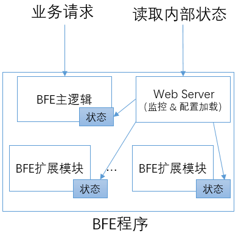
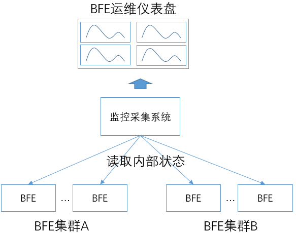
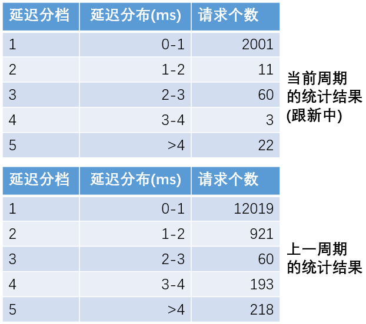

# 监控机制

BFE作为一个七层负载均衡软件，需要7*24小时的持续稳定运转。为了保证系统的稳定性和正确性，对于系统的监控非常重要。下面对BFE的监控机制做一个简要的介绍。

## 日志监控及其问题

很多系统依赖于对外输出的错误日志来发现系统的问题，具体方法是：

+ 在错误发生时，打印日志，其中包含错误的信息
+ 配置监控系统，对于日志的内容进行监控，如果发现有错误的信息，则输出报警

在很多时候，不仅希望看到系统错误的情况，也希望能够看到系统的一些状态。比如：目前并发的连接数有多少，每秒处理请求的数量有多少，等等。类似这样的需求，在很多系统中也是依靠分析系统输出的日志来实现的。

基于系统日志来监控的机制，存在以下问题：

+ 被监控系统的资源消耗较高

  打印日志会使用磁盘IO，是一个消耗资源很高的操作。如果是输出文本日志，日志格式化时所进行的字符串操作也是消耗CPU资源较多的。

  大家可以做这样的试验：对于BFE或者Nginx，打开或关闭访问日志的输出，会看到明显的性能变化。

+ 监控系统的资源消耗较高

  对日志进行监控，监控系统要进行读取、解析、匹配等操作，都是资源消耗较多的。

  曾经听说过这样的案例：业务系统运行时使用了4核CPU；为了分析这个系统输出的日志，监控系统也使用了4核CPU。监控使用了和业务系统几乎一样多的资源，成本有些太高了。

+ 很多状态信息并不适合都打印输出

  如果希望了解BFE内部系统间的调用处理情况，不可能将这些内部调用的情况都通过打印日志的方式输出。

## BFE的内部状态输出



为了更方便的向外展示内部的状态信息，BFE做了一些专门的设计：

+ 在BFE的主逻辑和BFE的各扩展模块中，使用专门的存储来维护状态信息
+ 在BFE程序中嵌入一个Web Server，用于外部读取BFE内部的状态信息及触发配置加载

下面是一个在浏览器中查看从BFE监控端口读取结果的例子。状态信息默认以JSON格式输出，每项包括状态变量名及变量的值。比如：CLIENT_REQ_ACTIVE是指当前活跃的请求数，CLIENT_REQ_SERVED是指从BFE程序启动以来，一共服务的请求数。


这个设计的好处是：

+ 状态信息可以低成本的收集和汇聚

  一个状态的累加计算，成本仅仅是对BFE内存中一个变量的“加1”操作。

+ 状态信息可以低成本的读取

  监控系统通过BFE对外的监控端口，一次可以读取几十甚至几百个变量。由于BFE所输出的状态信息为格式化数据，也便于监控系统对内容进行解析。

通过以上方式，BFE向外暴露数千个内部状态信息，可以反映出系统内部各方面的实时状态。使用监控系统（如Prometheus）对各BFE程序实例的状态信息做采集和汇聚，可以形成BFE集群的运维仪表盘。



## Web Monitor基础库

以上所介绍的BFE相关状态输出机制已经封装为独立的基础库，命名为Web Monitor。下面介绍一下Web Monitor的设计机制和使用方法。

Web Monitor的代码位于[https://github.com/baidu/go-lib](https://github.com/baidu/go-lib) 中的web-monitor目录下。

### 概述

Web Monitor提供Web接口，帮助持续运行的后台程序提供内部状态展示和配置热加载功能。

Web Monitor中主要提供以下3类支持：

+ 专用的定制Web Server

  这个Web Server可以嵌入到后台程序中运行

+ 回调接口注册

  需要外部访问状态或配置热加载的后台程序模块，可以向Web Monitor注册对应的状态展示函数或配置加载函数

+ 内部状态维护

  Web Monitor为后台程序维护内部状态提供了多种形式的支持

### 状态变量维护

#### 变量类型

在内部状态维护场景，考虑了以下几种场景：

+ 计数器变量（Counter）：只能单向增长
+ 计量变量（Gauge）：可以增加、减少，也可以直接改变取值
+ 状态变量（State）：可以设置一个字符串作为状态，如“on”、“off”、“red”、“green”

以上几种变量对应的类型定义可以查看[https://github.com/baidu/go-lib](https://github.com/baidu/go-lib) 中 [/web-monitor/metrics](https://github.com/baidu/go-lib/tree/master/web-monitor/metrics)目录下的counter.go、gauge.go和state.go。

#### 差值计算

对于计数器变量，Web Monitor还提供了“获取指定时间周期内的差值”的能力。比如，对于"CLIENT_REQ_SERVED"，获取BFE程序启动后一共处理了多少请求并没有太大意义，我们更希望得到“最近20秒内服务了多少请求”。获取差值的能力实现在[/web-monitor/metrics](https://github.com/baidu/go-lib/tree/master/web-monitor/metrics)的metrics.go中。Metrics的用法如下：

(1) 定义包含统计变量的数据类型

```
	import "github.com/baidu/go-lib/web-monitor/metrics"
	
	// define counter struct type
	type ServerState {
		ReqServed *metrics.Counter
		ConServed *metrics.Counter
		ConActive *metrics.Gauge
	}
	
	var s ServerState
```

(2) 定义和初始化Metrics变量

在Metrics的Init()函数中

+ 第二个参数为“前缀字符串”

  Web Monitor输出有一种格式为key-value方式，在这种方式下输出时，会将“前缀字符串“放在原始的变量名称前面，以便在复杂场景时在全局区分各统计变量。在这个例子中，增加了”PROXY“前缀，以key-value方式输出时会显示为：
```
PROXY_REQ_SERVED: 0
PROXY_CON_SERVED: 0
PROXY_CON_ACTIVE: 0
```

+ 第三个参数为“差值计算的间隔时间”

  这个例子中设为20秒

```
	// create metrics
	var m metrics.Metrics
    m.Init(&s, "PROXY", 20)
```

(3) 统计变量的相关操作。如：
```
	// counter operations
	s.ConActive.Inc(2)
    s.ConServed.Inc(1)
    s.ReqServed.Inc(1)
	s.ConActive.Dec(1)
```

(4) 获得结果

通过调用Metrics的GetAll()接口，可以获得其中所有变量的“绝对值”；调用GetDiff()接口，可以获得其中Counter类型在20秒内的“变化值”。

```
	// get absoulute data for all metrics
	stateData := m.GetAll()
	// get diff data for all counters
	stateDiff := m.GetDiff()
```

#### 使用案例

BFE主逻辑的统计变量定义在[/bfe_server](https://github.com/bfenetworks/bfe/blob/develop/bfe_server)目录下的proxy_state.go中。

在扩展模块开发中也会使用状态变量的机制，可以参考"[如何开发BFE扩展模块](../../develop/how_to_write_module/how_to_write_module.md)"中的说明。

### 延迟统计变量维护

在BFE中，也需要对一些处理的延迟进行统计，如：转发处理的延迟，HTTPS握手的延迟等。

在Web Monitor中，提供了Delay Counter的机制，以支持对于延迟的统计。

#### 机制说明

Delay Counter支持以下能力：

+ 平均延迟

  通过记录样本的数量和延迟总和，可以计算得到平均延迟

+ 延迟的分布

  可以用户可以指定延迟统计分档的数量及每个分档的时间大小，可以获得落入各延迟分档的请求数量

以上这些统计数据，都是针对一定的时间周期的。Delay Counter的使用者需要指定统计的周期（如：60秒）。Delay Counter会显示“当前周期”的统计数据，如果刷新Web Monitor的接口，会发现这些统计数据在持续发生变化。从观测长期变化的角度，需要在每个周期结束后，获取其稳定不变的统计值，为此Delay Counter也会同时提供“上一周期”的统计结果。



#### 使用方法

Delay Counter的用法如下：

(1) 定义和初始化Delay Counter

```
	import "github.com/baidu/go-lib/web-monitor/delay_counter"

	ProxyDelay = new(delay_counter.DelayRecent)
	
	// Init的3个参数为： 统计周期，延迟分档（毫秒），分档个数
	ProxyDelay.Init(60, 1, 10)
```

(2)  增加样本值
```
	ProxyDelay.AddBySub(startTime, endTime)
```
(3) 输出文本形式的结果
```
	// params是由Web Monitor的Web Server传入的参数
	ProxyDelay.FormatOutput(params)
```

## 建立专用的Web Server

BFE内嵌的监控专用Web Server，在[/bfe_server](https://github.com/bfenetworks/bfe/blob/develop/bfe_server)的web_server.go中定义：

```
func newBfeMonitor(srv *BfeServer, monitorPort int) (*BfeMonitor, error) {
	m := &BfeMonitor{nil, nil, srv}

	// initialize web handlers
	m.WebHandlers = web_monitor.NewWebHandlers()
	if err := m.WebHandlersInit(m.srv); err != nil {
		log.Logger.Error("newBfeMonitor(): in WebHandlersInit(): ", err.Error())
		return nil, err
	}

	// initialize web server
	m.WebServer = web_monitor.NewMonitorServer("bfe", srv.Version, monitorPort)
	m.WebServer.HandlersSet(m.WebHandlers)

	return m, nil
}
```

上面的代码中，建立了维护回调函数的变量m.WebHandlers，也建立了Web Server的变量m.WebServer。


最后，启动Web Server
```
func (m *BfeMonitor) Start() {
	go m.WebServer.Start()
}
```

## 注册回调函数
在上面一段所调用的m.WebHandlersInit()中，既注册了用于显示内部状态的回调函数，也注册了用于动态加载配置的回调函数：
```
func (m *BfeMonitor) WebHandlersInit(srv *BfeServer) error {
	// register handlers for monitor
	err := web_monitor.RegisterHandlers(m.WebHandlers, web_monitor.WebHandleMonitor,
		m.monitorHandlers())
	if err != nil {
		return err
	}

	// register handlers for for reload
	err = web_monitor.RegisterHandlers(m.WebHandlers, web_monitor.WebHandleReload,
		m.reloadHandlers())
	if err != nil {
		return err
	}

	return nil
}
```

以上是BFE主逻辑注册回调函数的逻辑。在各扩展模块，也有独立的注册逻辑，可以参考"[如何开发BFE扩展模块](../../develop/how_to_write_module/how_to_write_module.md)"中的说明。