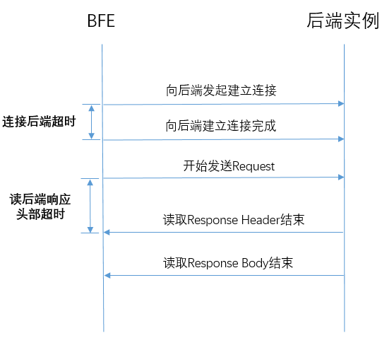

# 超时设置

BFE中有一些涉及超时的配置，包括：

+ BFE和客户端间通信的超时
+ BFE和后端实例间通信的超时

超时的设置，对于业务流量的处理非常重要。

## 客户端和BFE间通信的超时

### 定义

BFE和客户端间通信的超时包括：

+ **读用户请求头部超时**：从连接建立开始，到完整读取到来自客户端请求头部
+ **读用户请求主体超时**: 从完成读取请求头部，到完成读取请求主体
+ **写响应超时**: 从发送响应头部开始，到将响应完全发送给客户端
+ **与用户长连接超时**：从上一个请求结束，到完成读取下一个请求头部


### 配置方法

+ **读用户请求头部超时**

  在[/conf/bfe.conf](https://github.com/bfenetworks/bfe/tree/master/conf)中统一配置，单位为秒。这个配置只能在程序重新启动时生效，无法热加载。

```
[Server]
...
# read timeout, in seconds
ClientReadTimeout = 60
...
```

+ **读用户请求主体超时**

  在[/conf/server_data_conf/cluster_conf.data](https://github.com/bfenetworks/bfe/blob/master/conf/server_data_conf/cluster_conf.data)中，针对各集群（Cluster）独立配置，单位为毫秒。

```
{
    "Version": "init version",
    "Config": {
   		"cluster_example": {
    		...
    	    "ClusterBasic": {
                "TimeoutReadClient": 30000,
                ...
            }
    	 }
    }
}
```

+ **写响应超时**

  在[/conf/server_data_conf/cluster_conf.data](https://github.com/bfenetworks/bfe/blob/master/conf/server_data_conf/cluster_conf.data)中，针对各集群（Cluster）独立配置，单位为毫秒。

```
{
    "Version": "init version",
    "Config": {
   		"cluster_example": {
    		...
    	    "ClusterBasic": {
                "TimeoutWriteClient": 60000,
                ...
            }
    	 }
    }
}
```

  在[/conf/bfe.conf](https://github.com/bfenetworks/bfe/tree/master/conf)中，包含写响应超时的缺省配置。这个配置适用于不知道请求对应的集群、又需要控制与客户端超时的场景。例如：还没有执行到通过路由转发规则确定后端集群、而需要从BFE直接返回自定义响应的时候，使用缺省的超时配置。

```
[Server]
...
# write timeout, in seconds
ClientWriteTimeout = 60
...
```


+ **与用户长连接超时**

  在[/conf/server_data_conf/cluster_conf.data](https://github.com/bfenetworks/bfe/blob/master/conf/server_data_conf/cluster_conf.data)中，针对各集群（Cluster）独立配置，单位为毫秒。

```
{
    "Version": "init version",
    "Config": {
   		"cluster_example": {
    		...
    	    "ClusterBasic": {
                "TimeoutReadClientAgain": 30000,
                ...
            }
    	 }
    }
}
```

## BFE和后端实例间通信的超时

### 定义

BFE和后端实例间通信的超时包括：

+ **连接后端超时**：从向后端发起建立连接，到建立连接完成
+ **读后端响应头部超时**：从BFE开始发送请求，到完成接收响应头部



### 配置方法

+ **连接后端超时**

  在[/conf/server_data_conf/cluster_conf.data](https://github.com/bfenetworks/bfe/blob/master/conf/server_data_conf/cluster_conf.data)中，针对各集群（Cluster）独立配置，单位为毫秒。

```
{
    "Version": "init version",
    "Config": {
   		"cluster_example": {
    		...
    	    "BackendConf": {
                "TimeoutConnSrv": 2000,
                ...
            }
    	 }
    }
}
```

+ **读后端响应头部超时**

  在[/conf/server_data_conf/cluster_conf.data](https://github.com/bfenetworks/bfe/blob/master/conf/server_data_conf/cluster_conf.data)中，针对各集群（Cluster）独立配置，单位为毫秒。

```
{
    "Version": "init version",
    "Config": {
   		"cluster_example": {
    		...
    	    "BackendConf": {
                "TimeoutResponseHeader": 50000,
                ...
            }
    	 }
    }
}
```


## links
上一章：[第十四章 日志机制](../../design/log/log.md)  
下一章：[第十六章 配置管理](../../design/configuration/configuration.md)