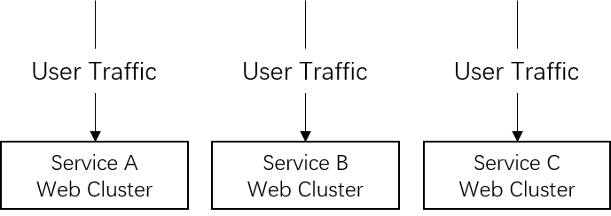
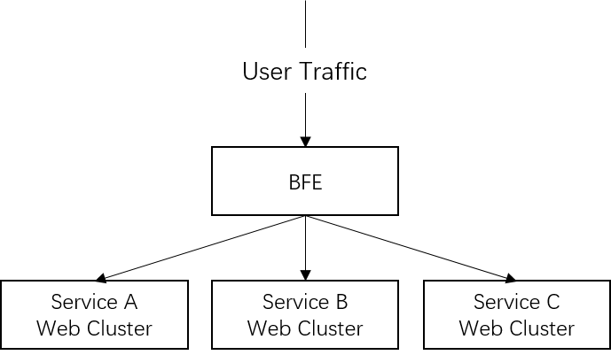
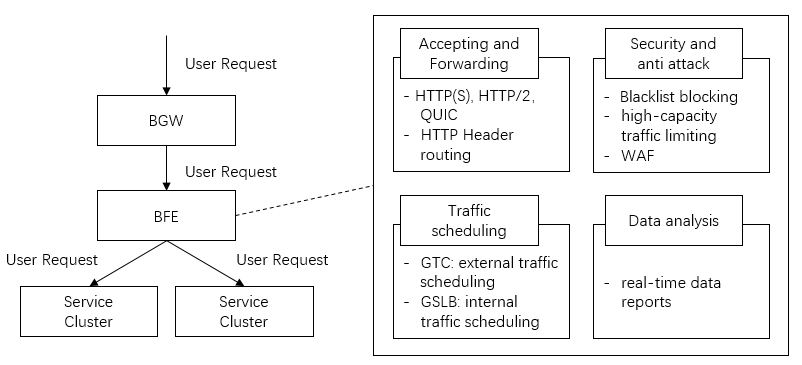
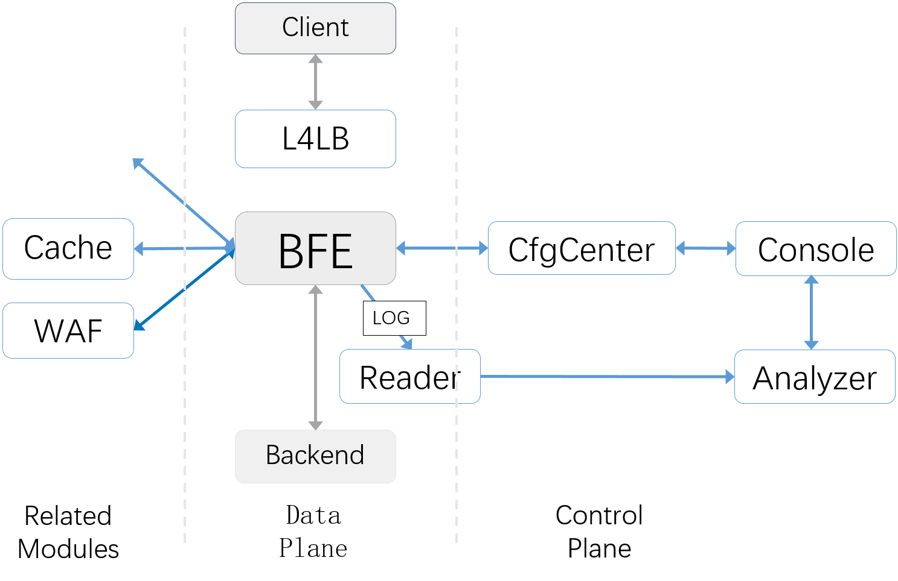

# Introduction to BFE

## What is BFE？

BFE was originally the abbreviation of Baidu Front End, and it is Baidu's unified layer-7 load balancer platform. BFE platform has been built since 2012. By the end of 2020, the BFE platform has forwarded more than 1 trillion requests every day, and the daily peak exceeds 10 million QPS.

In 2014, the core forwarding engine of BFE platform was reconstructed based on Go language, and was fully launched in Baidu in January 2015. In China, BFE is an early project to use Go language for load balancing scenarios and large-scale scenarios.

At the beginning of 2019, BFE platform successfully supported the Red Envelope Project of Spring Festival Gala sponsored by Baidu. In this project, BFE platform provided forwarding capability of more than 100 million QPS , supportting HTTPS unloading, precise traffic limiting and other key capabilities under massive traffic, and ensured the smooth progress of activities.

In July 2019, BFE's forwarding engine was open to public as an open source project. The name of open source project remained as BFE, but it was renamed to Beyond Front End. It was hoped that the open source project of BFE can promote the development of load balancing technology.

In June 2020, BFE was accepted as a Sandbox Project of  CNCF (Cloud Native Computing Foundation).

The address of BFE open source project is https://github.com/bfenetworks/bfe

## The BFE Platform

### Why BFE Is Required？

In the traditional solution, there is no uniform layer-7 load balancer layer. In the scenario where there are multiple services, traffic for each service will directly arrive at the web service cluster after being forwarded by the layer-4 load balancer.

This solution has the following problems:

(1)  Repeated development for the same features

​	In terms of protocol processing and security, there are many important functions that need to be supported. Considering the differences in programming languages and technology stacks of various service clusters, supporting the same features on multiple different services clusters will bring high R&D costs.

(2) High operation and maintenance costs

In some scenarios, it is necessary to apply the same security policy for multiple services at the same time. In the absence of a unified layer-7 load balancer layer, the security policy need to be applied in multiple service clusters repeatedly. This not only brings a lot of operation costs, but also makes the launch time of security strategy very long.

(3) Low capability of unified traffic control 

Due to the dispersion of service clusters, there is a lack of unified observation and control for traffic from the company level. This also hinders the unified control of network resources and the unified management of network QoS (Quality of Service).

After the introduction of BFE platform, all traffic will be forwarded by BFE before arriving at the service cluster. This solution brings the following advantages:

(1) Unified development of new features

​	Regardless of the technical differences of service clusters, all relevant features only need to be developed once in BFE platform.

(2) Unified operation and maintenance

​	For the security policies that need to be widely used by multiple services, you only need to make modification on BFE platform.

(3) Enhanced traffic control

​	Compared with layer-4 load balancer, the layer-7 load balancer can "see" more content in the traffic and provide stronger capabilities in traffic forwarding, security, data statistics, etc.

### Main Functions of BFE Platform

As a comprehensive large layer-7 load balancer platform, BFE platform provides the following four main functions:

(1) Accepting and forwarding

The BFE platform can process the traffic of HTTP, HTTPS, HTTP/2, QUIC and other protocols, and do traffic forwarding based on the information of HTTP headers.

(2) Traffic scheduling

BFE platform includes a two-layer traffic scheduling system consisting of internal network traffic scheduling and external network traffic scheduling.

(3)  Security and anti attack

The BFE platform supports a variety of security capabilities, including blacklist blocking, high-capacity traffic limiting, WAF (Web Application Firewall), etc.

(4) Data analysis

The BFE platform can generate real-time data reports based on the access logs, reflecting the traffic changes of the business and the health status of the downstream service cluster (error number, delay, etc.)

## BFE open source project

### Modules of BFE Platform

BFE platform is a complex distributed system composed of many modules, which can be divided into data platform, control platform, and some related  modules.

The main modules of the data plane include:

+ Forwarding Engine:  Provide the basic traffic forwarding function
+ Log Reader: Processing access logs on a single node

The main modules of the control plane include:

+ Log Analyzer: In addition to Log Reader, the log data is centralized processed
+ Config Center: Centralized management of BFE configuration
+ Console: For user to manage configuration and view platform status

Related modules include:

+ Crypto：Provide remote services for some high consumption computing in HTTPS processing, thus reducing consumption of CPU resources
+ Cache：Provide the cache function required for forwarding, such as session cache used in HTTPS
+ WAF(Web Application Firewall)：Check malicious requests

### Features of BFE Open Source Project

At present, the BFE open source project is the forwarding engine in the BFE platform, including the core framework and most of the functions. The specific functions include:

+ Multiple protocols supported

  BFE supports HTTP, HTTPS, SPDY, HTTP2, WebSocket, TLS, gRPC, FastCGI, etc. Future support is planned for HTTP/3.

+ Flexible plugin framework

  BFE has a builtin plugin framework that makes it possible to develop new features rapidly by writing plugins.

+ Content based routing

  BFE provides an [advanced domain-specific language](https://github.com/bfenetworks/bfe/blob/develop/docs/en_us/condition/condition_grammar.md) to describe routing rules which are easy to understand and maintain.

+ Multiple load balancing strategies

  BFE supports multi-level (cluster, sub cluster, instance) load balancing, support the load balancing in multiple data centers and multiple cluster, and support overload protection

+ Best-in-class observability

  Rich and detailed monitoring indicators are built in BFE, which can fully grasp the system status with third-party monitoring systems (such as Zabbix and Prometheus)

The above contents will be introduced in detail in the following chapters
