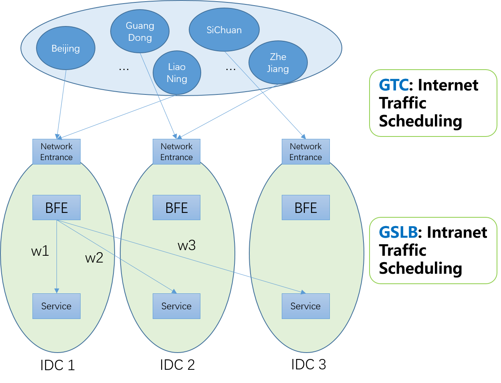
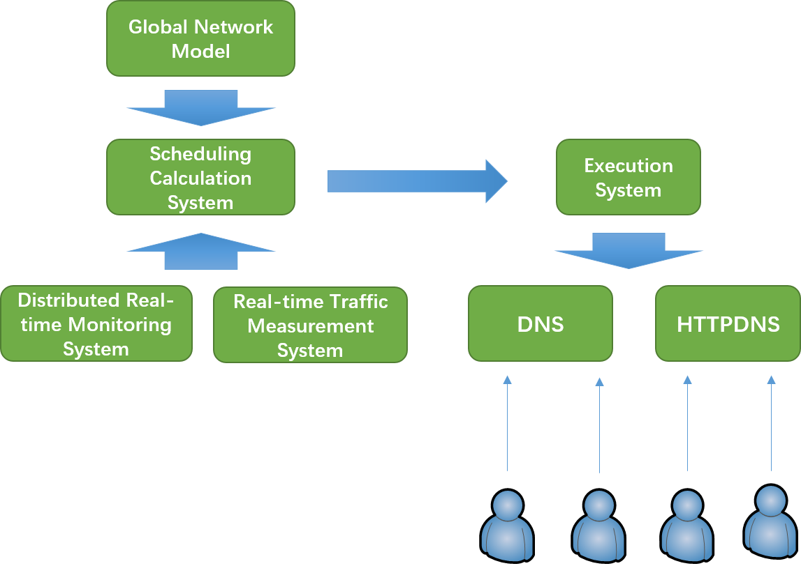
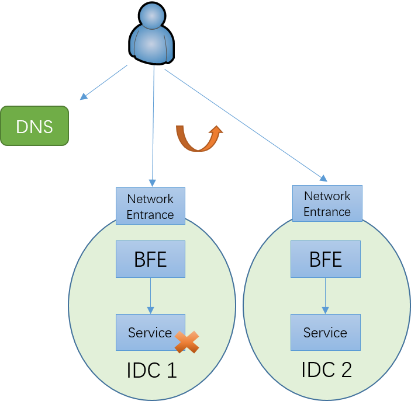
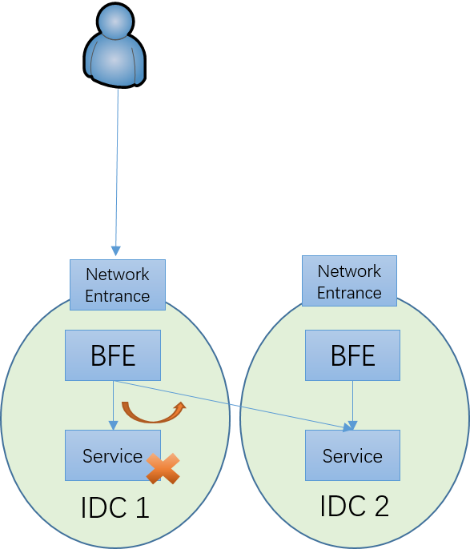
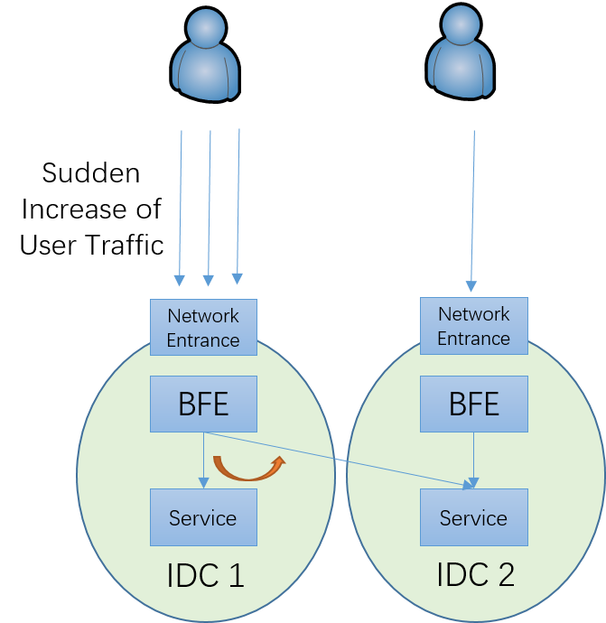
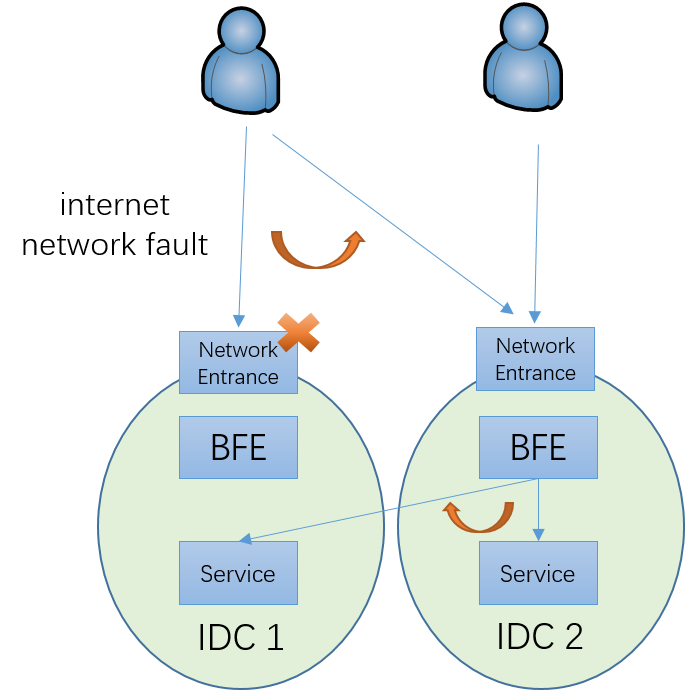
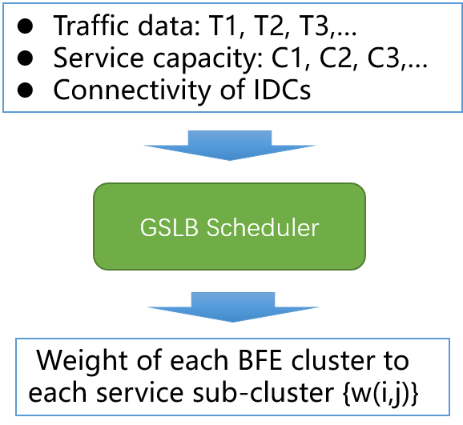

# Traffic Scheduling

## Background

### Global Traffic Scheduling Solution

After years of construction, Baidu has built a two-layer global traffic scheduling system for traffic served by IDC:

+ GTC: Internet traffic scheduling

  Based on DNS, the user traffic of each province is guided to the appropriate network entrance. In the scheduling calculation, GTC should consider such factors as bandwidth (capacity and usage) of network entrance, resources (capacity and usage) of BFE platform, and network quality (connectivity,  delay) from users to each network entrance.

+ GSLB: Intranet traffic scheduling

  Based on BFE, the traffic to each BFE cluster will be forwarded to the sub clusters located in multiple data centers according to the weight.

### GTC: Internet Traffic Scheduling

GTC is responsible for traffic scheduling between network entrances. GTC includes the following three main steps:

+ Real-time monitoring

  The monitoring nodes located in various regions continuously send detection signals to the access points of the Internet to monitor the connectivity and quality between the regions and the access points. If any abnormality is found, the distributed real-time monitoring system will report the fault signal to the scheduling system within 1 minute.

+ Scheduling calculation

  The real-time traffic collection system obtains real-time bandwidth usage from the router and real-time requests per second from the layer-7 load balancer system. According to the real-time traffic data and real-time monitoring report, the scheduling system, in cooperation with the global network model, calculates a new scheduling scheme within 1 minute.

+ Execution

  The scheduling system dispatches the scheduling scheme to DNS and HTTPDNS to take effect. Due to the DNS cache, it takes some time for the client to take effect. The DNS TTL of most Baidu domain names is set to 300 seconds (5 minutes). Generally, it takes 8-10 minutes to take effect for more than 90% of users after launching the new scheduling scheme.

Compared with the previous generation of Internet scheduling system, GTC has the following two improvements:

+ Accelerate the speed of Internet network fault handling

  Through real-time monitoring plus automatic scheduling calculation, the time from the failure to the start of DNS dispatch is reduced to less than 2 minutes.

+ Reduce the cost of configuration maintenance

  There is no need to maintain complex plans for domain names.

Many similar systems in the industry adopt the "plan" mechanism. For example, for a domain name, there are two alternative IP addresses, A and B. The plan of this domain name will be as follows: If A has a problem, switch the traffic to B; If B has a problem, switch the traffic to A. For each domain name directly assigned with IP addresses (that is, the domain name has A record), such a plan needs to be prepared.

The biggest problem of the plan mechanism is the high maintenance cost. First of all, the maintenance cost has an exponential relationship with the number of network entrances. The situation of two network entrances is very simple; If there are 5 or even 10 network entrances, the plan is very difficult to prepare, and various possibilities need to be considered. In addition, the maintenance cost is linear with the number of domain names. If there are thousands of domain names, then if you want to make an adjustment to the network entrances (add or delete a network entrances), the amount of work required is amazing.

Internet traffic scheduling is mainly applicable to the following scenarios:

+ Network entrance failure

  The user cannot access the network portal due to the failure of the local network portal or the operator network

+ Network entrance congestion caused by attack

  Large-scale DDoS attacks can reach hundreds of giga bps, or even tera bps, and can directly overload the incoming bandwidth of the network entrance

+ Network access system failure

  For example, the failure of the layer-4 load balancing system or the layer-7 load balancing system

+ Regional connectivity failure

  Although the network portal can be accessed generally, it cannot be accessed from a certain region of an operator. This is partly due to local network anomalies in the user's area, or it may be because the IP used by the service is mistakenly blocked in local areas.

### Why Intranet Traffic Scheduling is Required

In the scenario of multiple data centers, if there is no intranet traffic scheduling mechanism, when the service in one data center fails, the traffic can only be scheduled to another data center by changing the IP address for the domain name. As mentioned above, after changing the configuration of authoritative DNS, it takes 8-10 minutes to take effect to more than 90% of users. Before the handover is completed, the users who were originally served by the failed IDC cannot use the service. In addition, the number of local DNS of operators is large, and there may be local DNS that has faults or does not follow the DNS TTL, resulting in the corresponding users taking longer to complete the handover, or even not switching all the time.

After the intranet traffic scheduling mechanism is introduced, the traffic can be cut off from the failed service cluster by modifying the BFE configuration. In Baidu, with the automatic intranet traffic scheduling module, traffic scheduling can be completed within 30 seconds after sensing the fault. Compared with the mechanism that completely relies on internet network traffic scheduling, the failure stop time has been greatly reduced, from 8-10 minutes to 30 seconds. Moreover, because the BFE clusters that perform the scheduling are all internal, the controllability of the intranet traffic scheduling is also much better than that of the internet traffic scheduling based on DNS.

## Intranet Traffic Scheduling

### Basic Mechanism

The basic mechanism of intranet traffic scheduling is shown in the figure above, and its basic principle is very simple. In each BFE cluster, a group of weights is assigned to each sub cluster of a backend service cluster. When forwarding traffic, BFE determines the target sub cluster of the request according to this weight.

In addition, for each service cluster, there is also a virtual sub cluster called BLACKHOLE. When the corresponding weight of the BLACKHOLE cluster is not 0, the traffic allocated to the BLACKHOLE sub cluster will be actively discarded by BFE. When the traffic arriving at BFE exceeds the overall capacity of the service cluster, the BLACKHOLE cluster can be enabled to prevent the overall overload of the service cluster.

Intranet traffic scheduling is applicable to scenarios related to internal services, including:

+ Internal service failure

  In some scenarios (such as canary release of services), a single sub cluster of the service may fail, resulting in a decline in service capacity, or even total inability to provide services. At this time, stop loss processing can be completed quickly through intranet traffic scheduling.

+ Uneven internal service pressure

  There are two possible scenarios:

  - The sudden increase of user traffic in a certain region causes the service pressure of sub-clusters in a single data center to exceed the capacity

    At this time, some traffic can be scheduled to other sub clusters of the service

  - Due to the internet network fault handling, part of the traffic is scheduled from one network entrance to another network entrance through internet traffic scheduling, resulting in the related sub cluster pressure exceeding the capacity

    At this time, you can also schedule some traffic to other sub clusters

### Automatic Intranet Traffic Scheduling

The weight of intranet traffic scheduling can be set manually. However, in fact, this weight should not be fixed, but should be adjusted according to the changes of user traffic, service cluster capacity and connectivity of IDCs. For this reason, an intranet traffic scheduler has been implemented in Baidu to calculate the weight of scheduling.

The overall mechanism of automatic intranet traffic scheduling is:

+ Traffic data collection: based on BFE access logs, real-time traffic data of all services arriving at each BFE cluster is obtained

+ Weight calculation: calculate the weight of each BFE cluster to each service sub-cluster based on traffic data, capacity of each service sub-cluster, network connectivity/distance between data centers and other factors

+ Dispatch and execution: each BFE cluster performs forwarding according to the weight

At present, in the BFE open source project, the manual setting of intranet traffic scheduling weight is supported, and the related modules of automatic  intranet traffic scheduling is not included.

### Example

+ Consider the following scenario：
  - Two IDCs: IDC_1, IDC_2
  - Two BFE clusters: BFE_1, BFE_2
  - Two backend sub clusters: SubCluster_1, SubCluster_2
+ In BFE clusters, weights for distributing traffic to each sub cluster can be configured as follows:
  - BFE_1：{SubCluster_1: W11，SubCluster_2: W12, Blackhole: W1B}
  - BFE_2：{SubCluster_1: W21，SubCluster_2: W22, Blackhole: W2B}
+ Based on the above configuration, BFE clusters distribute traffic to backend sub clusters.
  - For example，if configuration of BFE_1 is {W11，W12, W1B} ={45，45，10}, traffic percentage to SubCluster_1, SubCluster_2 and Blackhole is 45%, 45% and 10%.

By modifying the above configuration, traffic can be distributed in different sub-clusters to achieve load balancing, fast stop loss, overload protection and other purposes.

## Other Mechanisms for Forwarding

### Failure Retry Mechanism

If request forwarding fails, BFE supports retry in two ways：

- In-Sub-Cluster Retry: 
  - After a forwarding failure, re-forward request to other service instances in the same sub-cluster.
  - The maximum number of retries in the same sub-cluster can be controlled by configuring the cluster parameter "**Retry times in the same sub-cluster**".
- Cross-Sub-Cluster Retry: 
  - After the forwarding fails, re-forward request to other sub-cluster outside the original target sub-cluster.
  - The maximum number of retries cross sub-clusters can be controlled by configuring the cluster parameter "**Retries time cross sub-clusters**".

After the forwarding fails, BFE will first do In-Sub-Cluster Retry (if the **Retry times in the same sub-cluster** is greater than 0), and then do Cross-Sub-Cluster Retry (if the **Retries time cross sub-clusters** is greater than 0).

Be careful when enabling the Cross-Sub-Cluster Retry function. In some scenarios, this function may transfer excessive traffic to other healthy sub-clusters, resulting in excessive pressure on these sub-clusters, or even collapse of sub-clusters. Unlike the mechanism of forwarding traffic to each sub-cluster according to the weight in the "intranet traffic scheduling" above, the traffic caused by Cross-Sub-Cluster Retry is uncontrollable.

BFE does not retry in all failure scenarios. If BFE senses that the downstream backend instance has read the request (even if the read operation is not complete), it will not retry again. In this case, BFE cannot confirm whether the downstream backend instance has processed the request. If it sends the request again, it may cause the status error, so it adopts a conservative strategy.

### Connection Pool

Two ways are supported for TCP connection between BFE and backend instance：

- Short-Lived Connection: BFE forwards each request to backend instance with a new established TCP connection.
- Connection Pool:
  - BFE maintains a connection pool for each backend instance.
  - For a request forwarded to given backend instance:
    - If there is an available idle connection in the connection pool, take it from the pool and reuse it.
    - Otherwise, establish a new TCP connection.
  - After processing for a request is finished, for the connection used for this request:
    - If number of idle connections in the pool is less than configured capacity, the connection is added into the pool.
    - Otherwise, close the connection directly.

Connection pooling can avoid the delay caused by new TCP connections, thus reducing the total forwarding delay. Because BFE needs to maintain long connections for each downstream backend instance, in some cases (for example, there are a large number of instances of BFE), it may lead to a large number of concurrent connections for downstream backend instances. When using connection pool and setting connection pool parameters, the above factors need to be considered comprehensively.

### Session Stickiness

When BFE forwards requests to the downstream, it supports forwarding requests from the same source to a fixed backend (a sub-cluster or an instance). This function is called "session stickiness".

Session could be defined based on following infos of the request:

- Source IP
- Field in request header, cookie etc.

Session stickiness is supported for the following two levels:

- Sub cluster level: requests of the same session are forwarded to the same sub cluster (may be different instances in this sub cluster).
- Instance level: requests of the same session are forwarded to the same instance.

## links
Previous: [Chap8 Traffic Routing](../../../en_us/design/route/route.md)  
Next: [Chap10 Plugin Architecture](../../../en_us/design/module/module.md)