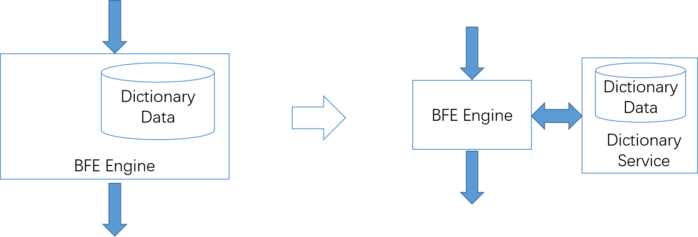

# Design Considerations of BFE

## The Reason for Refactoring BFE Forwarding Engine

Baidu's BFE platform was first launched in early 2012. At that time, the forwarding engine was an internal system called Transmit. Transmit is based on the C language and is a multi process+libevent model.

By the end of 2013, we had the idea of refactoring the forwarding engine. The main considerations are as follows:

+ The need for providing platform support

  At the initial stage, BFE platform was only used by more than ten product teams. By the end of 2013, BFE was already used by dozens of product teams. In the original system, there is no multi tenant mechanism, so it is not easy to do configuration management for multiple services. In addition, the configuration is unstructured, which is not easy to generate and process with programs; The configuration hot reload mechanism of the original system  is also complex.

+ Maintenance cost of network protocol stack

  The HTTP protocol stack in Transmit was self-developed by Baidu. As time went by, we found some problems in protocol consistency, and the maintenance cost was high. In addition, at the end of 2013, Baidu started project for HTTPS, and it was required to add support for HTTPS to the forwarding engine. Network protocol stack is very important for reverse proxy system. In the long run, the cost of maintaining a completely self-developed network protocol stack is high.

+ Lack of status monitoring capability

  For an industrial level proxy system, it needs to have a strong state monitoring capability. Transmit has less monitoring information, and it is difficult to add new monitoring status.

+ The configuration is difficult to maintain

  Transmit's forwarding configuration is mainly described by regular expressions. In practice, we found that regular expressions are problematic in terms of maintenance.

At the beginning of 2014, it was determined to refactor the BFE forwarding engine based on Go language. In April 2014, we began to write code. The project was completed at the end of 2014, and the Go version of the forwarding engine was launched in full at Baidu in early 2015.

## Why BFE is Based on Go Language?

During the survey of BFE refactor in early 2014, two technical roadmap were considered:

+ Based on Nginx. This is a widely used solution in the industry. In most companies, the layer-7 load balancing  is based on Nginx.

+ Based on Go language.

Back in 2014, there were few cases of Go language in China. Over the years, people have been asking why you choose Go. Here are some considerations at that time:

+ development efficiency

  People who have used both C and Python should have the experience that Python's R&D efficiency is much higher than C. Our basic judgment is that there are still many features to be developed for layer-7 load balancing in the coming years. The development efficiency of Go language is close to Python, which provides a great advantage for fast delivery.

+ Stability

  Load balancing requires high stability. If the forwarding engine crashes, no matter how stable other services in the data center are, users cannot access the services at all. For systems developed using C language, memory errors account for a very high proportion, and some errors can directly lead to the collapse of the system; Moreover, C language lacks the protection mechanism for errors. For the Go language, the system is responsible for the memory management, which does not need the developer's attention, which greatly reduces the probability of problems; In addition, the Recover mechanism can be used in the Go language to capture Panic that may be found.

+ Security

  Theoretically, programs written in C language have the potential of buffer overflow, which is the basis for many malicious attacks. Go's memory management mechanism greatly reduces the security risk of buffer overflow.

+ Code readability 

  Compared with C language (and Lua language commonly used in Nginx), Go language has better readability. In addition, in terms of writing highly concurrent programs, Go Routine allows programs to be written in a multithreaded model without the need to design complex state machines. This makes it easier to write programs.

+ Network protocol stack

  For a load balancing software, the network protocol stack is an important consideration. BFE makes use of the mature and stable network protocol stack in the Go system library, which comes from Google's strong strength in network protocol stack. In recent years, many network protocol stack upgrades are initiated by Google, such as HTTP/2 and QUIC. The Go system library always provides support for the new protocol.

In practice, the choices made in 2014 were very correct. The BFE engine based on Go language timely responded to various demands of Baidu's internal business for layer-7 load balancing, and remained stable for a long time. Since the full launch in early 2015, the BFE engine has never crashed in the online environment.

Of course, the Go language also has its weaknesses. Compared with Nginx, the performance of the BFE engine based on Go is worse. This performance gap mainly comes from two aspects:

+ BFE does not make extreme optimization in memory copy

  Nginx has made end-to-end optimization in memory copy, which is one of the main sources of performance consumption. Considering of the consistency of the network protocol stack, BFE tries to keep the original network protocol stack implementation of the Go system library , so it consumes more in memory copies.

+ BFE cannot utilize CPU Affinity

  Nginx can make use of  CPU affinity to reduce the performance loss of the process switching. For BFE, developers can only control Go Routine. The underlying threads are controlled by the system, and CPU Affinity cannot be used to optimize performance.

Here is another point to highlight the impact of GC (Garbage Collection) delay of Go language on development of BFE . In 2014, the Go version was 1.3. The problem of GC delay was very serious. The GC delay of BFE reached 400ms, which was completely unacceptable. Therefore, the "multi process rotation" mechanism was introduced in BFE at that time to reduce the impact of GC delay on forwarding traffic (see Appendix 1 for details of this mechanism). The problem of GC delay was better solved in Go 1.8 released at the beginning of 2017. Most GC delays were reduced to less than 1ms, which could meet requirements. Therefore, the multi process rotation mechanism was removed from BFE in 2017.

## Main Ideas of BFE Engine Design

Refactoring the BFE forwarding engine based on Go is not just a change of programming language. In the new version of BFE, there are the following design considerations:

+ Modify the forwarding model greatly

  The concept of tenants is explicitly introduced into the engine, and tenants can be distinguished based on the hostname (tenants are also distinguished in the configuration of each functional module). In addition, based on the problems found in regular expressions before, we try to reduce the use of regular expressions, and design a "Condition Expression" mechanism.

+ Reduce the difficulty of configuration hot reload

  Hot reload of configuration is an important requirement of load balancing software. Except for the scenario of upgrading executable programs, the software should be able to run continuously to ensure the continuity of traffic forwarding. The new version of BFE divides the configuration into "general configuration" and "dynamic configuration": the general configuration only takes effect when the program is started; Dynamic configuration can be dynamically loaded during program execution. The dynamic configuration uses JSON format, taking into account the needs of program processing and manual reading. In addition, the system provides a unified hot reload mechanism, which can be directly used when implementing new modules.

+ Enhance service status monitoring capability

  When refactoring BFE, a web-monitor framework is also written: each BFE instance can show the internal execution status through a independent HTTP service inside; Adding a new internal state is very simple, requiring only one line of code.

+ Move large storage functions to the outside

  In the original implementation, functions like "data dictionary" are also included in BFE. When such a module is started, it takes a long time to load dictionary data, which is not conducive to the fast start of BFE program. The quick start ability of BFE program is crucial to the stability of the system. When a failure occurs, the recovery time of a program that takes several minutes to start is much longer. Therefore, when refactoring BFE, the dictionary function is rewritten as an independent "dictionary service", which is called remotely by BFE. This ensures that BFE can restart in seconds.

The above contents will be described in detail in the following chapters.

