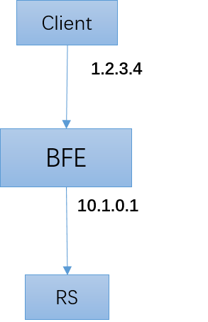
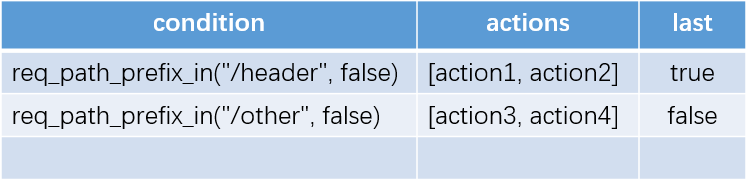

# Information Passthrough

As an HTTP reverse proxy, BFE not only forwards the original HTTP request, but also transmits some additional information to the backend by adding fields in the HTTP header.

## Passthrough of Client IP Address

### Requirement

With BFE forwarding involved, RS cannot obtain the original client IP address, but only the IP address of the BFE instance.

As shown in the figure below, the IP address of the client is 1.2.3.4. After forwarded by BFE, BFE and RS establish a new TCP connection. RS can only see the address of BFE, i.e., 10.1.0.1.



Many applications need to obtain the original IP address of the request. Some mechanism needs to be provided to transfer the original IP address to RS.

### Solution

BFE provides the function of carrying client IP address and port in extension module mod_header by default. As long as it is configured to load mod_header when BFE starts, the header will contain these two information in the request after forwarding.

After BFE forwarding, 2 fields will be added to the request header:

+ X-Real-Ip: used to pass the original client IP address

+ X-Real-Port: used to pass the original client port

Some people may consider obtaining the IP address of the client from "X-Forwarded-For". BFE uses the independently defined "X-Real-Ip" to avoid the forgery of "X-Forwarded-For". If the request already contains the "X-Real-Ip" field when it arrives at BFE, BFE will rewrite the value of this field to the client IP address seen by BFE to avoid forgery of this field.

## Passthrough of Other Information

In addition to the IP address and port of the client, mod_header also provides the ability to add other information to the request.

### Tenant Configuration Table

In mod_header, a configuration table is provided for each tenant. Each configuration item includes:

+ Matching conditions: use "condition expression" (see "[Traffic routing](../route/route. md)") to describe

+ List of actions to execute: 1 to more actions can be executed after matching conditions are hit

  The possible actions are described below.

+ Last: If it is true, it will be returned directly and will no longer match the following rules

  It is different from the "only one hit" mechanism in the "forwarding table" (see "[Traffic routing](../route/route. md)"). In mod_header, A request may hit multiple rules at the same time and execute the actions corresponding to multiple rules. When you want to continue to match other rules, you can set last to false.



### Actions

In mod_header, you can set, add, or delete requests and responses.

When setting or adding, you need to provide the name and value of the header field.

| Action            | Description            | Parameters              |
| -------------- | ---------- | ----------------------- |
| REQ_HEADER_SET | Set request header | HeaderName, HeaderValue |
| REQ_HEADER_ADD | Add request header | HeaderName, HeaderValue |
| REQ_HEADER_DEL | Delete request header | HeaderName              |
| REQ_HEADER_RENAME | Rename request header  | HeaderName, HeaderName2 |
| RSP_HEADER_SET | Set response header | HeaderName, HeaderValue |
| RSP_HEADER_ADD | Add response header | HeaderName, HeaderValue |
| RSP_HEADER_DEL | Delete response header | HeaderName              |
| REQ_HEADER_RENAME | Rename response header | HeaderName, HeaderName2 |

### Example

The following is an example of mod_header configuration.

Only one rule is configured for the tenant example_product. If the rule is hit, perform three actions in sequence, set the request header twice, and set the response header once.

When transmitting information in the request header, users can set the name of the header field according to their own needs.

```
{
    "Version": "20190101000000",
    "Config": {
        "example_product": [
            {
                "cond": "req_path_prefix_in(\"/header\", false)",
                "actions": [
                    {
                        "cmd": "REQ_HEADER_SET",
                        "params": [
                            "X-Bfe-Log-Id",
                            "%bfe_log_id"
                        ]
                    },
                    {
                        "cmd": "REQ_HEADER_SET",
                        "params": [
                            "X-Bfe-Vip",
                            "%bfe_vip"
                        ]
                    },
                    {
                        "cmd": "RSP_HEADER_SET",
                        "params": [
                            "X-Proxied-By",
                            "bfe"
                        ]
                    }
                ],
                "last": true
            }
        ]
    }
}
```

### Builtin Variables

In the above example, built-in variables are used when setting "X-Bfe-Log-Id" and "X-Bfe-Vip". Other built-in variables are also provided in mod_header, which can be used when setting the header.

| Variable                                 | Description                                                  |
| ---------------------------------------- | ------------------------------------------------------------ |
| %bfe_client_ip                           | Client IP                                                    |
| %bfe_client_port                         | Client port                                                  |
| %bfe_request_host                        | Value of Request Host header                                 |
| %bfe_session_id                          | Session ID                                                   |
| %bfe_log_id                              | Request ID                                                   |
| %bfe_cip                                 | Client IP (CIP)                                              |
| %bfe_vip                                 | Virtual IP (VIP)                                             |
| %bfe_server_name                         | BFE instance address                                         |
| %bfe_cluster                             | Backend cluster                                              |
| %bfe_backend_info                        | Backend information                                          |
| %bfe_ssl_resume                          | Whether the TLS/SSL session is resumed with session id or session ticket |
| %bfe_ssl_cipher                          | TLS/SSL cipher suite                                         |
| %bfe_ssl_version                         | TLS/SSL version                                              |
| %bfe_ssl_ja3_raw                         | JA3 fingerprint string for TLS/SSL client                    |
| %bfe_ssl_ja3_hash                        | JA3 fingerprint hash for TLS/SSL client                      |
| %bfe_http2_fingerprint                   | HTTP/2 fingerprint                                           |
| %bfe_protocol                            | Application level protocol                                   |
| %client_cert_serial_number               | Serial number of client certificate                          |
| %client_cert_subject_title               | Subject title of client certificate                          |
| %client_cert_subject_common_name         | Subject Common Name of client certificate                    |
| %client_cert_subject_organization        | Subject Organization of client certificate                   |
| %client_cert_subject_organizational_unit | Subject Organizational Unit of client certificate            |
| %client_cert_subject_province            | Subject Province of client certificate                       |
| %client_cert_subject_country             | Subject Country of client certificate                        |

## links
Previous: [Chap17 HTTPS Optimization](../../../en_us/design/https/https.md)  
Next: [Chap19 Installation And Deployment of BFE Service](../../../en_us/operation/installation/installation.md)