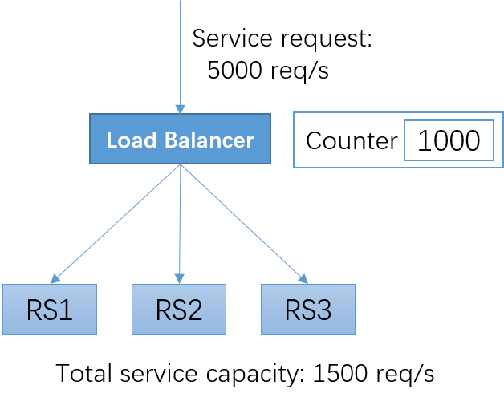
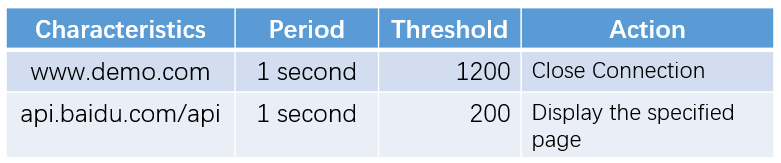
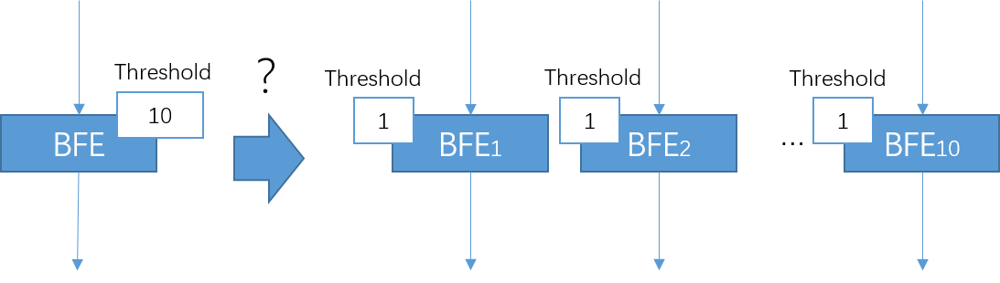
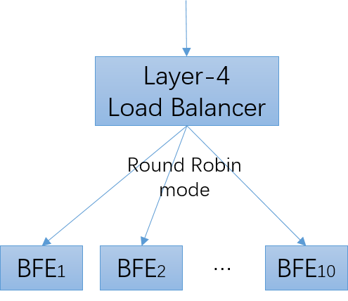
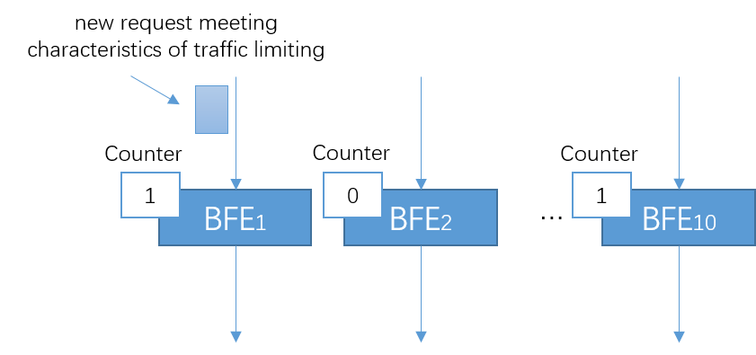
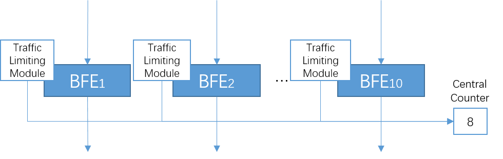
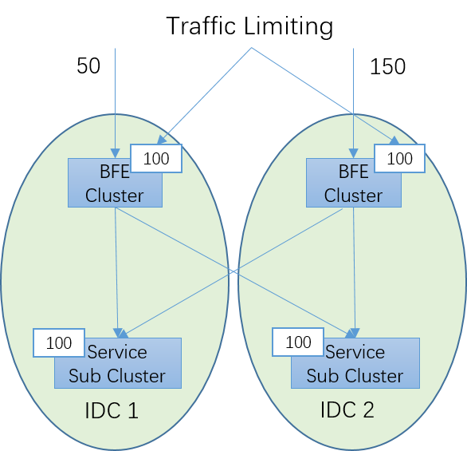
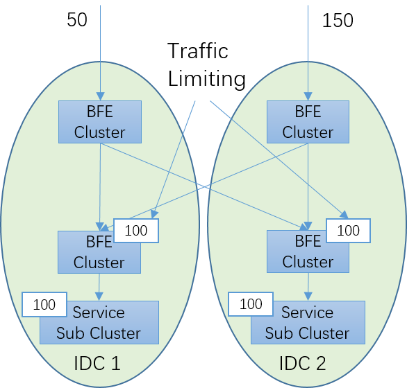

# Traffic Limiting

## Concept

The traffic limiting scenario is shown in the figure above. A service is composed of three RSs, with a total service capacity of 1500 requests per second. At a certain time, the traffic is 5000 requests per second. If load balancer directly forwards all requests to the service, the service will be overloaded, resulting in increased delay in processing all requests, and some requests will be rejected; In serious cases, overloaded traffic can crush the service program or cause other unexpected results. The client program often contains a timeout mechanism. The response with excessive delay is often judged as a failure from the client, which leads to all users' perception of the failure of the service.

The Internet is a very open architecture and cannot restrict the behavior of clients. In normal scenarios, it is also common for requests to exceed the back-end service capacity. For example, some news events may lead to a sudden increase in the number of visits to news websites or search websites. In addition, there will also be service overload caused by malicious attacks.

Load balancing systems often provide a traffic limiting mechanism to protect downstream services. In the load balancing system, service thresholds can be set for downstream services; When the request exceeds the service threshold, load balancer will stop forwarding to RS and directly return the response to the client or directly reject the request. In this way, requests forwarded before exceeding the service threshold can still be processed normally.

## Configuration of Traffic Limiting

For traffic limiting, typical configurations are shown in the figure above, including:

+ Characteristics of counting

  The domain name, URL or other information in HTTP requests may be used as characteristics.

+ Period of counting

  Although it can be set to other values, the period is generally set to 1 second. If it is set to a longer period, all requests within the threshold range may arrive within the first 1 second, thus crushing the service; If the setting is shorter, considering the various delays in the system, the implementation will be very difficult.

+ Threshold

  The threshold of traffic limiting can be set according to the capacity of the service. The capacity of the service may be static (for example, obtained through offline stress testing) or dynamic (for example, it may be inferred from the CPU and other resources in real time).

+ Action

  In the period of counting, if the number of requests exceeds the threshold, the preset action will be triggered. Possible actions include closing the connection, displaying the specified page, etc.

## Distributed Traffic Limiting

In the implementation of traffic limiting, it is necessary to count the requests on the load balancer instance. When the count exceeds a predetermined threshold, a preset action is performed.

In the scenario of using software load balancer, forwarding is often completed by a load balancer cluster composed of multiple load balancer instances. For the traffic limiting function, can we simply distribute the threshold evenly among multiple load balancer instances? For example, in the figure below, the threshold of the traffic limit is 10. If forwarding is completed by 10 BFE instances, and the traffic limit threshold is configured to be 1 on each BFE instance, can the overall traffic limit threshold be 10?

In practice, it is found that the final traffic is often smaller than the preset overall threshold. The reasons for this are:

+ As the the upstream of BFE,  layer-4 load balancer is used to distribute traffic among multiple BFE instances.

+ The effects of layer-4 load balancer are: for a Virtual Server, the new connections are evenly distributed to multiple BFE instances according to the Round Robin mode 

  

+ It should be noted that evenly distribution is for **all requests for a single Virtual Server**, not for **all requests meeting characteristics of traffic limiting**.

+ For requests that meet the characteristics of traffic limiting, the distribution among multiple BFE instances is unbalanced. The scenario shown in the following figure will appear: the count of some BFE instances is still 0, while the count of some BFE instances has reached the threshold value, thus starting to reject traffic.

In order to solve the problems mentioned above, the centralized counting method needs to be adopted in a BFE cluster. When a new request arrives at a BFE instance, the BFE traffic limiting module will report to the centralized counting system (Redis can be used to achieve this). If the centralized  counter exceeds a predetermined threshold, a preset action is performed.

These two types of traffic limiting schemes can also be combined to form a two-stage traffic limiting scheme. First, coarse-grained traffic limiting is realized through the distributed counter at the first level, and the traffic to be processed at the next level is reduced. Then, the second level of centralized counter traffic limiting is used to achieve high-precision traffic limiting.

## Entrance Traffic Limiting vs Destination Traffic Limiting

Some new problems will be encountered when the traffic limiting is used in the multiple data center scenario. Here is a brief analysis.

As shown in the figure below, there are two data centers, in which two BFE clusters are deployed for layer-7 load balancing. There are two service sub-clusters located in two data centers. The traffic limiting function is enabled on both BFE clusters. Assume that the capacity of each service sub-cluster is 100 req/s. In order to protect the service sub-cluster from overload, is it OK to set the traffic limit threshold of each BFE cluster to 100?

In fact, this is not feasible. It cannot be simply assumed that the traffic to the two BFE clusters is equal. As described in "[Traffic Scheduling](../gslb/gslb. md)", the network traffic from outside will change with a variety of reasons, and the traffic relationship between multiple network entrances is very uncertain. The following describes a possibility: the traffic to the entrance of IDC1 is 50 req/s, and the traffic to the entrance of IDC2 is 150 req/s. Although the total traffic does not exceed the total service capacity on the whole, more than 100 traffic will be discarded in the BFE cluster of IDC2 due to the traffic limiting  configuration.

The root cause of this problem is that there is an inconsistency between the **purpose** of traffic limiting (i.e.,  to protect service sub-cluster) and the **means** of traffic limiting (i.e., to limit traffic at the network entrance). To fundamentally solve this problem, it is necessary to change "entrance traffic  limiting" to "destination traffic limiting". The detailed scheme is shown in the figure below.  Layer-7 load balancing clusters of two-layer are required: the upper layer of BFE cluster is used for cross-IDC scheduling, and the lower layer of BFE cluster is used for traffic limiting. The cost of this scheme is higher, and it needs to increase the resource consumption of a layer of load balancing, which can be used in scenarios with high requirements for the accuracy of traffic limiting.

## Traffic Limiting vs Traffic Scheduling

Superficially, there seems to be some similarities between traffic limiting and "[intranet traffic scheduling](../gslb/gslb. md)". Intranet traffic scheduling provides a "black hole" capability, which can actively discard a certain proportion of traffic, and can also play the role of overload protection.

In terms of overload protection capability, there are the following differences between traffic limiting and intranet traffic scheduling:

+ Speed of taking effect

  When the traffic exceeds the threshold, the traffic limiting can take effect in seconds; While, the intranet traffic scheduling needs tens of seconds to make adjustments, and there is no way to deal with second-level burst traffic.

+ Granularity of taking effect

  Based on counters, traffic limiting can be accurate to the granularity of a single request; The effectiveness of intranet traffic scheduling is based on the weight set at BFE, and the control granularity is coarse.
