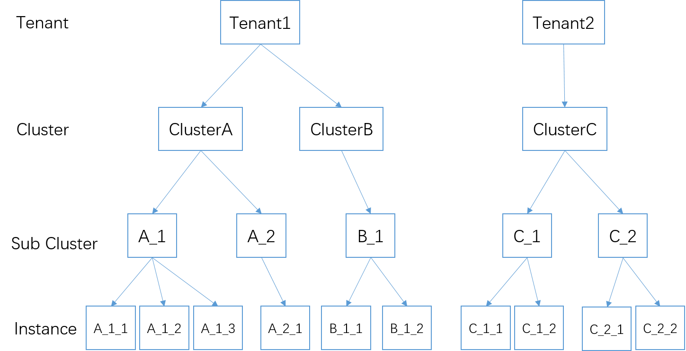
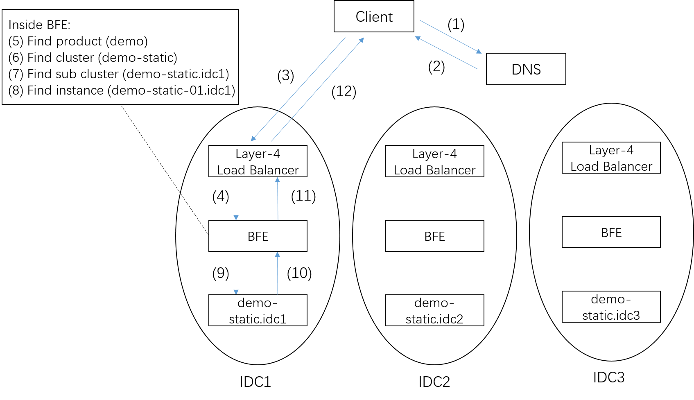

# Forwarding Model of BFE

For a layer-7 load balancing software, the forwarding model is very crucial. This chapter gives a brief introduction to the forwarding model of BFE. In the following chapters, the routing mechanism and traffic balancing mechanism will be introduced in detail.

## Terminology

In BFE, there are the following basic concepts:

+ Tenant

  The services forwarded by BFE can be distinguished by "tenants". The configuration in the BFE engine, such as forwarding policy and the configuration of each plugins, is distinguished by tenants.

  Tenant can also called "product" in BFE.

+ Cluster

  A Cluster means a set of backend servers which provide the same functionality. Multiple clusters can be defined within a product. In some scenarios, clusters can also called services.

  In one tenant, the forwarding table can be used to forward the traffic to the appropriate cluster. For detailed mechanism, please refer to the description of BFE routing mechanism in the following chapter.

+ Sub Cluster

  In the multi data center scenario, clusters can be divided into multiple sub clusters. Usually, you can define the backends in the same IDC (Internet Data Center) as one sub cluster. In some scenarios, sub clusters are also called Instance Groups.

  The concept of sub cluster is introduced to handle traffic scheduling in the multi data center scenario. For detailed mechanism, please refer to the description of traffic scheduling mechanism of BFE in the following chapters.
  
+ Instance

  A sub cluster contains multiple instances (i.e. backend servers).  Each instance is identified by IP address and port.

The following figure illustrates the relationship between these concepts with an example. It includes 2 tenants. Tenant 1 is configured with two clusters (Cluster A and Cluster B), which have two sub clusters and one sub cluster respectively. Each sub cluster has 1-3 instances. Tenant 2 only has one cluster (Cluster C) configured. Cluster C has two sub clusters, each with two instances.

## Traffic Forwarding

The figure above is an example to illustrate the BFE forwarding process.

This is a multi data center scenario, including three data centers (IDC1 to IDC3), each of which has an internet PoP(Point of Presence). The three data centers may be in adjacent areas (generally called Region) or not in the same region.

In each data center, a layer-4 load balancing cluster is deployed, as well as a layer-7 load balancing cluster based on BFE. In general scenarios, BFE exists as RS (Real Server) of  layer-4 load balancer. In a BFE cluster, there are generally more than two BFE instances on different servers. When a BFE instance fails (due to the failure of server hardware, operating system, or BFE itself), the Layer 4 load balancer system can automatically remove the problematic instance to achieve high availability.

Here we assume that there is a service providing static web page, named demo-static. This service is deployed in three data centers and is organized into three independent sub clusters (demo-static. idc1 to demo-static. idc3).

Demo-static uses the domain name demo.example.com to provide services. For each of the three data centers,  an external IP address is assigned, assuming that they are 6.6.6.6, 7.7.7.7 and 8.8.8.8 respectively (Note: these domain names and IP addresses are fictitious and are only used to explain the operation mechanism of BFE).

To access the demo-static service, the client must first resolve the domain name to an appropriate IP address. In steps 1 and 2 of the above figure, according to the location of the client, the IP address returned by the intelligent DNS is 6.6.6.6.

Then the client initiates a TCP connection to port 80 of IP address 6.6.6.6. To make the case simple, it is assumed that the client and server use the normal HTTP protocol to interact instead of the HTTPS protocol. The client establishes a TCP connection with a BFE instance in the BFE cluster through the layer-4 load balancer system. One or more HTTP requests can be sent within a TCP connection. The number of HTTP requests sent in a connection is called the Connection Reuse Rate. Before HTTP/2, the connection reuse rate was 2-3 in general, that is, a TCP connection was closed after 2-3 HTTP requests were sent. After the advent of HTTP/2, the connection reuse rate has been greatly improved.

After the HTTP request arrives at BFE, steps 5 to 8 are the key steps for BFE processing.

+ Step 5: Determine the tenant to which the HTTP request belongs

  Multi tenant support of BFE is a capability designed for cloud scenarios. At present, BFE can determine the tenant according to the Host field in the HTTP request header or the target IP address of the HTTP request.

  In this case, for the domain name demo.example.com in the HTTP request header, BFE finds that the corresponding tenant is "demo".

+ Step 6: Determine the destination cluster of HTTP requests according to the tenant's forwarding rules

  For each tenant,  there is an independent forwarding table. Determine the destination cluster to which the request belongs by looking up the forwarding table. The details of the traffic routing mechanism will be introduced in the following chapters.

  In this case, the corresponding target cluster is determined to be demo-static by looking up the table.

+ Step 7: Select an appropriate sub cluster according to the cluster's traffic scheduling strategy

  For each BFE cluster, the forwarding weight can be set for each sub cluster of each cluster. BFE performs forwarding operations according to the forwarding weight. The details of the traffic scheduling mechanism will be introduced in the following chapters.

  In this case, suppose that on the BFE cluster in IDC1, the forwarding weight corresponding to the three sub clusters of demo-static is (100, 0, 0). Therefore, it is determined that the target sub cluster is demo-static. idc1.

+ Step 8: Select the appropriate instance according to the sub cluster load balancing policy of the cluster

  For each cluster, you can set the load balancing policies of sub clusters, such as WRR (Weighted Round Robin), WLC (Weighted Least Connection), etc. BFE selects the appropriate service instance in the sub cluster to process the request according to the load balancing strategy of the sub cluster.

  In this case, demo-static-01.idc1 is finally selected to process the request.

Then, the request is sent to the backend instance demo-static-01.idc1 (step 9). BFE receives the response from the backend instance (step 10), and returns the response to the client through the layer-4 load balancer system (steps 11 and 12).

## Discussion on Multi Tenant Mechanism

"Multi tenant support" is an important requirement of cloud computing systems.  In the Layer 7 load balancing service, there are two possibilities for the multi tenant implementation mechanism:

(1) Use isolated forwarding resources

This is a common method in many companies. For different services, build an independent layer-7 load balancer cluster. The main advantage of this method is to avoid interference between services, but it will also lead to uneven usage of  resources. In addition, each independent layer-7 load balancer cluster is not large enough to resist traffic burst or attack traffic.

(2) Use shared forwarding resources

This is the method adopted by Baidu. BFE platform is a platform that supports multiple tenants. Thousands of tenants share layer-7 load balancing resources. The shared BFE cluster has sufficient capacity to resist traffic burst or attack traffic. To achieve it, the forwarding engine is required to have multi tenant support, so as to isolate the configuration between multiple tenants; In addition, it is also required to provide platform support for multiple tenants to initiate configuration changes at the same time.

A common problem is how to solve the conflict of resources in the case of sharing forwarding resources. In some cases, the traffic burst of one service may interfere with other services sharing resources. In the mode of sharing resources, this situation cannot be completely avoided. Similar to network QoS, there are two possible solutions: add a complex mechanism for controlling use of resources; not use complex control mechanism, but provide sufficient resources. From the historical experience, the second way has been successful in the Internet. In the layer-7 load balancer scenario, the use of complex control mechanisms will inevitably lead to additional resource consumption. The choice we made was not to use complex control mechanisms, but to provide sufficient resources. If there is a certain service with very large traffic, it can be solved by limiting traffic of  the VS(Virtual Server) of the corresponding service on the layer-4 load balancer.
