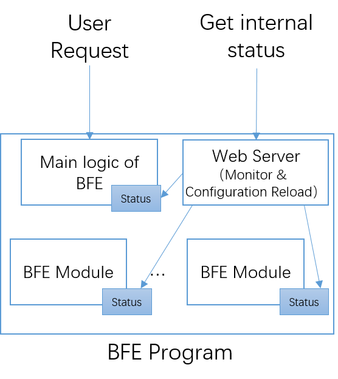
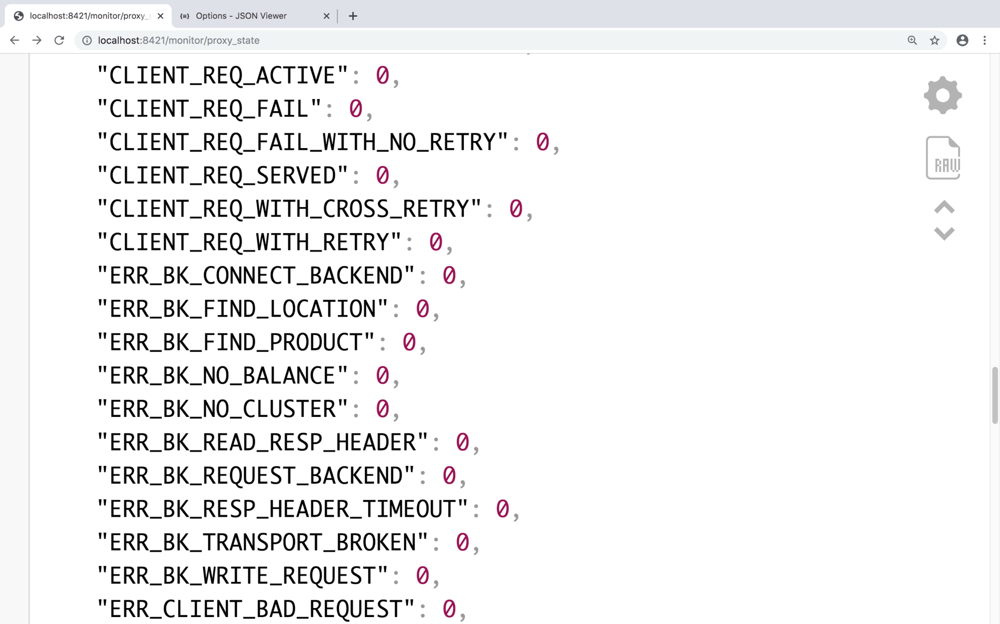
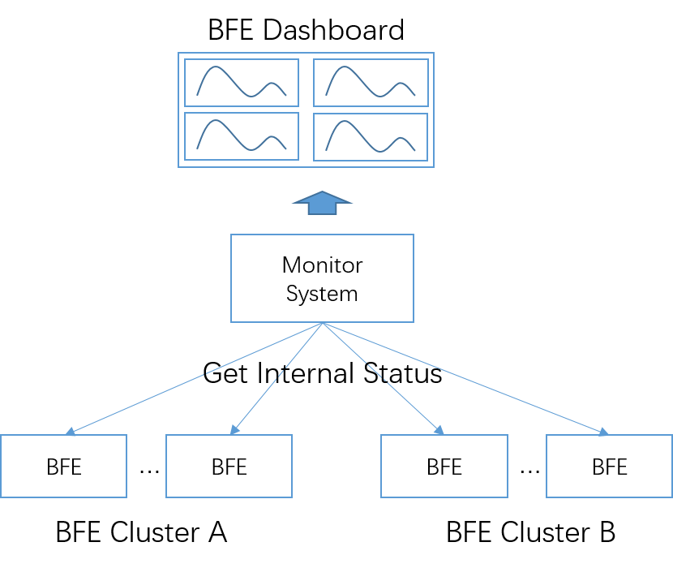
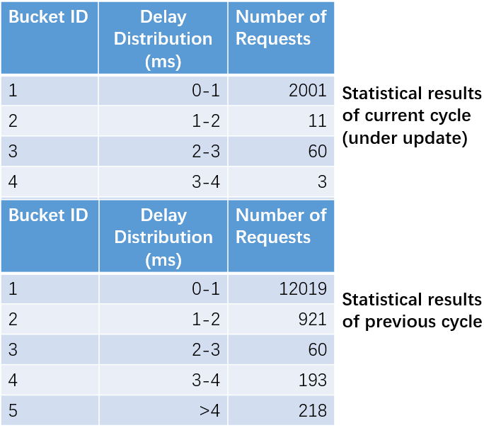

# Status Monitoring

As a layer-7 load balancing software, BFE needs 7 * 24 hours of continuous and stable operation. In order to ensure the stability and correctness of the system, it is very important to monitor the system. The following is a brief introduction to the monitoring mechanism of BFE.

## Log-based Monitoring And Its Problems

Many systems rely on error log to find system problems. The specific methods are as follows:

+ When an error occurs, print a log containing information about the error

+ Configure the monitoring system to monitor the contents of the log, and output an alarm if any error information is found

In many cases, you not only want to see the system error, but also want to see some status of the system. For example, how many concurrent connections are there, how many requests are processed per second, and so on. Similar requirements are realized in many systems by analyzing the log of the system.

The log-based monitoring mechanism has the following problems:

+ The resource consumption of the monitored system is high

  Printing logs involves disk IO, which is a resource-consuming operation. If the log is in text format, the string operation during log format also consumes a lot of CPU resources.

  You can do this experiment: for BFE or Nginx, turn on or off the access log, and you will see obvious performance changes.

+ High resource consumption of monitoring system

  To monitor the log, the monitoring system needs to do read, parse, match and other operations, which are resource consuming.

  I have heard of such cases: the target system uses 4 CPU cores when running; In order to analyze the log of this system, the monitoring system also uses 4 CPU cores. Monitoring uses almost as many resources as the target system, and the cost is too high.

+ Many status information is not suitable for printing

  If you want to know the interactions between systems inside BFE, it is impossible to print the log of these interactions.

## Output of BFE Internal Status



In order to display the internal status information more conveniently, BFE has made some special designs:

+ In the main logic of BFE and each module of BFE, special storage is used to maintain status information

+ Embed a web server in the BFE to read the status information of BFE and trigger configuration loading from outside

The following is an example of viewing the results read from the BFE monitoring port in a browser. The status information is in JSON format by default, and each item includes the name and value of the status variable. For example: CLIENT_REQ_ACTIVE is the number of currently active requests, CLIENT_REQ_SERVED is the total number of requests serviced since the BFE program was started.




The benefits of this design are:

+ Status information can be collected and aggregated at low cost

  The cost of an accumulation calculation of a state is only the "plus 1" operation of a variable in BFE memory.

+ Status information can be read at low cost

  The monitoring system can read dozens or even hundreds of variables at a time through the monitoring port of BFE. Since the status information output by BFE is structured data, it is also convenient for the monitoring system to analyze the content.

Through the above methods, BFE exposes thousands of internal status information, which can reflect the real-time status of all aspects of the system. The monitoring system (such as Prometheus) is used to collect and gather the status information of each BFE instance, which can form the operation and maintenance dashboard of BFE cluster.




## Combination of Internal Status and Log

Although monitoring based on internal status does not rely on logs, logs are still useful.

+ For some errors, you can only see "error occurrence" from the status information, but you cannot see "error details"

+ In this scenario, after monitoring the occurrence of the error based on the status information, you can further query the corresponding log to further understand the error situation

For BFE log mechanism, please refer to "[Log Mechanism](../log/log. md)".

## Web Monitor Library

The status monitor mechanism described above used in BFE has been encapsulated as an independent basic library, named as Web Monitor. The following describes the design mechanism and usage of Web Monitor.

The code for Web Monitor is located at [https://github.com/baidu/go-lib](https://github.com/baidu/go-lib) , in the web-monitor directory.

### Introduction

Web Monitor provides a Web interface to help continuously running daemon programs expose internal status and  do configuration hot reload.

Web Monitor mainly provides the following three types of support:

+ Dedicated customized web server

  This web server can be embedded in the daemon program

+ Callback function registration

  For daemon programs that require external access to the internal status or configuration hot reload, you can register the corresponding status display function or configure the reloading function with Web Monitor

+ Internal status maintenance

  Web Monitor provides various forms of support for daemon programs to maintain internal status

### Maintenance of Status Variable 

#### Type of Variable

In the internal status maintenance, the following scenarios are considered:

+ Counter variable: can only be increased in one direction

+ Gauge variable: can be increased, decreased, or directly changed

+ State variable: You can set a string as the state, such as "on", "off", "red", "green"

The definitions of the above type variables can be viewed in counter.go, gage.go and state.go in the directory [/web monitor/metrics](https://github.com/baidu/go-lib/tree/master/web-monitor/metrics) of [https://github.com/baidu/go-lib](https://github.com/baidu/go-lib).

#### Difference Calculation

For counter variables, Web Monitor also provides the ability to "get the difference within a specified time period". For example, for "CLIENT_REQ_SERVED", it doesn't make much sense to get the total number of requests processed after the BFE program is started. We prefer to get "how many requests have been serviced in the last 20 seconds". The ability to obtain the difference is realized in metrics. go in [/web monitor/metrics](https://github.com/baidu/go-lib/tree/master/web-monitor/metrics). 

The usage of Metrics is as follows:

(1) Define the data type containing status variables

```
import "github.com/baidu/go-lib/web-monitor/metrics"

// define counter struct type
type ServerState {
	ReqServed *metrics.Counter
	ConServed *metrics.Counter
	ConActive *metrics.Gauge
}

var s ServerState
```

(2) Define and initialize Metrics variables

In the Init() function of Metrics

+ The second parameter is "prefix string"

  The output of Web Monitor has a format of key-value mode. When outputting in this mode, the "prefix string" will be placed in front of the original variable name, so that the status variables can be distinguished globally in complex scenarios. In this example, the "PROXY" prefix is added. When outputting in key-value mode, it will be displayed as follows:

```
PROXY_REQ_SERVED: 0
PROXY_CON_SERVED: 0
PROXY_CON_ACTIVE: 0
```

+ The third parameter is "interval time for difference calculation"

  It is set to 20 seconds in this example

```
// create metrics
var m metrics.Metrics
m.Init(&s, "PROXY", 20)
```

(3) Related operations of status variables. For example:

```
// counter operations
s.ConActive.Inc(2)
s.ConServed.Inc(1)
s.ReqServed.Inc(1)
s.ConActive.Dec(1)
```

(4) Get results

The "absolute values" of all variables can be obtained by calling the GetAll() function of Metrics; Call the GetDiff() function to obtain the "change value" of the Counter type within 20 seconds.

```
// get absolute data for all metrics
stateData := m.GetAll()
// get diff data for all counters
stateDiff := m.GetDiff()
```

#### Use Cases

The status variables of BFE main logic are defined in state. go in [/bfe_server](https://github.com/bfenetworks/bfe/blob/develop/bfe_server).

The mechanism of status variables can also be used in the development of extension modules of BFE. Please refer to the description in "[How to develop BFE extension modules](../../development/how_to_write_module/how_to_write_module. md)".

### Maintenance of Delay Statistics Variable 

In BFE, it is also necessary to count some processing delays, such as the delay of forwarding processing and the delay of HTTPS handshake.

In Web Monitor, Delay Counter is provided to support the statistics of delay.

#### Function Description

The Delay Counter supports the following capabilities:

+ Average delay

  The average delay can be calculated by recording the number of samples and the total delay

+ Distribution of delay

  The user can specify the number of delay statistics buckets and the time size of each bucket, and obtain the number of requests falling into each delay bucket.

The above statistics are all for a certain time period. The user of the Delay Counter needs to specify the statistical period (for example, 60 seconds). The Delay Counter will output the statistics of the "current period". If you refresh the interface of the Web Monitor, you will find that these statistics are continuously changing. From the perspective of observing long-term changes, it is necessary to obtain its stable statistical value after the end of each cycle. For this reason, the Delay Counter will also provide the statistical results of the "previous cycle".



#### Usage

The usage of Delay Counter is as follows:

(1) Define and initialize the Delay Counter

```
import "github.com/baidu/go-lib/web-monitor/delay_counter"

ProxyDelay = new(delay_counter.DelayRecent)
	
// The three parameters of Init are: statistical cycle, size of bucket(ms), and number of buckets
ProxyDelay.Init(60, 1, 10)
```

(2) Add sample

```
ProxyDelay.AddBySub(startTime, endTime)
```
(3) Output results in text

```
// params is the parameter passed in by the Web Server of Web Monitor
ProxyDelay.FormatOutput(params)
```

### Establish the Dedicated Web Server

The dedicated Web Server embeded in BFE, is defined in web_server.go in [/bfe_server](https://github.com/bfenetworks/bfe/blob/develop/bfe_server ):

```
func newBfeMonitor(srv *BfeServer, monitorPort int) (*BfeMonitor, error) {
	m := &BfeMonitor{nil, nil, srv}

	// initialize web handlers
	m.WebHandlers = web_monitor.NewWebHandlers()
	if err := m.WebHandlersInit(m.srv); err != nil {
		log.Logger.Error("newBfeMonitor(): in WebHandlersInit(): ", err.Error())
		return nil, err
	}

	// initialize web server
	m.WebServer = web_monitor.NewMonitorServer("bfe", srv.Version, monitorPort)
	m.WebServer.HandlersSet(m.WebHandlers)

	return m, nil
}
```

In the above code, the variable **m.WebHandlers** to maintain the callback function is established, and the variable **m.WebServer** for the Web Server is also established.


Finally, the Web Server is started.

```
func (m *BfeMonitor) Start() {
	go m.WebServer.Start()
}
```

### Register Callback Functions
In the **m.WebHandlersInit()** called in the previous paragraph, both the callback function used to output the internal status and the callback function used to dynamically load the configuration are registered:

```
func (m *BfeMonitor) WebHandlersInit(srv *BfeServer) error {
	// register handlers for monitor
	err := web_monitor.RegisterHandlers(m.WebHandlers, web_monitor.WebHandleMonitor,
		m.monitorHandlers())
	if err != nil {
		return err
	}

	// register handlers for for reload
	err = web_monitor.RegisterHandlers(m.WebHandlers, web_monitor.WebHandleReload,
		m.reloadHandlers())
	if err != nil {
		return err
	}

	return nil
}
```

The above is the logic of the callback function in BFE main program. There are also independent registration logic for each extension module. Please refer to the description in "[How to develop BFE extension module](../../development/how_to_write_module/how_to_write_module. md)".
