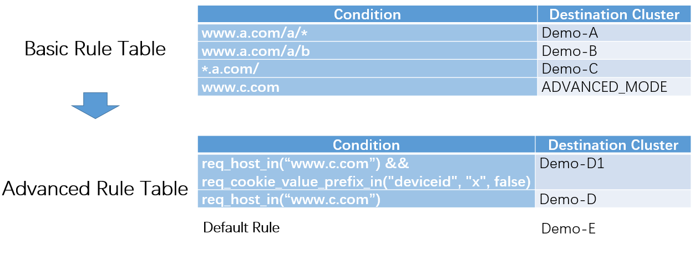

# Traffic Routing

## Overview

In BFE [forwarding model](https://www.bfe-networks.net/en_us/introduction/forward_model/), after "product name" for one request is determined, the destination cluster should be specified. BFE provides a Forwarding Table for each product. For each request, the forwarding table for the determined product is searched, and destination cluster is specified.


## Forwarding Table

A Forwarding Table is composed of two parts:

- **Basic Rule Table**, consists of "Basic Rules". BFE searches "host" and/or "path" conditions to match a Basic Rule.
- **Advanced Rule Table**, consists of "Advanced Rules". It's searched in listed order (from up to down). Various request contents (including host, path, header, cookie, method, etc) can be used in search to match conditions in advanced rules. A Default Rule should be configured in Advanced Rule Table, as the last resort.

Basic Rule Table uses tree search and can be searched fast, even with large amount (thousands, for example) of rules configured. Advanced Rule Table has more powerful condition description capability, but its search performance may degrade when number of rules is large ( >100 rules, for example).

BFE search in the forwarding table in the following steps:

- BFE will search in Basic Rule Table first, then Advanced Rule Table, to specify the destination cluster for a request.
- If required, destination cluster of a Basic Rule can be set to "ADVANCED_MODE". If such a rule is hit, BFE will continue to search in the Advanced Rule Table for this request.


The following figure shows an example of forwarding table. In this example, there are five service clusters: Demo-A, Demo-B, Demo-C, Demo-D, Demo-E. Demo-E is the destination cluster for the default rule. The traffic is distinguished from Demo-A to Demo-D in the basic rule table.  For Demo-D, there is one cluster Demo-D1 for canary release.  Traffic for Demo-D is distinguished in advanced rule table further.

In the advanced table, each forwarding rule includes two parts: condition and destination cluster. Condition Expressions are used to describe the forwarding conditions.



## Condition Expression

Conditional expression is the core mechanism of BFE forwarding. The design consideration and mechanism of condition expression are introduced below.

For more details about condition expression, see the [BFE open source website]( https://github.com/bfenetworks/bfe/tree/develop/docs/en_us/condition).

### Design Ideas

Before using Go language to refactor the BFE forwarding engine, BFE uses regular expression to describe the forwarding conditions. In practice, we found the following two serious problems with regular expressions:

+ Configuration is difficult to maintain

  Regular expressions have serious readability problems. The forwarding conditions written with regular expressions are difficult to understand and easy to have ambiguity. It is often found that the conditions written by one person are difficult for others to take over and maintain.

+ There are potential performance problems

  For improperly written regular expressions, serious performance degradation may occur under specific traffic characteristics. There has been such a situation that the performance of a service that can handle thousands of requests per second has decreased to only handle dozens of requests per second due to the addition of a regular expression.

To avoid the problem of regular expression, condition expression is designed when refactoring BFE forwarding engine. The main ideas in the design of conditional expressions are:

+ Specify the HTTP request fields to be used in the expression to improve readability

  For example, from the name req_path_prefix_in() , it can be immediately seen as prefix matching for the path part of the request; From the name req_method_in(), it can be seen to match the method field of the request.

+ Control the complexity of calculation and reduce the risk of performance degradation

  In the condition expression, the calculation methods such as exact match, prefix match and suffix match are mainly used. These calculation methods have low computational complexity.

### Basic Concepts

#### Condition Primitive

- A condition primitive is a basic and built-in function which checks some specified condition is matched or not.

``` go
// return true if the request Host is "www.bfe-networks.com" or "bfe-networks.com"
req_host_in("bfe-networks.com|bfe-networks.org") 
```

+ Condition primitives are the smallest units of judgment. According to the classification of request, response, session and system, dozens of condition primitives have been established. You can also add new condition primitives as required.

#### Condition Expression

- A condition expression is a series of condition primitives combined with operators (e.g. AND, OR, NOT, etc).

```go
// return ture if the request host is "bfe-networks.com" and the request method is "GET"
req_host_in("bfe-networks.com") && req_method_in("GET") 
```

#### Condition Variable

- You can define a variable and assign a condition expression to it.

```go
// define a condition varaible
bfe_host = req_host_in("bfe-networks.com") 
```

#### Advanced Condition Expression

- An advanced condition expression is a series of condition primitives and condition variables combined with operators (e.g. AND, OR, NOT, etc).

- In an advanced condition expression, the condition variable is identified by "$" prefix

```go
// return true if the value of new_host is true and the request method is GET
$new_host && req_method_in("GET") 
```

+ The introduction of condition variables and advanced condition expressions is to facilitate the reuse of condition expression logic.

### Grammar

#### Condition Primitive Grammar

A condition primitive is shown as follows:

```go
func_name(params)
```

- **func_name** is the name of condition primitive
- **params** are the parameters condition primitive
- The type of return value is **bool**

#### Condition Expression Grammar

Condition Expression(CE) grammar is defined as follows:

```
CE = CE && CE
   | CE || CE
   | ( CE )
   | ! CE
   | ConditionPrimitive
```

#### Advanced Condition Expression Grammar

Advanced Condition Expression(ACE) grammar is defined as follows:

```
ACE = ACE && ACE
    | ACE || ACE
    | ( ACE )
    | ! ACE
    | ConditionPrimitive
    | ConditionVariable
```

#### Operator Precedence

The precedence and associativity of operators are similar to the C language. The following table lists the precedence and associativity of all operators. Operators are listed top to bottom, in descending precedence.

| Precedence | Operator | Description            | Associativity |
| ---------- | -------- | ---------------------- | ------------- |
| 1          | ()       | parentheses (grouping) | Left-to-right |
| 2          | !        | logical NOT            | Right-to-left |
| 3          | &&       | logical AND            | Left-to-right |
| 4          | \|\|     | logical OR             | Left-to-right |

### The Content Matched By Condition Primitives

The condition primitive can match the content in the request, response, session and request context. Each condition primitive will accurately match a certain content. This way improves the accuracy of forwarding configuration description, and also improves readability and maintainability.

The contents matched by condition primitives include:

+ **cip**：Client IP address
  + For example: req_cip_range(start_ip, end_ip)
+ **vip**：Virtual IP address
  + For example: req_vip_in(vip_list)
+ **cookie**: Cookie in HTTP header
  + For a cookie, it contains key and value
  + For example: req_cookie_key_in(key_list)，req_cookie_value_in(key, value_list, case_insensitive)
+ **header**：To be precise, it should be the HTTP header field
  + For an HTTP header field, it contains key and value
  + For example: req_header_key_in(key_list)，req_header_value_in(header_name, value_list, case_insensitive)
+ **method**：HTTP method
  + HTTP methods include GET, POST, PUT, DELETE, etc
  + For example: req_method_in(method_list)
+ **URL**: Uniform Resource Locator
  + For example: req_url_regmatch(reg_exp)

For URLs, the detailed format is:

```
scheme:[//authority]path[?query][#fragment]
```

Where, the format of authority is:

```
[userinfo@]host[:port]
```

For URLs, you can further match the contents:

+ **host**: 
  + For example: req_host_in(host_list)
+ **port**:
  + For example: req_port_in(port_list)
+ **path**:
  + For example: req_path_in(path_list, case_insensitive)
+ **query**:
  + For a query string, it contains key and value
  + For example: req_query_key_in(key_list)，req_query_value_in(key, value_list, case_insensitive)

### Naming Convention of Condition Primitives

At present, more than 40 condition primitives have been included in the BFE. The names of condition primitives will follow certain convention for easy classification and reading.

For the full list of condition primitives supported by BFE, please see [BFE open source website](https://github.com/bfenetworks/bfe/blob/develop/docs/zh_cn/condition/condition_primitive_index.md).

#### Name Prefix of Condition Primitives

- Name prefix of the request primitive is "**req_**"
  
- - e.g. req_host_in()
- Name prefix of the response primitive is "**res_**"
  - e.g. res_code_in()
- Name prefix of the session primitive is "**ses_**"
  - e.g. ses_vip_in()
- Name prefix of the system primitive is "**bfe_**"
  - e.g. bfe_time_range()

#### Name of Comparison Operations

- **match**: exact match

- - eg. req_tag_match()
- **in**: whether an element exists in a set or not
  - eg. req_host_in()
- **prefix_in**: whether the prefix exists in a set or not
  - eg. req_path_prefix_in()
- **suffix_in**: whether the suffix exists in a set or not
  - eg. req_path_suffix_in()
- **key_exist**: whether the specified key exists or not
  - eg. req_query_key_exist()
- **value_in**: whether the value exists in a set or not
  - eg. req_query_key_exist()
- **value_prefix_in**: whether the value prefix exists in a set or not
  - eg. req_header_value_prefix_in()
- **value_suffix_in**: whether the value suffix exists in a set or not
  - eg. req_header_value_suffix_in()
- **range**: range match
  - eg. req_cip_range()
- **regmatch**: use regular expression to match
  - eg. req_url_regmatch()
  - Warning: Inappropriate use can significantly affect performance
- **contain**: string match
  - eg. req_cookie_value_contain()
