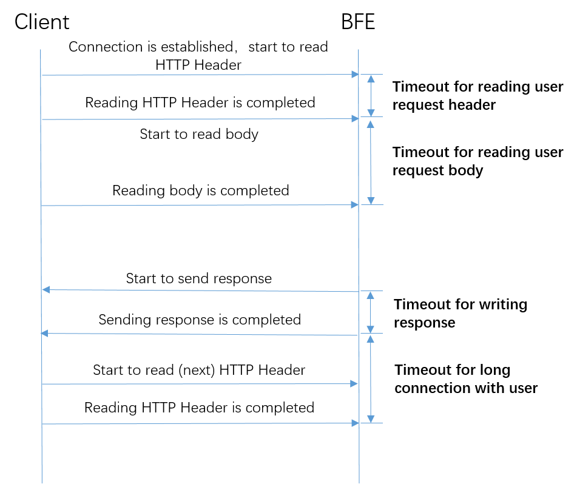
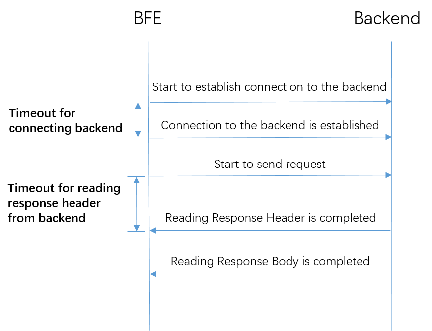

# Timeout Setting

There are some configurations involving timeout in BFE, including:

+ Timeout of communication between BFE and clients

+ Timeout of communication between BFE and backend instance

The timeout setting is very important for the traffic processing.

## Timeout of Communication Between Client and BFE

### Definition

The timeout of communication between BFE and clients includes:

+ **Timeout for reading user request header**: from the connection establishment to the completion of reading the request header from client

+ **Timeout for reading user request body**: from completion of reading request header to completion of reading request body

+ **Timeout for writing response**: from sending the response header to sending the response completely to the client

+ **Timeout for long connection with user**: from the end of the previous request to the completion of reading the next request header



### Method of Configuration

+ **Timeout for reading user request header**

  It is configured in [/conf/bfe. conf](https://github.com/bfenetworks/bfe/tree/master/conf). The unit is seconds. This configuration can only take effect when the program is restarted, and cannot be hot reloaded.

```
[Server]
...
# read timeout, in seconds
ClientReadTimeout = 60
...
```

+ **Timeout for reading user request body**

  It is configured in [/conf/server_data_conf/cluster_conf. data](https://github.com/bfenetworks/bfe/blob/master/conf/server_data_conf/cluster_conf.data). The unit is milliseconds. It is configured independently for each cluster.

```
{
    "Version": "init version",
    "Config": {
   		"cluster_example": {
    		...
    	    "ClusterBasic": {
                "TimeoutReadClient": 30000,
                ...
            }
    	 }
    }
}
```

+ **Timeout for writing response**

  It is configured in [/conf/server_data_conf/cluster_conf. data](https://github.com/bfenetworks/bfe/blob/master/conf/server_data_conf/cluster_conf.data). The unit is milliseconds. It is configured independently for each cluster.

```
{
    "Version": "init version",
    "Config": {
   		"cluster_example": {
    		...
    	    "ClusterBasic": {
                "TimeoutWriteClient": 60000,
                ...
            }
    	 }
    }
}
```

In [/conf/bfe. conf](https://github.com/bfenetworks/bfe/tree/master/conf), it contains the default configuration of timeout for writing response. This configuration is applicable to scenarios where the cluster for the request is unknown and the timeout needs to be controlled. For example, the default timeout configuration is used when the backend cluster is not determined by forwarding rules, and the customized response needs to be returned directly from BFE.

```
[Server]
...
# write timeout, in seconds
ClientWriteTimeout = 60
...
```


+ **Timeout for long connection with user**

  It is configured in [/conf/server_data_conf/cluster_conf. data](https://github.com/bfenetworks/bfe/blob/master/conf/server_data_conf/cluster_conf.data). The unit is milliseconds. It is configured independently for each cluster.

```
{
    "Version": "init version",
    "Config": {
   		"cluster_example": {
    		...
    	    "ClusterBasic": {
                "TimeoutReadClientAgain": 30000,
                ...
            }
    	 }
    }
}
```

## Timeout of Communication Between BFE and Backend Instance

### Definition

The timeout of communication between BFE and backend instance includes:

+ **Timeout for connecting backend**: from start of establishing connection to the backend to the completion of the establishment of the connection

+ **Timeout for reading response header from backend**: from BFE sending request to the backend to the completion of receiving response header




### Method of Configuration

+ **Timeout for connecting backend**

  It is configured in [/conf/server_data_conf/cluster_conf. data](https://github.com/bfenetworks/bfe/blob/master/conf/server_data_conf/cluster_conf.data). The unit is milliseconds. It is configured independently for each cluster.

```
{
    "Version": "init version",
    "Config": {
   		"cluster_example": {
    		...
    	    "BackendConf": {
                "TimeoutConnSrv": 2000,
                ...
            }
    	 }
    }
}
```

+ **Timeout for reading response header from backend**

  It is configured in [/conf/server_data_conf/cluster_conf. data](https://github.com/bfenetworks/bfe/blob/master/conf/server_data_conf/cluster_conf.data). The unit is milliseconds. It is configured independently for each cluster.

```
{
    "Version": "init version",
    "Config": {
   		"cluster_example": {
    		...
    	    "BackendConf": {
                "TimeoutResponseHeader": 50000,
                ...
            }
    	 }
    }
}
```


