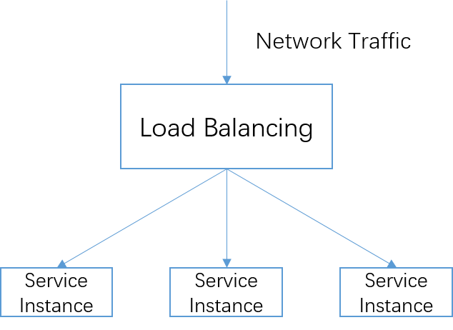
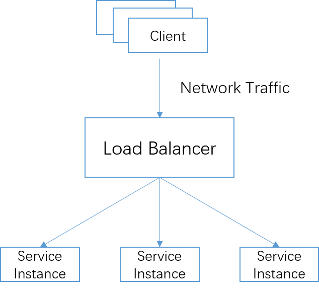
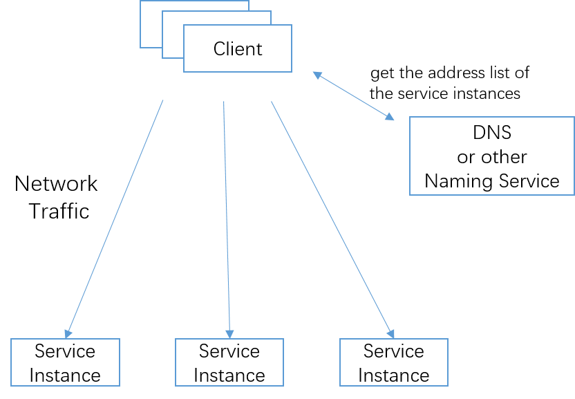
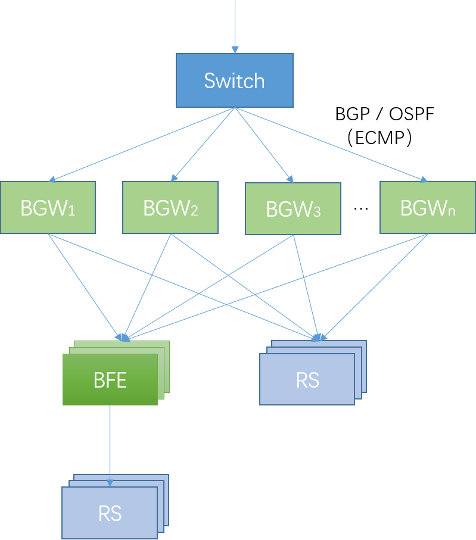

# Introduction to Network Load Balancing Technology

In the previous chapter, the background of BFE is introduced from the perspective of "network front-end access". From the perspective of system classification, BFE also belongs to the category of "network load balancing". To facilitate your understanding, the following is a brief introduction to network load balancing technology.

## Concept

In computing, **load balancing** is the process of distributing a set of tasks over a set of resources (from wikipedia). Load balancing technology is widely used in distributed computing scenarios. As long as there is more than one computing unit, you need to consider using load balancing technology.

In the network field, the load balancer is responsible for distributing network traffic to multiple downstream instances.

## Load Balancer vs Naming Service

### Mechanism Description

The network load balancing function can be realized in two ways:

+ Load balancer
  All network traffic is sent to the load balancer first, and then forwarded to the downstream service instance by the load balancer.
  In this way, the load balancer performs the load balancing function.

+ Naming service + client strategy
The client obtains the address list of the service instances through DNS (or other naming service), and then sends the network traffic directly to the service instances.
  In this way, the load balancing function is completed by the client and the naming service. The naming service has certain strategies when returning the address list of service instances; After obtaining the address list of the service instances, the client can also have certain strategies when sending network traffic.

### Scheme Comparison

The above two schemes are compared in the following table.

**The load balancer based method** is applicable to scenarios with high requirements for flow control, and can achieve fine forwarding control of a single connection/request granularity. In addition, this method has very low requirements for the client. The client does not need to implement any strategy, nor does it involve the introduction of the client SDK. The disadvantage of this method is that additional resources need to be invested in the load balancer, and the required resource cost needs to be calculated when using it.

The advantage of **the naming service+client strategy method** is that the client accesses the service directly without additional resource consumption. However, the actual effect of this method strongly depends on the cooperation of the client. To implement more complex strategies on the client, the client SDK is usually introduced, which introduces the cost of client upgrading. For many companies, there are many kinds of client software, belonging to different teams, and it is difficult to upgrade in time. In addition, the execution granularity of this method is relatively coarse. The interaction between the client and the naming service cannot be too frequent. The interaction frequency of several seconds is already very high, but even in this way, it is impossible to control the granularity of a single connection/request.

In some scenarios, the load balancer cannot be used, the naming service+client strategy is the only solution. For example, in [Internet Scheduling Scenario](../../design/gslb/gslb. md), you can only use DNS.

| Solution                         | Control on Traffic                                           | Resource Consumption                                         | Requirements for Clients                                     | Applicable Scenarios                                         |
| -------------------------------- | ------------------------------------------------------------ | ------------------------------------------------------------ | ------------------------------------------------------------ | ------------------------------------------------------------ |
| Load Balancer Based              | **Strong**. It can achieve the granularity of a single connection/request. | **High**. The load balancer introduces additional resource consumption. | **Low**. The client does not need to implement complex policies. | The overall traffic scale is small (from the perspective of load balancer resource consumption); Application scenarios require strong flow control. |
| Naming service + Client strategy | **Weak**. The client accesses the service directly. There is no reliable control point, and  fine flow control can not be achieved. | **Low**. No additional resource is required.                | **High**. The client needs to support complex strategies and involves upgrading. | The overall traffic scale is large; The application scenario requires weak flow control; Scenarios where load balancers cannot be used. |

## Layer-4 Load Balancing vs. Layer-7 Load Balancing

The traditional hardware network load balancer includes more comprehensive functions. From the perspective of protocol, it includes support for TCP and UDP traffic, as well as handling HTTP, HTTPS and other protocols.

In most Internet companies, load balancers in the form of software are widely used, and they are divided into two different systems based on the protocols they process:

+ Layer-4 load balancing: It is only used to process TCP and UDP traffic. Also called network load balancing.

  Layer-4 load balancing is mainly based on IP address, port information in forwarding.
  Open source software for layer-4 load balancing includes LVS, DPVS, etc.

+ Layer-7 load balancing: supports the processing of HTTP, HTTPS, SSL, TLS and other protocols. Also called application load balancing.

  The layer-7 load balancer can use the information of the application layer (such as the HTTP request header) in forwarding, which is invisible to the layer-4 load balancer.
  Open source software for layer-7 load balancing includes Nginx, BFE, Traefik, Envoy, etc.

Some software supports both layer-4 load balancing and layer-7 load balancing, such as Nginx and Haproxy. However, in large-scale deployment scenarios, dedicated layer-4 load balancing software is generally used. The main reason is that there are large differences between the  layer-4 load balancing and  layer-7 load balancing scenarios, which are suitable for different technology stacks.

+ Layer-4 load balancing software: It requires high processing power to achieve high cost performance ratio and is used to resist DDoS attacks from the external network.

  The BGW software introduced in "[Introduction to Network Front End](../introduction/introduction. md)" uses C language and is developed based on DPDK technology. It can handle 50Gbps of network traffic on a single x86 server, and can handle more than 1 million new connections per second. To achieve higher performance, the overall logic of the software needs to be simple, without the function of high resource consumption. At the same time, because of the high requirements for performance and stability, the cost of developing new features is relatively high, and the cycle of developing new features and going online is relatively long.

+ Layer-7 load balancing software: Its functions are relatively complex, and new features need to be added continuously.

  The layer-7 load balancing software can "see" the information of the application layer, and the features required are much more than that of layer-4 load balancing software. As it is closer to the application, it will continue to receive demand from the applicaiton, and needs to constantly develop new features; Due to the characteristics of Internet application, faster development and online speed are required. The performance requirements of the layer-7 load balancer software are lower than those of the layer-4 load balancer software, and there is almost an order of magnitude difference in bandwidth throughput.

The following figure illustrates the mixed use of the layer-4 load balancing software and the layer-7 load balancing software, taking Baidu's BGW and BFE as examples.

+ Interconnection between BGW and switch

  BGW interacts with upstream switches through BGP or OSPF routing protocols. The switch uses the ECMP (Equal Cost Multi Path) mechanism to distribute traffic to multiple BGW instances.

  For a VS (Virtual Server, indicated by (IP address, protocol, port)), all BGW instances can receive and process its traffic. In this way, the distributed fault tolerance of BGW is realized. In the case of a single BGW instance failure, the BGW cluster can continue to process traffic forwarding.

+ Interconnection of BGW and downstream services

  Each BGW instance forwards traffic to downstream RS (Real Server, corresponding to VS) according to Round Robin (or other policies).

+ Interconnection of BGW and BFE

  In the scenario of using layer-7 load balancing, BGW regards BFE as RS and forwards the traffic to a VS to the downstream BFE instance. In case of BFE instance failure, BGW can automatically remove the failed BFE instance.

+ Interconnection of BFE and downstream services

  Each BFE instance forwards traffic to downstream RS according to Round Robin (or other policies).

