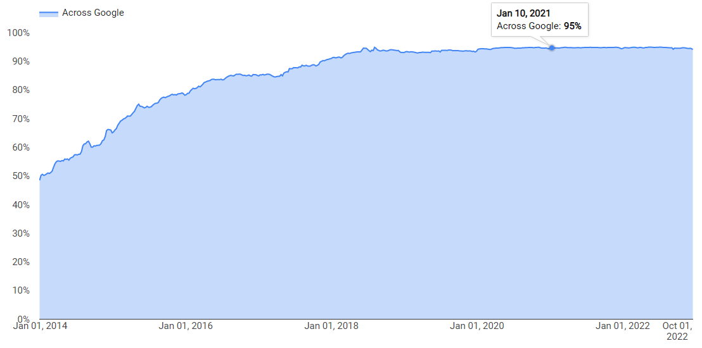

# Trend of Network Front End Technology

## Encryption of Network Transmission

As a technology for encrypting network traffic, HTTPS has been proposed in RFC2818 as early as 2000. However, HTTPS has not been widely used in the industry for more than ten years.

With the rapid penetration of the Internet in the field of human life in recent years, the economic benefits carried by the Internet are getting higher and higher, and the security risks caused by HTTP plaintext transmission are getting bigger and bigger. For websites that do not use HTTPS technology, the following threats may exist:

+ With DNS hijacking technology, websites may be forged. For websites containing accounts with economic benefits (such as banks and e-commerce), hackers can cheat users' account names and passwords.

+ The content obtained by the user may be tampered with. For example, for some high-quality websites, hackers may obtain illegal benefits through adding advertising content without the awareness of the website owner.
+ The user's information may be sniffed. For example, by sniffing users' traffic to search, e-commerce and other websites, hackers can resell these information to third-party companies for optimization of advertising.

From the perspective of protecting search traffic from hijacking and eavesdropping, Google has vigorously promoted its own HTTPS transformation since 2014. From 2014 to 2020, the coverage HTTPS traffic for its products and services  will increase from 50% to 95% (see https://transparencyreport.google.com/https/overview ). At the same time, Google has also promoted third-party websites to upgrade to HTTPS through the huge influence of Chrome browser. For websites that do not use HTTPS, they will be displayed as "unsafe" in Chrome browser. Almost at the same time, the major domestic Internet companies also started the "whole website HTTPS transformation".

It must be noted that the application of HTTPS is definitely not as simple as "encrypting HTTP traffic". HTTPS brings a series of challenges to companies using this technology:

+ Increased requirements for network resource management

​		HTTPS certificate is involved in HTTPS, and certificate is closely related to domain name. In the process of HTTPS transformation, some enterprises may find that a large number of domain names applied in disorder before may cause great problems in the use and cost of certificates.

+ External dependency enhancement

​		After HTTPS is used, it is more difficult for the server to be compatible with the client due to the more complex technology. When upgrading the server program, it is possible that some client programs/code bases are incompatible, resulting in exceptions in service access. In addition, after HTTPS is used, CA (Certificate Authority) is heavily relied on. CA has become a new hidden danger for website stability and security.

+ Impact on performance

​		The use of encryption and decryption technologies in HTTPS will definitely have an impact on performance. In particular, the asymmetric encryption and decryption computing used in it will consume a lot of CPU computing resources, which will lead to the increase of website cost and increase the risk of DDoS attacks.

+ Impact on delay

​		Compared with HTTP, HTTPS will increase 1 to 2 rounds of protocol message interaction, thus increasing the user's access delay. For scenarios where there is a large network delay between users and websites, HTTPS will double or triple this delay.

For these challenges, we need to adopt some measures in technology and mechanism to solve them.

## Increased Technical Threshold of Nework Protocol

About 20 years ago, building a website might be relatively simple. HTTP was the mainstream network protocol. A technician who may not know much about the network can download an Apache software (later Nginx), install and run it according to some simple instructions.

In recent years, with the upgrading of security technology and the upgrading of network protocols for mobile Internet, HTTPS, SPDY, HTTP/2, QUIC and other protocols are constantly emerging or widely used. Compared with HTTP protocol, the complexity of these protocols is much higher, and not everyone can quickly master them. If there is no in-depth understanding of relevant protocol technologies, there may be many problems in security, stability, performance, etc. This situation has promoted the specialization of network front-end access personnel. Many companies, especially large Internet companies, have established special network front-end access teams.

## Impact of Mobility on Network Front End

The mobility of network access is reflected in two aspects. First of all, in terms of network transmission media, a considerable proportion of traffic is accessed through wireless Internet (Wifi, 3G/4G/5G). On the other hand, a considerable proportion of users access through mobile terminals/mobile clients, rather than through PCs. As early as October 2014, Baidu's search traffic from mobile clients exceeded that from PCs.

The mobility of network access has an important impact on the network front-end access, as shown in:

+ Rapid upgrade of transmission protocol

​		Many important assumptions contained in the design of the TCP protocol (which is most commonly used by the Internet) are based on wired networks. For example, packet loss is mainly due to congestion in the network, so packet loss can be used as a signal of congestion; The end-to-end delay and bandwidth are relatively stable for a certain period of time. The loss is detected through the timeout mechanism. In the wireless Internet scenario, many of the above assumptions have been broken. Because of the characteristics of wireless links, many packets are lost not due to congestion; End to end latency and bandwidth are also unstable. This change has led to the upgrading of Internet protocols.

+ Customization of transmission protocol

​		As we all know, TCP is located in the network protocol stack of the operating system. There are only three companies in the world that can modify the mobile operating system: Google (Android), Apple (iOS, Mac OS), and Microsoft (Windows). For other companies, the possibility of continuous optimization of TCP protocol on the client side is very low, and many previous optimizations can only be done from the server side. The widespread use of mobile terminals, especially the Native App, has changed this situation. QUIC protocol is an example. It is based on UDP protocol and runs in APP. Any company can modify and optimize it according to its own needs.

+ The rise of HTTPDNS

​		DNS is one of the three basic mechanisms of the Internet (the other two are IP routing and TCP congestion control). DNS is easy to be hijacked, slow to take effect, low resolution accuracy and has other inherent problems. There are opportunities to solve the problems of DNS in the mobile Internet era.

## Increased Importance of Network Security

The economic benefits of Internet services have also led to various attacks, such as DDoS attacks that make websites unable to serve under great pressure, or application layer attacks that take advantage of various vulnerabilities of websites. Network attacks are attracted by the value of business. The greater the company's revenue, the greater the possibility of being attacked. If there is not enough security protection capability, it is impossible to use the Internet to engage in economic activities or customer services safely. We can often hear news like this: a company's game is very good, the players like it very much, and the number of users is rising, but suddenly it is attacked by malicious DDoS, which makes normal users unable to use, leading to a large number of user losses, and even the company's bankruptcy; A company has been hacked to disclose private customer information from the database due to system vulnerability, thus affecting the company's market reputation.

For ordinary companies, security capability such as DDoS protection and WAF protection have become the basic capabilities that are commonly needed.

There are two possible ways to defend against DDoS attacks:

+ Filter attack traffic

​		This is applicable to scenarios where the attack traffic is less than the bandwidth capacity, or the attack traffic is less than the load balancing system

+ Schedule the traffic

​		When the attack traffic is larger than the bandwidth capacity or load balancing system, the traffic needs to be dispatched to other idle network access points

In terms of application layer attack defense, the focus is on the following two points:

+ The completeness of rules

​		The validity of WAF depends heavily on the inspection rules. The zero-day scenario is still a great challenge to WAF.

+ Computing resources required to execute rules

​		The resources required for checking will increase with the number of rules. There is a trade-off between resource consumption and security.

The defense against attacks is essentially a confrontation based on resources (including bandwidth, computing power, etc.). The ability to prevent attacks depends partly on the ability to mobilize resources. When attacked, whether all bandwidth resources and server resources can be flexibly called to participate in the confrontation determines the result of attack defense. Building a strong resource scheduling capability is very important for improving the defense capability against attacks.

## Data Driven Operations

When the Internet first appeared, there was a saying that the Internet was Best Effort. Compared with telecommunications networks, it could not guarantee very high stability. However, at present, many Internet services have become essential basic services for life, similar to the importance of water and electricity. This puts forward very high requirements for the stability of Internet services.

For network front-end access, there may have been no continuous and accurate data reports and monitoring of services, traffic, and failures. In many companies, there is a lack of accurate data on the overall number of requests per second, the number of concurrent connections, and the success rate of HTTPS handshake, let alone in-depth analysis of these data in terms of services, domain names, regions, and other dimensions.

To achieve the goal of improving service reliability (for example, from 99.9% to 99.999%), we must rely on technical means instead of manual operation. Moving to data driven operations is the only way. The construction of front-end access network data includes:

+ Establish data report system

+ Establish monitoring system

+ Provide required data for automatic/intelligent control

From the perspective of data content, the following three aspects can be considered in the construction of data report and mornitoring:

+ Data of user traffic of services forwarded by network front-end

+ Status of back-ends of each service

 		As the caller, the network front-end can find the exceptions of the back-end service in terms of latency, error rate, etc

+ Status of external network

​		For network front-end, the external network is the most difficult to control. It is necessary to monitor the resolution of Local DNS and the connectivity between regions and access points as much as possible.

## Automatic/Intelligent Control

In the front-end network, there are many places that need decision-making, such as: traffic scheduling, fault handling, etc. In many companies, these problems are still handled manually.

For the purpose of upgrading from manual to automatic control, many people still stay in the understanding of "saving labor costs". In fact, this is not the most important. In terms of improving the reliability of services, many automatic control capabilities are simply impossible to achieve manually. For example, in terms of external network traffic scheduling, Baidu's automatic scheduler can continuously calculate based on bandwidth resources, service capacity, network connectivity and other information; In case of failure, automatic switching can be realized within 2 minutes. This effect is completely impossible to complete manually (even if one person can work for 7 * 24 hours).

From the perspective of automation control, the directions that can be optimized include:

+ Convert the policies previously implemented by people into the policies in the system, so as to reduce the dependence on individuals

+ On the basis of establishing the model, continuously optimize the model and strategy

+ From qualitative control to quantitative control. In this respect, it is difficult to do it manually

It must be noted here that it is not so easy to realize automatic control, which puts forward high requirements for system design. Compared with the previous system based on manual control, the automatic control system has two basic prerequisites:

+ Clear model

​		The difficulty of automation system is not system and coding, but model design and optimization. The quality of model design determines the final quality of the system. For many software engineers, the  ability of designing models is a short board that needs to be improved urgently.

+ Complete, reliable and quantifiable data

​		The actual effect of the control algorithm depends heavily on the input data. The reliability of data used for control should be much higher than that of report data. If the data system fails, the final control will also fail. In the design of automatic control system, many fault-tolerant designs need to be made in data acquisition and control.

## Software Based/Service-Oriented/Open Source for Network Front-end

Before, most of the network front-end functions were provided by hardware devices. Users need to purchase relevant equipment and deploy it in their own data center.

In recent years, great changes have taken place in this regard, as shown in:

+ Software based

​		It is more and more common to deploy software based on standard servers to realize network front-end functions (such as load balancing and DNS). This can not only reduce the cost of equipment procurement, but also enhance the elastic capacity expansion.

+ Service-oriented

​		For some functions, you can directly use services without even deploying software. Including various load balancing services, DNS, CDN, network proxy, etc. in the public cloud, there are already services available for purchase.

+ Open source

​		In the field of cloud computing, open source is an important driving force, as is the field of network front-end. Open source enhances users' control over software, and also enhances the evolution ability of software.

## Cloud Native for Network Front-end

Cloud Native is an important direction of cloud computing.

On the one hand, the network front-end system should support the cloud native of the business, and support the micro service, multi tenant, elastic capacity expansion and other capabilities of the business; In addition, it is also necessary to realize itself as cloud native, which has the characteristics of microservice and elastic capacity expansion.
