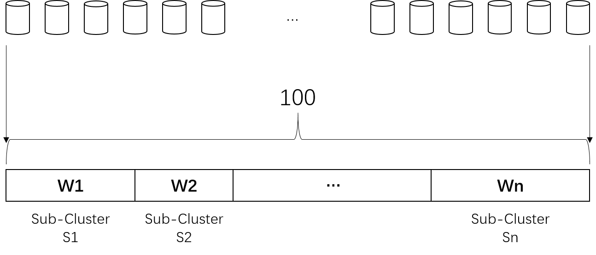

# Load Balancing

The tenant's backend  **cluster** usually contains multiple sub-clusters, and **sub-cluster**s are deployed in different data centers in different regions. Each sub-cluster contains a set of backend **instance**s with different processing capabilities.

It is usual to use multiple backend sub-clusters to manage backend services, which can bring the following benefits:

1. Multiple sub-clusters belong to different fault isolation domains. If a sub-cluster fails (for example, the Canary Release goes online abnormally), it can quickly switch traffic to stop loss and improve overall availability

2. Multiple sub-clusters are distributed closer to users, which can support processing user requests as close as possible and optimizing user experience

3. Multiple sub-clusters simultaneously serve to improve the overall capacity to meet the requirements of highly concurrent Internet users

Correspondingly, traffic load balancing of BFE includes two levels:

1. **Cluster-level load balancing**: BFE clusters use full information of user traffic , backend capacity, and network conditions to achieve load balancing among multiple backend clusters, realize global near-real-time decision optimization, and meet the objectives of nearby distribution, scheduling to stop loss, overload protection, etc.

2. **Instance-level load balancing**: BFE instances are independent, and the traffic of a sub-cluster is balanced among its multiple backend instances to realize fine-grained real-time load balancing, and meet the goals of instance balancing, exception instance shielding, retry and fault tolerance.

## Cluster-Level Load Balancing

BFE adopts a load balancing strategy based on WRR algorithm between multiple sub-clusters of the backend cluster. See the code in bfe_balance/bal_gslb/bal_gslb.go:subClusterBalance() for algorithm implementation。

The cluster-level load balancing algorithm includes the following two steps:

### Step 1. Determine the Bucket

User requests may have affinity, that is, it may be required to forward specific requests to specific sub-cluster. For example:

1. The request from a specific user is forwarded to a specific sub-cluster for processing, so as to facilitate user grouping management

2. The request containing a specific query is forwarded to a specific sub-cluster for processing to meet the cache friendliness

In order to realize load balancing of content-aware, BFE supports the following three ways to identify requests:

1. Based on specific header or specific cookie of the request

2. Based on source IP of the request

3. Based on the specific header or specific cookie in the request first, and based on the source IP otherwise

```go
// bfe_balance/bal_gslb/bal_gslb.go 

switch *bal.hashConf.HashStrategy {
	  case cluster_conf.ClientIdOnly:
			  hashKey = getHashKeyByHeader(req, *bal.hashConf.HashHeader)

	  case cluster_conf.ClientIpOnly:
			  hashKey = clientIP

	  case cluster_conf.ClientIdPreferred:
		  	hashKey = getHashKeyByHeader(req, *bal.hashConf.HashHeader)
		  	if hashKey == nil {
		  			hashKey = clientIP
		  	}
}

// if hashKey is empty, use random value
if len(hashKey) == 0 {
		hashKey = make([]byte, 8)
		binary.BigEndian.PutUint64(hashKey, rand.Uint64())
}

return hashKey
```

The algorithm divides the space of hash value into 100 buckets, and based on the specified policy (for example, based on the user ID in the request cookie), the specific request is fixed hashed to one of the buckets.

```go
// bfe_balance/bal_slb/bal_rr.go 

func GetHash(value []byte, base uint) int {
	  var hash uint64

	  if value == nil {
		    hash = uint64(rand.Uint32())
	  } else {
		    hash = murmur3.Sum64(value)
	  }
	  return int(hash % uint64(base))
}
```

### Step 2. Determine the Sub-Cluster
The algorithm assigns 100 buckets to all sub-clusters with a weight sum of 100.



For example, the backend cluster contains three sub-clusters S1/S2/S3, with the corresponding weights are W1/W2/W3 and W1+W2+W3=100, then:

- The bucket number range assigned to sub-cluster S1 is [0, W1)

- The bucket number range assigned to sub-cluster S2 is [W1, W1+W2]

- The bucket number range assigned to sub-cluster S3 is [W1+W2100]


```go
// bfe_balance/bal_gslb/bal_gslb.go

// Calculate bucket number for incoming request
w = bal_slb.GetHash(value, uint(bal.totalWeight))

for i := 0; i < len(bal.subClusters); i++ {
		subCluster = bal.subClusters[i]

		// Find target subcluster for specified bucket
		w -= subCluster.weight
		if w < 0 {
		  	return subCluster, nil
		}
}

// Never come here
return nil, err.News("subcluster balancing failure") 
```

## Instance-Level Load Balancing

BFE supports multiple load balancing strategies between multiple instances of one sub-cluster, including:

- WRR: Weighted Round Robin 

- WLC: Weighted Least Connection

See bfe_balance/bal_slb/bal_rr.go:Balance() for algorithm implementation. The following only takes the WRR algorithm as an example and introduces it in combination with the example scenario.

### Step 1. Random Sorting Backend Instance List

When each forwarding instance of BFE initially loads (or updates) the backend instances, the instance list is preprocessed and randomly sorted.

```go
// bfe_config/bfe_cluster_conf/cluster_table_conf/cluster_table_load.go

func (allClusterBackend AllClusterBackend) Shuffle() {
	  for _, clusterBackend := range allClusterBackend {
		    for _, backends := range clusterBackend {
		   	    backends.Shuffle()
		    }
	  }
}
```

This is to avoid uneven load due to the same balancing result for BFE instances when there are many BFE forwarding instances. For example, if the upstream BFE cluster has 1000 instances, and the actual user request is 1000 QPS, and the downstream backend cluster contains 10 backend instances, it may occur periodically:

- Every BFE instance forwards 1000 requests only to the **first** backend instance in the first second

- Every BFE instance forwards 1000 requests only to the **second** backend instance in the second second

- And so on

BFE avoids the above problem of uneven load by randomly disrupting the sequence of backend instances in advance.

### Step 2. Select Backend Instance Smoothly and Evenly

In the case of large differences in the weights of backend instances, uneven load may also occur, which is shown as follows: although the number of instances selected in a cycle meets the corresponding weight ratio, instances with large weights may be selected for many times in succession, resulting in other instances with low weights not being allocated traffic for a long time.

To avoid uneven load, BFE uses the following WRR algorithm, and the simplified algorithm pseudocode is as follows:

```go
// bfe_balance/bal_slb/bal_rr.go 

func smoothBalance(backs BackendList) (*backend.BfeBackend, error) {
	  var best *BackendRR
	  total, max := 0, 0

	  for _, backendRR := range backs {
				backend := backendRR.backend

				// select backend with greatest current weight
				if best == nil || backendRR.current > max {
		  			best = backendRR
				  	max = backendRR.current
				}
				total += backendRR.current

				// update current weight
				backendRR.current += backendRR.weight
	  }

	  // update current weight for chosen backend
	  best.current -= total

	  return best.backend, nil
}
```

The algorithm maintains two parameters for each instance: instance weight (Weight) and instance preference index (Current). Each time the algorithm selects the best backend from the list of all available backend as follows:

- Select the instance with the largest instance preference index

- Update the preference index of each instance:
  - The preference index value of each instance is added with the instance weight

- For the selected instance, the value of its preference index is subtracted from the sum of the preference index of all instances (the value before adding the instance weight)

For example, suppose that backend cluster contains three instances a/b/c, with weights of 5/1/1 respectively. If based on the above algorithm, the selection process is as follows:

| Round | Preference Index Before Selection | Selected Instance | Preference Index After Selection |
| ----- | --------------------------------- | ----------------- | -------------------------------- |
| 1     | 5  1  1                           | a                 | 3  2  2                          |
| 2     | 3  2  2                           | a                 | 1  3  3                          |
| 3     | 1  3  3                           | b                 | 6 -3  4                          |
| 4     | 6 -3  4                           | a                 | 4 -2  5                          |
| 5     | 4 -2  5                           | c                 | 9 -1 -1                          |
| 6     | 9 -1 -1                           | a                 | 7  0  0                          |
| 7     | 7  0  0                           | a                 | 5  1  1                          |

## links
Previous: [Chap31 Request Routing](../../../en_us/implementation/routing/routing.md)  
Next: [Chap33 Implementation of Core Protocols](../../../en_us/implementation/protocol/protocol.md)