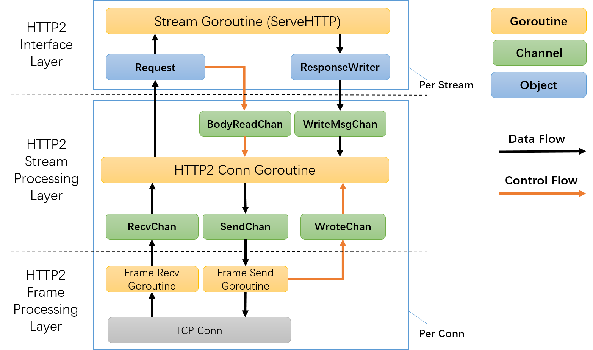

# Implementation of Core Protocols

In BFE, HTTP/HTTP2/SPDY/WebSocket/TLS and other network protocols are based on the official open source library of Go language. In order to better meet the scenario of reverse proxy, customization development has been carried out in BFE, including performance optimization, improvement of anti-attack mechanism, compatibility improvement, and addition of monitor probes.

This chapter focuses on the implementation of HTTP/HTTP2 protocol. The implementation of SPDY is very similar to that of HTTP2, so it will not be repeated here. For the implementation of other protocols, please refer to the instructions in [Layout of BFE Code Base](../source_layout/source_layout md) to check the corresponding source code, and can also ask questions in the BFE open source community.

## Implementation of HTTP

### Structure of HTTP code

The following code is included in the bfe_http directory:

```bash
$ ls bfe/bfe_http
chunked.go       cookie.go       header_test.go  readrequest_test.go   response.go            sniff.go     transfer_test.go
chunked_test.go  cookie_test.go  httputil        request.go            response_test.go       state.go     transport.go
client.go        eof_reader.go   lex.go          request_test.go       response_writer.go     status.go
common.go        header.go       lex_test.go     requestwrite_test.go  responsewrite_test.go  transfer.go
```

The functions of each document are described as follows:

| Category  | File Name          | Description                                                  |
| --------- | ------------------ | ------------------------------------------------------------ |
| basic     | common.go          | Type definition of HTTP basic data                           |
|           | state.go           | Internal status indicator of HTTP protocol                   |
|           | eof_reader.go      | It is the type definition of EoReader, implements the io.ReadCloser interface, and returns EOF forever |
| protocol  | request.go         | Definition of HTTP request type                              |
|           | response.go        | Definition of HTTP response type                             |
|           | header.go          | HTTP header type definition and related operations           |
|           | cookie.go          | Processing of HTTP Cookie                                    |
|           | status.go          | Definition of status code of HTTP response                   |
|           | lex.go             | HTTP legal character table                                   |
| backend   | client.go          | The interface definition of RoundTripper, supports concurrent sending requests and obtaining responses |
|           | transport.go       | HTTP connection pool management, which implements the RoundTripper interface, is used to manage HTTP communication with the backend in reverse proxy scenarios |
|           | transfer.go        | It contains the type definition of transferWriter/transfterReade, which is used to streamingly send requests and read responses to the backend in reverse proxy scenarios |
|           | response_writer.go | It contains the type definition of ResponseWriter, which is used to construct and send the response in the reverse proxy scenario |
| auxiliary | httputil           | HTTP related auxiliary functions                             |
|           | chunked.go         | HTTP Chunked encoding processing                             |
|           | sniff.go           | Implementation of HTTP MIME Sniffing (for reference https://mimesniff.spec.whatwg.org) |

### Read HTTP Request From Client

Reading an HTTP request from HTTP connection is implemented in the file bfe_http/request.go, including the following steps:

- Read the HTTP request line and parse the request method, URI and protocol version

- Read the HTTP request header and parse it

- Read HTTP request body

```go
// bfe_http/request.go

// ReadRequest reads and parses a request from b.
func ReadRequest(b *bfe_bufio.Reader, maxUriBytes int) (req *Request, err error) {
	tp := newTextprotoReader(b)
	req = new(Request)
	req.State = new(RequestState)

	// Read first line (eg. GET /index.html HTTP/1.0)
	var s string
	if s, err = tp.ReadLine(); err != nil {
		return nil, err
	}
	...

	// Parse request method, uri, proto
	var ok bool
	req.Method, req.RequestURI, req.Proto, ok = parseRequestLine(s)
	if !ok {
		return nil, &badStringError{"malformed HTTP request", s}
	}
	rawurl := req.RequestURI
	if req.ProtoMajor, req.ProtoMinor, ok = ParseHTTPVersion(req.Proto); !ok {
		return nil, &badStringError{"malformed HTTP version", req.Proto}
	}
	if req.URL, err = url.ParseRequestURI(rawurl); err != nil {
		return nil, err
	}
	...

	// Read and parser request header
	mimeHeader, headerKeys, err := tp.ReadMIMEHeaderAndKeys()
	if err != nil {
		return nil, err
	}
	req.Header = Header(mimeHeader)
	req.HeaderKeys = headerKeys
	...

	// Read request body
	err = readTransfer(req, b)
	if err != nil {
		return nil, err
	}

	return req, nil
}
```

Note that in the last step, readTransfer(req, b) does not directly read the request content into memory. If it does in this way, it will greatly increase the memory overhead of the reverse proxy, and also increase the request forwarding delay.

In the readTransfer function, according to the request method, transfer encoding, and request body length, different implementations that meet the io.ReadCloser interface type are returned for on-demand reading of the request body.

```go
// bfe_http/transfer.go

// Prepare body reader. ContentLength < 0 means chunked encoding
// or close connection when finished, since multipart is not supported yet
switch {
case chunked(t.TransferEncoding):
	if noBodyExpected(t.RequestMethod) {
		t.Body = EofReader
	} else {
		t.Body = &body{src: newChunkedReader(r), hdr: msg, r: r, closing: t.Close}
	}
  
case realLength == 0:
	t.Body = EofReader
  
case realLength > 0:
	// set r for peek data from body
	t.Body = &body{src: io.LimitReader(r, realLength), r: r, closing: t.Close}
  
default:
	// realLength < 0, i.e. "Content-Length" not mentioned in header
	if t.Close {
		// Close semantics (i.e. HTTP/1.0)
		t.Body = &body{src: r, closing: t.Close}
	} else {
		// Persistent connection (i.e. HTTP/1.1)
		t.Body = EofReader
	}
}
```


### Forward Request To Backend And Get Response

In bfe_http/transport.go, the Transport type implements the RoundTripper interface, which supports sending requests and getting responses. It mainly includes the following steps:

- Check the legitimacy of the request

- Obtain the idle connection from the connection pool to the destination backend, or create a new connection (if there is no idle connection)

- Use this connection to send the request and read the response

The data type of the connection is persistConn, and the core member variables are as follows:

```go
// bfe_http/transport.go

// persistConn wraps a connection, usually a persistent one
// (but may be used for non-keep-alive requests as well)
type persistConn struct {
	t        *Transport
	cacheKey string // its connectMethod.String()
	conn     net.Conn
	closed   bool                // whether conn has been closed

	reqch    chan requestAndChan // written by roundTrip; read by readLoop
	writech  chan writeRequest   // written by roundTrip; read by writeLoop
	closech  chan struct{}       // broadcast close when readLoop (TCP connection) closes
	...
}
```

At the same time, persistConn contains two related Goroutines, writeLoop() and readLoop(), which are used to send requests and read responses to the backend connection respectively.

```go
// bfe_http/transport.go

func (pc *persistConn) writeLoop() {
    defer close(pc.closech)
    ...
    for {
        select {
        case wr := <-pc.writech:
            ...
            // Write the HTTP request and flush buffer
            err := wr.req.Request.write(pc.bw, pc.isProxy, wr.req.extra)
            if err == nil {
                err = pc.bw.Flush()
            }
            if err != nil {
                err = WriteRequestError{Err: err}
                pc.markBroken()
            }
            // Return the write result
            wr.ch <- err
        case <-pc.closech:
            return
        }
    }
}

func (pc *persistConn) readLoop() {
    defer close(pc.closech)
    ...
    alive := true
    for alive {
        ...
        rc := <-pc.reqch
        var resp *Response
        if err == nil {
            // Read the HTTP response
            resp, err = ReadResponse(pc.br, rc.req)
            ...
        }
        ...
        if err != nil {
            pc.close()
        } else {
            ...
            // Wrapper the HTTP Body 
            resp.Body = &bodyEOFSignal{body: resp.Body}
        }
        ...
        
        // Return the read result
        if err != nil {
            err = ReadRespHeaderError{Err: err}
        }
        rc.ch <- responseAndError{resp, err}
        ...
    }
}
```

### Send HTTP Response To User

The reverse proxy uses the ResponseWriter interface to construct and send responses, including the following interfaces:

- Header(): Set the response header through this method

- WriteHeader(): Set the response status code and send the response header through this method

- Write(): Send response body data through this method


```go
// bfe_http/response_writer.go

// A ResponseWriter interface is used by an HTTP handler to
// construct an HTTP response.
type ResponseWriter interface {
	// Header returns the header map that will be sent by WriteHeader.
	// Changing the header after a call to WriteHeader (or Write) has
	// no effect.
	Header() Header

	// Write writes the data to the connection as part of an HTTP reply.
	// If WriteHeader has not yet been called, Write calls   
	// WriteHeader(http.StatusOK) before writing the data.  
	// If the Header does not contain a Content-Type line, Write adds a  
	// Content-Type set to the result of passing the initial 512 bytes of 
	// written data to DetectContentType.
	Write([]byte) (int, error)

	// WriteHeader sends an HTTP response header with status code.
	// If WriteHeader is not called explicitly, the first call to Write
	// will trigger an implicit WriteHeader(http.StatusOK).
	// Thus explicit calls to WriteHeader are mainly used to
	// send error codes.
	WriteHeader(int)
}
```

The ResponseWriter interface is implemented in the bfe_server/response.go file to send HTTP/HTTPS responses.

## Implementation of HTTP2

### Structure of HTTP2 code

The following code is included in the bfe_http2 directory:

```bash
$ls bfe/bfe_http2
errors.go       flow_test.go   headermap.go  http2_test.go     server_test.go  transport.go   z_spec_test.go
errors_test.go  frame.go       hpack         priority_test.go  state.go        write.go
flow.go         frame_test.go  http2.go      server.go         testdata        writesched.go
```

The functions of each document are described as follows:

| Category          | File Name     | Description                                                  |
| ----------------- | ------------- | ------------------------------------------------------------ |
| Stream processing | server.go     | Core processing logic of HTTP2 protocol connection           |
|                   | flow.go       | HTTP2 flow control                                           |
|                   | writesched.go | Priority queue for HTTP protocol frame sending               |
| Frame processing  | frame.go      | Definition and parsing of HTTP2 protocol frame               |
|                   | write.go      | HTTP2 protocol frame transmission                            |
|                   | hpack/        | HTTP2 protocol header compression algorithm HPACK            |
| Basic data types  | headermap.go  | Definition of HTTP2 common request headers                   |
|                   | errors.go     | Error definition of HTTP2 protocol                           |
|                   | state.go      | Internal status indicator of HTTP2 protocol                  |
| Auxiliary tools   | transport.go  | HTTP2 client encapsulation; Only used to communicate with backend instances |


### HTTP2 Connection Processing Module

After accepting an HTTP2 connection, BFE will not only create a master Goroutine for connection processing , but also create multiple child Goroutines to complete the protocol logic processing. The structure of a single HTTP2 connection protocol processing module is shown in the figure.



The internal structure of the module is divided into three layers from bottom to top:

**Frame Processing Layer**

- Frame processing layer realizes HTTP2 protocol frame serialization, compression and transmission

- Frame processing layer consists of two independent transceiver Goroutines, which are respectively responsible for receiving and sending protocol frames

- Frame processing layer communicates with the stream processing layer through the pipeline (RecvChan/SendChan/RouteChan)

**Stream Processing Layer**

- The stream processing layer implements the core logic of the protocol, such as stream creation, stream data transmission, stream closing, multiplexing, stream priority, flow control, etc

- The stream processing layer creates a Request/ResponseWriter instance for each stream and runs the application logic in the independent Goroutine

**Interface Layer**

- Provide standard Request/ResponseWriter implementation for HTTP application handlers, and mask HTTP2 protocol data transmission details

- The HTTP application handler runs in the Stream Goroutine

- HTTP application handler obtains the HTTP request through the Request instance (read from the specific HTTP2 stream)

- HTTP application handler sends HTTP response (to specific HTTP2 stream) through the ResponseWriter instance


### HTTP2 Connection Related Goroutines

The cooperation of Goroutines for each HTTP2 connection is based on the CSP(Communicating Sequential Processes) model, as follows:

**Goroutines of Frame Processing Layer**

Each HTTP2 connection contains two Goroutines for read and write , which are respectively responsible for reading or sending HTTP2 protocol frames, including:

* Frame Recv Goroutine reads the HTTP2 protocol frames from the connection and puts them into the frame receiving queue

```go
// bfe_http2/server.go

// readFrames is the loop that reads incoming frames.
// It's run on its own goroutine.
func (sc *serverConn) readFrames() {
    gate := make(gate)
    gateDone := gate.Done
    for {
        f, err := sc.framer.ReadFrame()
        ...

        // Send the frame to readFrameCh
        select {
        case sc.readFrameCh <- readFrameResult{f, err, gateDone}:
        case <-sc.doneServing:
            return
        }
        
        // Waiting for the frame to be processed
        select {
            case <-gate:
            case <-sc.doneServing:
                return
        }
        ...
    }
}
```

 * Frame Send Goroutine obtains the frames from the frame sending queue, writes them to the connection, and puts result into the writing result queue WroteChan

```go
// bfe_http2/server.go

// writeFrames runs in its own goroutine and writes frame
// and then reports when it's done.
func (sc *serverConn) writeFrames() {
    var wm frameWriteMsg
    var err error

    for {
        // get frame from sendChan
        select {
        case wm = <-sc.writeFrameCh:
        case <-sc.doneServing:
            return
        }

        // write frame
        err = wm.write.writeFrame(sc)
        log.Logger.Debug("http2: write Frame: %v, %v", wm, err)

        // report write result
        select {
        case sc.wroteFrameCh <- frameWriteResult{wm, err}:
        case <-sc.doneServing:
            return
        }
    }
}
```

**Goroutines of Steaming Processing Layer**

The master Goroutine communicates with other Goroutines through the Golang channel, for example:

* BodyReadChan: After the request processing Goroutine reads the request body, it sends the reading result message to the master Goroutine through BodyReadChan. The master Goroutine receives the message to perform the flow control operation and update the flow control window

* WriteMsgChan: After the request processing Goroutine sends the response, it sends the "request to write" message to the master Goroutine through WriteMsgChan. After receiving the message, the master Goroutine converts it into HTTP2 data frame and puts it into the stream sending queue

* ReadChan/SendChan/WroteChan: Get or send HTTP2 protocol frame from the connection

```go
// bfe_http2/server.go

func (sc *serverConn) serve() {
    ...
  
  	// Write HTTP2 Settings frame and read preface.
    sc.writeFrame(frameWriteMsg{write: writeSettings{...}})
    err := sc.readPreface()
    ...

    // Start readFrames/writeFrames goroutines.
    go sc.readFrames()
    go sc.writeFrames()

    for {
        select {
        case wm := <-sc.wantWriteFrameCh:
            sc.writeFrame(wm)
        case res := <-sc.wroteFrameCh:
            sc.wroteFrame(res)
        case res := <-sc.readFrameCh:
            if !sc.processFrameFromReader(res) {
            return
            }
            ...
        case m := <-sc.bodyReadCh:
            sc.noteBodyRead(m.st, m.n)
        case <-sc.closeNotifyCh: // graceful shutdown
            sc.goAway(ErrCodeNo)
            sc.closeNotifyCh = nil
        ...
		}
	}
}
```

**Goroutines of Interface Layer**

Each HTTP2 connection encapsulates the Request object and ResponseWriter object for the application layer, and creates an independent request processing Goroutine (Stream Goroutine) to process the request and return the response

* Stream Goroutine gets the request from the Request object

* Stream Goroutine sends a response to the ResponseWriter object

```go
// bfe_http2/server.go

func (sc *serverConn) processHeaders(f *MetaHeadersFrame) error {
    sc.serveG.Check()
    id := f.Header().StreamID
    ...

    // Create a new stream
    st = &stream{
        sc:    sc,
        id:    id,
        state: stateOpen,
        isw:   sc.srv.initialStreamRecvWindowSize(sc.rule),
    }
    ...

    // Create the Reqeust and ResponseWriter
    rw, req, err := sc.newWriterAndRequest(st, f)
    if err != nil {
        return err
    }
    st.body = req.Body.(*RequestBody).pipe // may be nil
    st.declBodyBytes = req.ContentLength
    ...

    // Process the request in a new goroutine
    handler := sc.handler.ServeHTTP
    go sc.runHandler(rw, req, handler)
    return nil
}
```


## links
Previous: [Chap32 Load Balancing](../../../en_us/implementation/balancing/balancing.md)  
Next: [Chap 34 How to Develop BFE Extension Module](../../../en_us/develop/how_to_write_module/how_to_write_module.md)