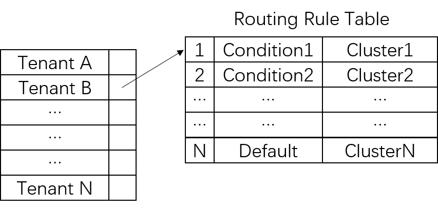
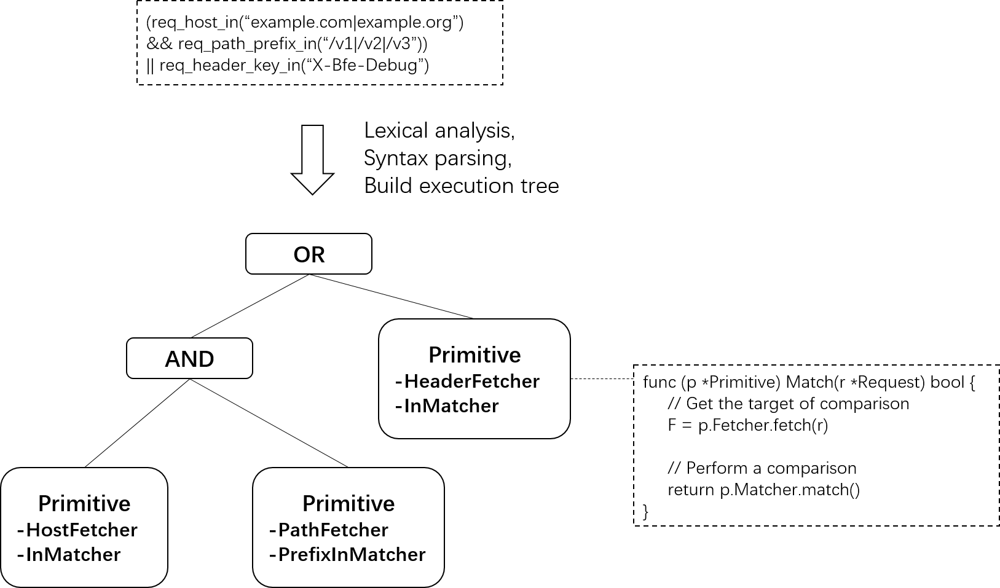

# Request Routing

BFE can process the traffic of multiple tenants at the same time. Each tenant contains multiple clusters, and each cluster handles requests for different types of services. **Request routing** refers to the process of determining the tenant and target cluster to which the request belongs during BFE forwarding request.

The BFE forwarding process can refer to the description in [Forwarding Model](../../design/model/model. md).


## Key Data Structures

In routing module bfe_route/host_table.go, the data structure used to manage routing rules is defined. It mainly includes the following types:

### **Domain Name Table**(hostTable)

HostTable is used to manage the mapping relationship between domain name and tenant identity.

HostTable is a data structure of Trie tree type to facilitate the support of universal domain name lookup. In short, the path from each leaf node to the root node in the Trie tree represents a domain name, and the leaf node contains the tenant name.

The data types of Trie tree nodes are as follows:

- Children points to all child nodes of this node

- Entry stores the domain name represented by the path from the node to the root node (e.g., x.example.com), and the corresponding tenant name

- Splat stores the wildcard domain name (e.g., *. x.example.com) represented by the path from the node to the root node, and the corresponding tenant name

```go
// bfe_route/trie/trie.go 

type trieChildren map[string]*Trie

type Trie struct {
	Children   trieChildren 
	Entry      interface{}
	Splat      interface{}
}
```

### **VIP Table**(vipTable)

VipTable is used to manage the mapping relationship between VIP and tenant ID.

VipTalbe is a hash table type data structure. Where key represents VIP and value represents tenant name.

```go
// bfe_config/bfe_route_conf/vip_rule_conf/vip_table_load.go

type Vip2Product map[string]string
```

### **Routing Rule Table**(productRouteTable)

ProductRouteTable is used to manage the routing rule table of each tenant.

ProductRouteTable is a data structure of hash table type. The key represents the name of the tenant, and the value is the routing rule table of the tenant.

The routing rule table of each tenant contains an orderly set of routing rules. Each rule consists of rule conditions and destination clusters.

```go
// bfe_config/bfe_route_conf/route_rule_conf/route_table_load.go

type ProductRouteRule map[string]RouteRules


// bfe_route/host_table.go

type HostTable struct {
	//...
	
	productRouteTable route_rule_conf.ProductRouteRule
}
```



### **Routing Condition**(Condition)

A routing condition is a condition expression composed of condition primitives and operators. For the syntax of condition expression, please refer to the description in [Traffic Routing](../../design/route/route. md).

The condition expression is a binary tree in the form of infix expression in the internal data structure of BFE. The non-leaf node of the binary tree represents the operator. Leaf nodes represent condition primitives. When the request matches the routing condition, it is equivalent to evaluating the infix expression. The return value is Boolean, representing whether the request matches the rule.




## Tenant Routing

LookupHostTagAndProduct() of HostTable implements the search of the target tenant.

The basic process of searching is as follows:

- Step 1: According to Host field of the request, try to search the hostTable and return the hit tenant name.

- Step 2: If the search fails, try to search the vipTable and return the hit tenant name according to the requested VIP.

- Step 3: If the search fails, return the default tenant name.

```go
// bfe_route/host_table.go

// LookupHostTagAndProduct find hosttag and product with given hostname.
func (t *HostTable) LookupHostTagAndProduct(req *bfe_basic.Request) error {
    hostName := req.HttpRequest.Host

    // lookup product by hostname
    hostRoute, err := t.findHostRoute(hostName)

    // if failed, try to lookup product by visited vip
    if err != nil {
        if vip := req.Session.Vip; vip != nil {
            hostRoute, err = t.findVipRoute(vip.String())
        }
    }

    // if failed, use default proudct
    if err != nil && t.defaultProduct != "" {
        hostRoute, err = route{product: t.defaultProduct}, nil
    }

    // set hostTag and product
    req.Route.HostTag = hostRoute.tag
    req.Route.Product = hostRoute.product
    req.Route.Error = err

    return err
}
```

## Cluster Routing

LookupCluster() of HostTable implements the lookup of the destination cluster.

The basic process of searching is as follows:

- Step 1: Search the routing rule table according to the target tenant name of the request.

- Step 2: In the tenant's routing rule table, match the request with the conditions of each rule in the table in order.

- Step 3: Return the destination cluster for the first matching rule.

Note that the last rule in the routing rule table is the default rule. If the last rule is executed, the default destination cluster will be returned.

```go
// bfe_route/host_table.go

// LookupCluster find clusterName with given request.
func (t *HostTable) LookupCluster(req *bfe_basic.Request) error {
    var clusterName string
    // get route rules
    rules, ok := t.productRouteTable[req.Route.Product]
    if !ok {
        ...
    }

    // matching route rules
    for _, rule := range rules {
        if rule.Cond.Match(req) {
            clusterName = rule.ClusterName
            break
        }
    }
    ...

    // set clusterName
    req.Route.ClusterName = clusterName
    return nil
}
```

