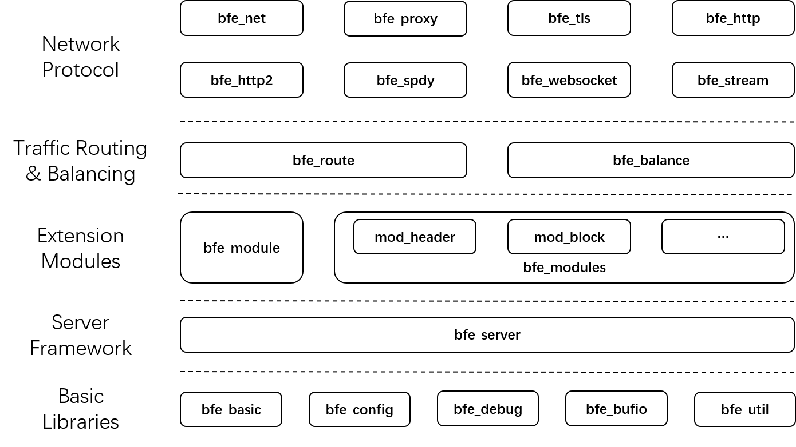

# Layout of BFE Code Base

The latest code of BFE can be downloaded from the BFE open source project release page https://github.com/bfenetworks/bfe/releases. This chapter will introduce BFE v1.0.0 as an example.

At the top level of the code directory, you can see that BFE contains the following directories or files:

```bash
$ ls bfe/
ADOPTERS.md		MAINTAINERS.md		bfe_basic		bfe_modules		bfe_util
CHANGELOG.md		Makefile		bfe_bufio		bfe_net			bfe_websocket
CODE_OF_CONDUCT.md	NOTICE			bfe_config		bfe_proxy		conf
CONTRIBUTING.md		README.md		bfe_debug		bfe_route		docs
CONTRIBUTORS.md		SECURITY.md		bfe_fcgi		bfe_server		go.mod
Dockerfile		VERSION			bfe_http		bfe_spdy		go.sum
GOVERNANCE.md		bfe.go			bfe_http2		bfe_stream		snap
LICENSE			bfe_balance		bfe_module		bfe_tls			staticcheck.conf
```

The hierarchical structure of each directory is as follows:



The functional modules corresponding to each directory in top-down order are described below.

## Network Protocol
- `bfe_net`: network-related basic library
- `bfe_http`:  code for HTTP protocol
- `bfe_tls`: code for TLS protocol
- `bfe_http2`: code for HTTP2 protocol
- `bfe_spdy`: code for SPDY protocol
- `bfe_stream`:	code for TLS proxy
- `bfe_websocket`: code for WebSocket proxy
- `bfe_proxy`: proxy related basic code

## Traffic Routing and Balancing
- `bfe_route`: code for traffic routing
- `bfe_balance`: code for traffic balancing

## Extension Modules
- `bfe_module`: code for BFE plugin framework
- `bfe_modules`: code for BFE extension modules

## Service Framework
- `bfe_server`: main parts of BFE server

## Basic Libraries
- `bfe_basic`: BFE basic library
- `bfe_config`: configuration loading related code
- `bfe_debug`: debug related code
- `bfe_util`: BFE basic library related code


## links
Previous: [Chap26 Support More Protocols](../../../en_us/operation/config_protocols/config_protocols.md)  
Next: [Chap28 Process Model](../../../en_us/implementation/process_model/process_model.md)