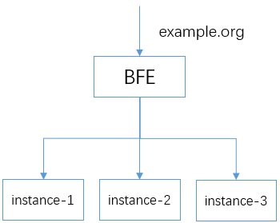
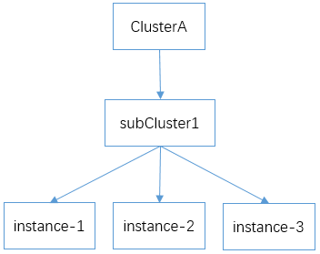
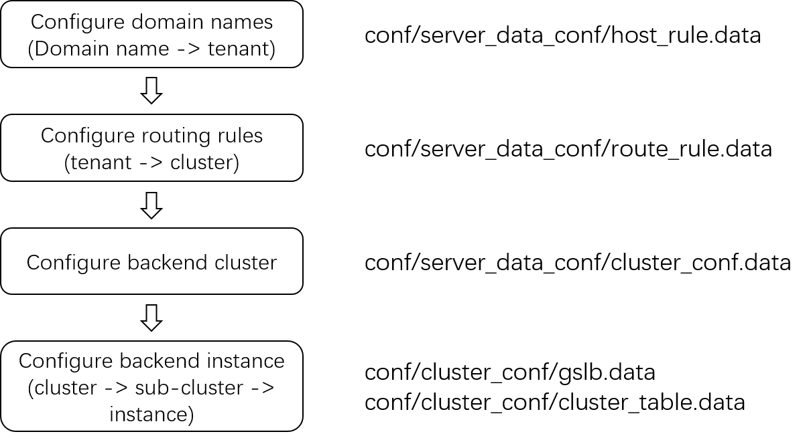

# Basic Configuration of BFE Service
The previous chapter introduced how to download and run BFE, and ran the BFE program with the default configuration in the installation package.

This chapter will further introduce the configuration of BFE, and show how to configure a basic load balancing system based on BFE through a simple load balancing example.

## Scenario Description

For load balancing, the basic capability is to forward the requests from the client to a group of back-end service instances. In the concept of BFE, back-end services with the same functions are defined as a cluster.

Let's use a simple example to show how to configure BFE to forward traffic to the back-end cluster.

Now there is a website with the domain name of "example. org", and there are three servers on the back end, instance-1, instance-2, and instance-3. HTTP requests need to be forwarded to three back-end servers through BFE.

The schematic diagram is as follows:



In the subsequent configuration, the three instances will be defined in the same sub-cluster subCluster1 of cluster clusterA:




## Modify *bfe.conf*

*bfe.conf* contains the basic configuration of BFE. You can start with this file to understand the configuration file. This configuration file contains a large number of configuration options, and the specific meaning will be described later.

You can view the default port configuration in bfe.conf. Users can modify the listening port as needed.

```ini
[Server]
# listen port for http request
HttpPort = 8080
# listen port for https request
HttpsPort = 8443
# listen port for monitor request
MonitorPort = 8421
```

## Process for Setting Forwarding Configuration

After determining the basic configuration file bfe.conf, users can set the forwarding related configuration.



The recommended process of setting forwarding configuration is shown in the figure above. The main steps are:

1. Configure domain name: configure the domain name to be processed, which is also used to distinguish tenants/products.

2. Configure routing rules: define the forwarding/mapping rules of requests to back-end clusters, that is, the rules by which requests are forwarded to a back-end cluster.

3. Configure the properties of the back-end cluster: set some parameters of the back-end cluster, such as the properties of the connection to the back-end , and the health check method.

4. Configure backend cluster instance: configure backend cluster instance and weight information, including the weight of sub-clusters, the weight of instances in sub-clusters, and so on.

## Case Study

The following will take adding a tenant example_product as an example to describe how to create relevant configurations for the tenant in detail.

### Tenant Domain Name Configuration host_rule.data

conf/server_data_conf/host_rule.data is the tenant domain name table configuration file of BFE.

The "HostTags" field in host_rule.data defines the tenant information. We add a tenant named "example_product". Multiple domain name tags can be defined under the tenant. The field "Hosts" defines the domain name contained in the tag. The tag in the example is exampleTag, which contains the domain name example.org that needs to be supported. The tag in the file is specified by the user.

An example of this configuration file is as follows:

```json
{
    "Version": "1",
    "DefaultProduct": null,
    "Hosts": {
        "exampleTag":[
            "example.org"
        ]
    },
    "HostTags": {
        "example_product":[
            "exampleTag"
        ]
    }
}

```

### Route Rule Configuration route_rule.data
conf/server_data_conf/route_rule.data is the routing configuration file of BFE.

In this example, a back-end cluster cluster_A will be defined. It will represent the cluster of back-end services.

In the following example, "Cond" uses the condition primitive req_host_in(), BFE will forward the request with Host of "example. org" to the back-end cluster cluster_A.

```json
{
    "Version": "1",
    "ProductRule": {
        "example_product": [
            {
                "Cond": "req_host_in(\"example.org\")",
                "ClusterName": "cluster_A"
            },
            {
                "Cond": "default_t()",
                "ClusterName": "cluster_default"
            }
        ]
    }
}
```

### Backend Cluster Configuration cluster_conf.data

conf/server_data_conf/cluster_conf.data is the configuration file of the backend cluster. It contains the relevant configurations of the backend cluster "cluster_A". Including: backend basic configuration, health check configuration, GSLB basic configuration and cluster basic configuration.

For the above example, the following configurations can be used:

```json
{
    "Version": "1",
    "Config": {
        "cluster_A": {
            "BackendConf": {
                "TimeoutConnSrv": 2000,
                "TimeoutResponseHeader": 50000,
                "MaxIdleConnsPerHost": 0,
                "RetryLevel": 0
            },
            "CheckConf": {
                "Schem": "http",
                "Uri": "/",
                "Host": "example.org",
                "StatusCode": 200,
                "FailNum": 10,
                "CheckInterval": 1000
            },
            "GslbBasic": {
                "CrossRetry": 0,
                "RetryMax": 2
            },
            "ClusterBasic": {
                "TimeoutReadClient": 30000,
                "TimeoutWriteClient": 60000,
                "TimeoutReadClientAgain": 30000,
            }
        }
    }
}
```

There are many configuration items in cluster_conf.data. The specific description of each item is as follows:

* Backend basic configuration BackendConf 


| Configuration Item | Description                |
| --------------------- | ----------------------- |
| BackendConf.TimeoutConnSrv        | Integer<br>Timeout for connecting backend, in ms. Default value is 2000. |
| BackendConf.TimeoutResponseHeader | Integer<br>Timeout for reading response header, in ms. Default value is 60000. |
| BackendConf.MaxIdleConnsPerHost   | Integer<br>Max idle connections to each backend per BFE. Default value is 2. |
| BackendConf.MaxConnsPerHost   | Integer<br>Max number of concurrent connections to each backend per BFE. 0 means no limitation. Default value is 0. |
| BackendConf.RetryLevel            | Integer<br>Retry level if request fail. 0: retry after connecting backend fails; 1: retry after connecting backend fails or forwarding GET request fails. Default value is 0. |

* Health Check Configuration CheckConf

| Configuration Item | Description                                              |
| ------------------------ | ------------------------------------------------------------ |
| CheckConf.Schem         | String<br>Protocol for health check (HTTP/TCP). Default value is http. |
| CheckConf.Uri           | String<br>Uri used in health check (HTTP only). Default value is "/health_check". |
| CheckConf.Host          | String<br>Host used in health check (HTTP only). Default value is "". |
| CheckConf.StatusCode    | Integer<br>Expected response code (HTTP only). Default value is 200. And 0 means any response code is considered valid. |
| CheckConf.FailNum       | Integer<br>Failure threshold (consecutive failures of forwarded requests), which will trigger BFE to set the backend instance to unavailable state and start the health check. |
| CheckConf.SuccNum       | Integer<br>Healthy threshold (consecutive successes of health check request), which will trigger BFE to set the backend instance to available state and stop the health check. |
| CheckConf.CheckTimeout  | Integer<br>Timeout for health check, in ms. Default value is 0, which means no timeout. |
| CheckConf.CheckInterval | Integer<br>Interval of health check, in ms. Default value is 1000. |

* GSLB basic configuration GslbBasic

| Configuration Item   | Description                                                  |
| -------------------- | ------------------------------------------------------------ |
| GslbBasic.CrossRetry | Integer<br>Max cross sub-clusters retry times. Default value is 0. |
| GslbBasic.RetryMax   | Integer<br>Max retry times within same sub-cluster. Default value is 2. |

### Configure Backend Cluster Instance
The configuration of this part includes:

* Sub-cluster load balancing configuration conf/cluster_ conf/gslb.data

* Instance load balancing configuration conf/cluster_ conf/cluster_ table.data

**glsb.data**

This file describes the weight of sub-clusters contained in a cluster. In the above example, we only need to define a sub-cluster "subCluster1" for cluster "cluster_A", with a weight of 100.

```json
{
    "Clusters": {
        "cluster_A": {
            "GSLB_BLACKHOLE": 0,
            "subCluster1": 100
        }
    },
    "Hostname": "",
    "Ts": "0"
}
```

**cluster_table.data**

This file describes the information of the instances in the sub-cluster. The sample sub-cluster "subCluster1" will contain three backend instances, instance-1, instance-2, and instance-3. The IP address of each instance is also specified.

```json
{
    "Config": {
        "cluster_A": {
            "subCluster1": [
                {
                    "Addr": "192.168.2.1",
                    "Name": "instance-1",
                    "Port": 8080,
                    "Weight": 10
                },
                {
                    "Addr": "192.168.2.2",
                    "Name": "instance-2",
                    "Port": 8080,
                    "Weight": 10
                },
                {
                    "Addr": "192.168.2.3",
                    "Name": "instance-3",
                    "Port": 8080,
                    "Weight": 10
                }
            ]
        }
    }, 
    "Version": "1"
}
```
After completing the above configuration, restart the bfe instance to make the configuration take effect.


## Test of BFE Service
On the client side, use the "curl" command to access the address and port of BFE. You can see that the request is forwarded to the backend server instance.

> Note: The curl command needs to specify the Host field in the request header through the parameter -H "Host: example.org", otherwise it will receive a 500 error.


## Reload of Configuration

After the above configuration is modified, you can also reload the configuration dynamically.

The configuration of BFE can be roughly divided into two parts: normal configuration and dynamic configuration. For normal configurations, such as bfe.conf, the BFE process needs to be restarted before the new configuration can take effect.

For dynamic configuration,  the re-loading of the configuration file can be triggered by accessing the monitoring port, which is 8421 by default. There is no need to restart the BFE process, which has no impact on the service. For details, please refer to [Configuration Management](../../design/configuration/configuration.md).
