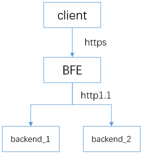

# Configure HTTPS Service
BFE can support TLS offloading, i.e., decrypt the encrypted HTTPS traffic received, and then forward it to the backend service.



## HTTPS Basic Configuration

HTTPS configuration includes the configuration of cipher suite, certificate file, and TLS protocol related parameters. To use HTTPS, you need to configure the corresponding certificate file. Please prepare the certificate file in advance.

### HTTPS Port
HTTPS ports can be configured in bfe.conf.

```ini
[Server] 
... 

# listen port for https request
HttpsPort = 8443
```

### Cipher Suite
The following cipher suite is included in bfe.conf. Users can modify it as needed. This section defines the cipher suite supported by TLS.

```ini
CipherSuites=TLS_ECDHE_RSA_WITH_AES_128_GCM_SHA256|TLS_ECDHE_RSA_WITH_CHACHA20_POLY1305_SHA256
CipherSuites=TLS_ECDHE_RSA_WITH_RC4_128_SHA
CipherSuites=TLS_ECDHE_RSA_WITH_AES_128_CBC_SHA
CipherSuites=TLS_ECDHE_RSA_WITH_AES_256_CBC_SHA
CipherSuites=TLS_RSA_WITH_RC4_128_SHA
CipherSuites=TLS_RSA_WITH_AES_128_CBC_SHA
CipherSuites=TLS_RSA_WITH_AES_256_CBC_SHA
```

### Server Certificate
The bfe.conf also contains the path of the configuration file of the server certificate. You can directly use the default configuration.

```ini
ServerCertConf = tls_conf/server_cert_conf.data
```

Open the server certificate configuration file tls_conf/server_cert_conf.data, you can see the following certificate information:

```json
{
    "Version": "1",
    "Config": {
        "Default": "example.org.cert",
        "CertConf": {
            "example.org.cert": {
                "ServerCertFile": "tls_conf/certs/server.crt",
                "ServerKeyFile" : "tls_conf/certs/server.key"
            }
        }
    }
}
```

This file contains the information of the server certificate, where the "Default" field indicates the default certificate of the server. "CertConf" contains the specific information of the certificate file. In the above example, a certificate named "example.org.cert" is configured.

"CertConf" can contain multiple certificates, which are identified by different names. The definition of each certificate contains two fields, "ServerCertFile" and "ServerKeyFile", indicating the server certificate file and the corresponding private key file respectively.

The certificate name, such as "example.org.cert" in the above example, will be used in the following configuration in tls_rule_conf.data.

### TLS Rules

After preparing the certificate, you need to set TLS-related rules, such as how to select the certificate.

bfe.conf contains the path to the TLS rule file:

```ini
TlsRuleConf = tls_conf/tls_rule_conf.data
```

The following example is the rule we prepared for the tenant "example_product".

```json
{
    "Version": "1",
    "DefaultNextProtos": ["http/1.1"],
    "Config": {
        "example_product": {
            "SniConf": ["example.org"],
            "CertName": "example.org.cert",
            "NextProtos": [
                "http/1.1"
            ],
            "Grade": "C"
        }
    }
}
```

"SniConf" indicates the domain name using SNI. "NextProtos" identifies the protocol used in ALPN negotiation. The security grade "Grade" defines the cipher suite that can be used by the server in TLS negotiation. See the following chapters for details.

After the above configuration is ready, restart BFE to make the configuration take effect. You can access the configured HTTPS port through HTTPS.

## Configure TLS Session Reuse

BFE supports two ways of TLS session reuse: Session Cache and Session Ticket.

### Configure Session Cache
BFE uses Redis for centralized TLS session information storage. Multiple BFE instances can connect to the shared Redis service. The connection is as follows:


To enable session cache, set SessionCacheDisabled to false in bfe.conf.

```ini
[SessionCache]
# disable tls session cache or not
SessionCacheDisabled = false

# tcp address of redis server
Servers = "example.redis.cluster"

# prefix for cache key
KeyPrefix = "bfe"

# connection params (ms)
ConnectTimeout = 50
ReadTimeout = 50
WriteTimeout = 50

# max idle connections in connection pool
MaxIdle = 20

# expire time for tls session state (second)
SessionExpire = 3600

```

The "Servers" field in the above configuration indicates the name of the Redis server. The specific address is specified in

conf/server_data_conf/name_conf.data :

```json
{
    "Version": "1",
    "Config": {
        "example.redis.cluster": [
            {
                "Host": "192.168.3.1",
                "Port": 6379,
                "Weight": 10
            }
        ]
    }
}
```

### Configure Session Ticket

To enable TLS session tickets, set SessionTicketsDisabled to false in the bfe.conf file:

```
[SessionTicket]
# disable tls session ticket or not
SessionTicketsDisabled = false
# session ticket key
SessionTicketKeyFile = tls_conf/session_ticket_key.data
```
In the file pointed to by SessionTicketKeyFile, users can configure the key for encrypting the ticket. The format is a string containing the characters a-z/0-9 and the length is 48.

After the above configuration is enabled, if the client supports session ticket, session reuse based on session ticket can be realized in TLS handshake.

## Configure Mutual Authentication 
In some scenarios, we need to configure mTLS(mutual TLS) to authenticate clients. Client certificates can be configured on BFE.

The directory of clientCA certificate can be configured in bfe.conf:

```ini

# client ca certificates base directory
# Note: filename suffix for ca certificate file should be ".crt", eg. example_ca_bundle.crt
ClientCABaseDir = tls_conf/client_ca

# client certificate crl base directory
# Note: filename suffix for crl file should be ".crl", eg. example_ca_bundle.crl
ClientCRLBaseDir = tls_conf/client_crl

```

Place the client's CA certificate in conf/tls_conf/client_ca, and the certificate name should end with .crt, as follows:

```
# ls conf/tls_conf/client_ca
example_ca.crt
```

Modify  the configuration of tenant "example_product" in conf/tls_conf/tls_rule_conf.data, "ClientAuth" is set to true, "ClientCAName" is the name of the above certificate file, in this case "example_ca".

```json
{
    ...
    "Config": {
        "example_product": {
            ...
            "ClientAuth": true,
            "ClientCAName": "example_ca"
        }
    }
}
```

Note that in the current implementation, if BFE is required to verify the client certificate, "clientAuth" must be enabled in "Extended Key Usage". You can view the certificate information for confirmation. See the details of client.crt as follows:

```
# openssl x509 -in client.crt -text -noout

Certificate:
    ...
        X509v3 extensions:
            X509v3 Basic Constraints: 
                CA:FALSE
            X509v3 Key Usage: 
                Digital Signature, Non Repudiation, Key Encipherment
            X509v3 Extended Key Usage: 
                TLS Web Server Authentication, TLS Web Client Authentication, Code Signing, E-mail Protection
    ...
```

After the configuration is completed, the client can use the above certificate client.crt and the corresponding private key to access the HTTPS service port.

## Security Grade

The configuration file for TLS contains the configuration item "Grade", which specifies the security level of the cipher suite used.

BFE supports multiple security grades (A+/A/B/C). The difference of each security grade lies in the supported protocol version and cipher suite. Grade A+ has the highest security and the lowest connectivity; Grade C has the lowest security and the highest connectivity.

* Grade A+

| Supported Protocols | Supported Cipher Suites |
| -------- | ------------ |
| TLS1.2  | TLS_ECDHE_RSA_WITH_CHACHA20_POLY1305_SHA256<br>TLS_ECDHE_RSA_WITH_CHACHA20_POLY1305_OLD_SHA256<br>TLS_ECDHE_RSA_WITH_AES_128_GCM_SHA256<br>TLS_ECDHE_RSA_WITH_AES_128_CBC_SHA<br>TLS_ECDHE_RSA_WITH_AES_256_CBC_SHA<br>TLS_RSA_WITH_AES_128_CBC_SHA<br>TLS_RSA_WITH_AES_256_CBC_SHA |


* Grade A

| Supported Protocols | Supported Cipher Suites |
| -------- | ------------ |
| TLS1.2<br>TLS1.1<br>TLS1.0 | TLS_ECDHE_RSA_WITH_CHACHA20_POLY1305_SHA256<br>TLS_ECDHE_RSA_WITH_CHACHA20_POLY1305_OLD_SHA256<br>TLS_ECDHE_RSA_WITH_AES_128_GCM_SHA256<br>TLS_ECDHE_RSA_WITH_AES_128_CBC_SHA<br>TLS_ECDHE_RSA_WITH_AES_256_CBC_SHA<br>TLS_RSA_WITH_AES_128_CBC_SHA<br>TLS_RSA_WITH_AES_256_CBC_SHA |

* Grade B

| Supported Protocols | Supported Cipher Suites |
| -------- | ------------ |
| TLS1.2<br>TLS1.1<br>TLS1.0 | TLS_ECDHE_RSA_WITH_CHACHA20_POLY1305_SHA256<br>TLS_ECDHE_RSA_WITH_CHACHA20_POLY1305_OLD_SHA256<br>TLS_ECDHE_RSA_WITH_AES_128_GCM_SHA256<br>TLS_ECDHE_RSA_WITH_AES_128_CBC_SHA<br>TLS_ECDHE_RSA_WITH_AES_256_CBC_SHA<br>TLS_RSA_WITH_AES_128_CBC_SHA<br>TLS_RSA_WITH_AES_256_CBC_SHA |
| SSLv3 | TLS_ECDHE_RSA_WITH_RC4_128_SHA<br>TLS_RSA_WITH_RC4_128_SHA |


* Grade C

| Supported Protocols | Supported Cipher Suites |
| -------- | ------------ |
| TLS1.2<br>TLS1.1<br>TLS1.0 | TLS_ECDHE_RSA_WITH_CHACHA20_POLY1305_SHA256<br>TLS_ECDHE_RSA_WITH_CHACHA20_POLY1305_OLD_SHA256<br>TLS_ECDHE_RSA_WITH_AES_128_GCM_SHA256<br>TLS_ECDHE_RSA_WITH_AES_128_CBC_SHA<br>TLS_ECDHE_RSA_WITH_AES_256_CBC_SHA<br>TLS_RSA_WITH_AES_128_CBC_SHA<br>TLS_RSA_WITH_AES_256_CBC_SHA<br>TLS_ECDHE_RSA_WITH_RC4_128_SHA<br>TLS_RSA_WITH_RC4_128_SHA |
| SSLv3 | TLS_ECDHE_RSA_WITH_RC4_128_SHA<br>TLS_RSA_WITH_RC4_128_SHA |


