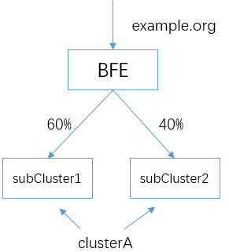
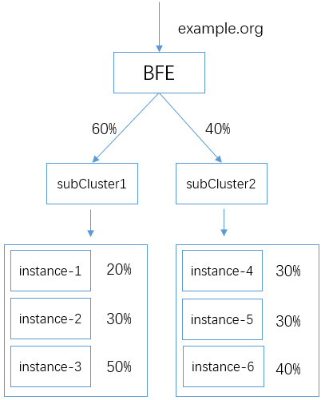

# Configure Load Balancing Algorithm and Session Stickiness
When configuring a load balancing system, one of the important parameters is how to set the load balancing algorithm. This determines how the load balancing system forwards traffic to the backend instance.

For BFE, a backend cluster may contain multiple sub-clusters, and sub-cluster may contain multiple instances. Therefore, the load balancing algorithm takes effect at two levels: sub-cluster level and instance level.

## Load balancing Between Sub-clusters

For a cluster of backend services, we can set the weight of its sub-clusters. BFE will allocate the requests to the sub-clusters according to the weight set by the sub-cluster.

Hash algorithm is used for load balancing among sub-clusters, and requests are distributed proportionally according to the weight of sub-clusters. The source IP is used for hash calculation by default.

### Configuration Example
Based on the example in the previous chapter, we expand the capacity of "cluster A" by adding a sub-cluster, subCluster2. Now cluster A contains two sub-clusters, subCluster1 and subCluster2. Due to the different processing capacity of the two sub-clusters, different traffic weights are set for them.



The traffic weights of the sub-clusters can be found in conf/cluster_conf/gslb.data.

The following is the content of the configuration file. We can specify weight values for the two sub-clusters to support the above traffic allocation:

```json
{
    "Clusters": {
        "clusterA": {
            "GSLB_BLACKHOLE": 0,
            "subCluster1": 60,
            "subCluster2": 40,
        }
    }
}
```

## Sub-cluster Session Stickiness

For the traffic distribution between sub-clusters, BFE performs hash calculation based on the fields in the request (such as IP address, request header, etc.), and then selects the target backend according to the configured weight. Hash computing can ensure that requests with the same key information can be allocated to the same sub-cluster, which also realizes session stickiness at the sub-cluster level.

Because the implementation is based on hash calculation, when the number of sub-clusters changes, session stickiness will be affected to some extent. This needs to be noted.

Session persistence can be based on the source IP address of the request or a specific field in the request header. The specific method can be set through the configuration file.

### Configuration Example

In *conf/server_data_conf/cluster_conf.data*, modify the "HashConf" field in the configuration file to set the attributes for sub-cluster session stickiness.

In the following example, BFE will use the cookie named UID in the request for hash calculation.

```
Cookie: UID=12345
```


```json
{
    "config": {
        ...
        "cluster_example": {
            ...
            "GslbBasic": {
                ...
                "HashConf": {
                    "HashStrategy": 0,
                    "HashHeader": "Cookie:UID",
                    "SessionSticky":false    
                }
            }
    }
}
```
### Meaning of Parameters

Meaning of fields in "HashConf ":

* HashStrategy: Set the policy used in session persistence:

  * 0: Use the field in the request header for session persistence. The name of the field is specified by "HashHeader ".

  * 1: Use the source IP address of request for session persistence

  * 2: Use the header first. If the header does not exist, use the source IP.

* HashHeader: This parameter specifies the name of the field in the header when using the field in the header for session persistence. For example, in the above example, "Cookie: UID" specifies to use a cookie named UID for session persistence.

* SessionSticky: Whether to enable instance-level session persistence.

## Load Balancing Between Instances

Within a sub-cluster, we can define multiple instances. How to allocate the traffic for this sub-cluster to these instances involves the problem of load balancing between instances.

BFE supports following load balancing algorithm between instances of the sub-cluster :

* Smooth weighted round robin

* Least connections

### Configuration Example of Weighted Round Robin

Weighted round robin is the default configuration for load balancing between instances. In this way, users only need to set the weights of the instances.

Based on the previous example of sub-cluster load balancing, we set different weights for the instances in the two sub-clusters. The following traffic forwarding is supported:



As mentioned earlier, the configuration file of the weights for instances is *conf/cluster_conf/cluster_table.data*

The configuration of the above scenario is as follows:


```json
{
    "Config": {
        "cluster_A": {
            "subCluster1": [
                {
                    "Addr": "192.168.2.1",
                    "Name": "instance-1",
                    "Port": 8080,
                    "Weight": 2
                },
                {
                    "Addr": "192.168.2.2",
                    "Name": "instance-2",
                    "Port": 8080,
                    "Weight": 3
                },
                {
                    "Addr": "192.168.2.3",
                    "Name": "instance-3",
                    "Port": 8080,
                    "Weight": 5
                }
            ],
            "subCluster2": [
                {
                    "Addr": "192.168.3.1",
                    "Name": "instance-4",
                    "Port": 8080,
                    "Weight": 3
                },
                {
                    "Addr": "192.168.3.2",
                    "Name": "instance-5",
                    "Port": 8080,
                    "Weight": 3
                },
                {
                    "Addr": "192.168.3.3",
                    "Name": "instance-5",
                    "Port": 8080,
                    "Weight": 4
                }
            ]            
        }
    }, 
    "Version": "1"
}
```

### Example of Least Connections 

If you want to use the least connections algorithm between the instances of the sub-cluster, modify  "BalanceMode" field in *conf/server_data_conf/cluster_conf.data* as follows:

```json
{
    "config": {
        ...
        "cluster_example": {
            ...
            "GslbBasic": {
                ...
                "BalanceMode": "WLC",
                ...
            }
    }
}
```

Modify the above configuration items, and the request will be forwarded to the instance with the least number of connections in the sub-cluster.


## Example of Instance-level Session Persistence

We can set the session to persist to the backend instance.

Modify the configuration and set "SessionSticky" in *conf/server_data_conf/cluster_conf. data* to true:

```
            "GslbBasic": {
                ...
                "HashConf": {
                    "HashStrategy": 0,
                    "HashHeader": "Cookie:UID",
                    "SessionSticky":true    
                }
             }
```
When this function is enabled, BFE will use the hash method to calculate the back-end instance in the sub-cluster. In this way, requests with the same UID can always be hashed to get the same backend, thus realizing the session persistence function.

The same problem will occur here: if the backend instance list changes, the session will be transferred to other instances.
