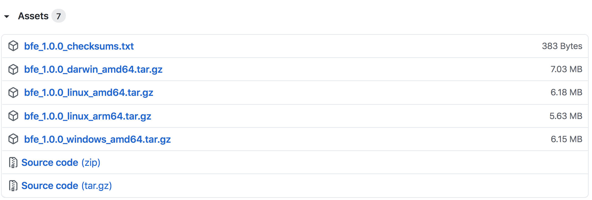
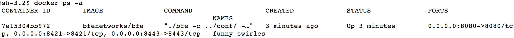
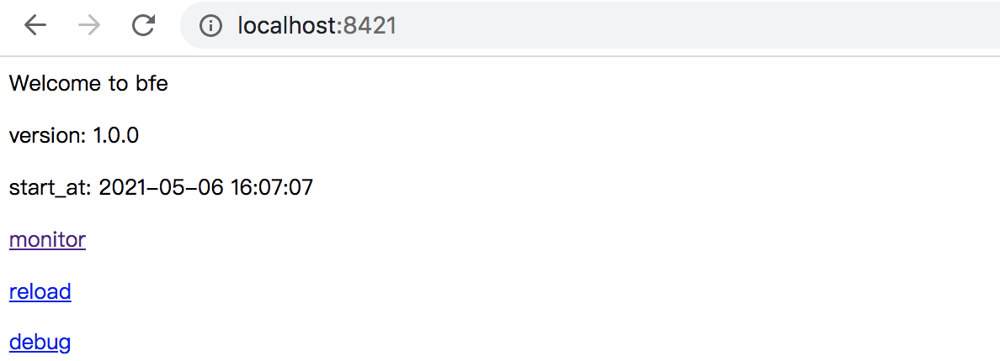

# Installation And Deployment of BFE Service
This chapter will introduce the download and installation of BFE in detail to help you understand how to run BFE services.

## Installation of BFE
BFE supports multiple installation methods. This chapter will introduce the following three methods:

* Software package download and installation

* Source code compilation and installation

* Docker installation

## Software Package Download And Installation

### Get BFE Installation Package
The installation package of BFE can be downloaded directly from the BFE project in github.com.

For different operating systems (Linux/MacOS/windows), corresponding software packages are provided.

The download address is as follows:

    https://github.com/bfenetworks/bfe/releases
You can select the software package according to the type of operating system.

### Download BFE Package
Take the Linux environment as an example, download version 1.0.0 of BFE.

On the above download page, find "BFE v1.0.0" and click to expand "Asserts", as shown below:



Click to download the compressed package named "bfe_1.0.0_linux_amd64. tar. gz".

### Content in BFE Software Package

Unzip the downloaded file bfe_ 1.0.0_ linux_ amd64.tar.gz:

```
sh-4.2# tar zxf bfe_1.0.0_linux_amd64.tar.gz 
sh-4.2# 
sh-4.2# cd bfe_1.0.0_linux_amd64
sh-4.2# 
sh-4.2# ls 
CHANGELOG.md	LICENSE		README.md	bin		conf
```

It includes two main directories:

* bin: This directory contains the executable program bfe.

```
sh-4.2$ ls bin
bfe
```

* conf: This directory contains the configuration file of bfe. Where bfe.conf is the main configuration file of BFE.

```
sh-4.2$ ls conf
bfe.conf		mod_block		mod_header		mod_static		server_data_conf
cluster_conf		mod_compress		mod_key_log		mod_tag			tls_conf
mod_access		mod_cors		mod_markdown		mod_trace
mod_auth_basic		mod_doh			mod_prison		mod_trust_clientip
mod_auth_jwt		mod_errors		mod_redirect		mod_userid
mod_auth_request	mod_geo			mod_rewrite		mod_waf
```

### Start BFE Service

Execute the following command to start a BFE instance as daemon. The instance is started using the default configuration.

```
sh-4.2# cd bin
sh-4.2# ./bfe -c ../conf -l ../log &
[1] 31024
```

Check port 8080, and you can find that it is in the listen state

```
sh-4.2$ ss -nltp | grep 8080
0      2048                           *:8080                          *:*      users:(("bfe",31024,10))
```

### Stop BFE Service

If you need to stop the BFE service, directly execute the kill command:

```
sh-4.2$ kill 31024
sh-4.2$ 
[1]+  Done                    ./bfe -c ../conf -l ../log
```

### Download And Install BFE In MacOs Or Windows
Similar to the installation process under Linux system: on the download page *https://github.com/bfenetworks/bfe/releases*, after downloading the BFE installation package corresponding to the operating system, you can start the BFE service.


## Source Code Compilation And Installation
The BFE source code is completely open source on github.com. You can also install it by compiling the source code.

### Environment preparation
- Environmental requirements
  - golang 1.13+
  - git 2.0+

+ Go language environment preparation

  Download address is *https://golang.org/dl/* or *https://golang.google.cn/dl/*

  On the download page, users can download the corresponding version according to the operating system environment.
  
  After downloading, follow *https://golang.org/doc/install* or *https://golang.google.cn/doc/install* for installation.

+ git installation

  The user needs to install the git command. The specific installation will not be repeated.

### BFE Source Code Download
Download the BFE source code through the *git clone* command

```bash
$ git clone https://github.com/bfenetworks/bfe
```

### BFE Source Code Compilation
Enter the directory *bfe*, execute *make* command, and compile the BFE source code:

```bash
$ cd bfe
$ make
```

> Tips: If you encounter a timeout error "https fetch: Get... connect: connection timed out", please set GO_PROXY for proxy and try again.

### Start BFE
After compilation, the executable file is in the directory *output/bin/*:

```bash
$ file output/bin/bfe
output/bin/bfe: ELF 64-bit LSB executable, ...
```

Start the BFE service by executing the following command:

```bash
$ cd output/bin/
$ ./bfe -c ../conf -l ../log
```

## Docker Installation
BFE also provides container image based on docker, which can be easily installed and deployed through docker.

The image of BFE can be found in the docker hub *https://hub.docker.com/r/bfenetworks/bfe*

### Set up Docker Environment
Refer to *docker. com* to set up the system's docker environment.

### Start BFE Container
Execute the following command to start a BFE container

```bash
# docker run -d -p 8080:8080 -p 8443:8443 -p 8421:8421 bfenetworks/bfe
```


The above command will run a BFE container and map the three default ports in the BFE container to the local.

View the running status of the container. You can see that the container ID is 7e15304bb972



If you want to stop the container, you can execute the following command:


## BFE Command Line

In the above section, we used the most commonly used command line options *- c* and *- l*. The command line options supported by BFE are as follows.

|Option|Description|
|---|----|
|-c \<config dir>   |The root directory of configuration files, default directory is ./conf   |
|-l \<log dir>      |The root directory of log files, default directory is ./log    |
|-s                 |Print logs to stdout. By default, this flag is set false.                |
|-d                 |Print debug logs. By default, this flag is set false.                  |
|-v                 |Display bfe version and exit. By default, this flag is set false.                 |
|-V                 |Display verbose version information and exit. By default, this flag is set false.        |
|-h                 |Display help information and exit. By default, this flag is set false.                       |


## View Running Status Of BFE Service

BFE provides an interface through which you can view various status of BFE service. The port defaults to 8421. Users can access the port directly using the browser, as shown in the following figure:



