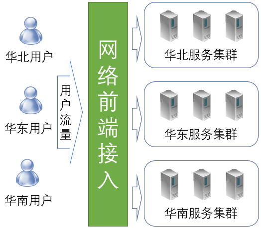

# 网络前端接入技术简介

## 什么是网络前端接入

“前端”（FE，Front End）这个词经常会用在区分软件工程师的角色：在浏览器上基于javascript、html等技术开发前端程序的工程师，常被称为“前端工程师”，或“FE工程师”；而在服务器上基于C++、Java、Go等编程语言开发后台程序的工程师，被称为“后端工程师”。

网络前端接入的英文也是Front End，缩写为FE。从事网络前端接入方向的工程师不是“前端工程师”，而是“网络研发工程师”。在这里，“前端”（Frond End）是从网络和用户访问的角度出发而产生的概念。“后端”（Back End）的服务位于数据中心中，是用户无法直接访问的；用户的流量必须要经过网络前端接入（也就是“前端”）的转发才能到达后端。我们也可以把网络前端接入定义为“流量从用户到达服务的过程”。

流量从用户到达数据中心内的服务并不是一个很简单的过程。流量从用户到达服务，要经过很多系统或设备的处理，其中包括家庭或公司的网络，也包括运营商的网络，还有服务提供商自己的网络。网络前端接入非常关键，如果这个环节出了问题，即使数据中心内的服务是正常的，用户仍然无法很好的访问服务。

## 网络前端接入面临的挑战

在网络前端接入中，面临以下几方面的挑战：

(1) 可用性

   这方面可能出现的问题包括：

+ 网络的故障。用户网络、运营商网络、服务提供商的网络都可能出现故障。
+ 服务的故障。数据中心内部署的服务可能由于数据中心、服务器、后台程序的问题而无法正常提供服务。
+ 网络攻击。黑客可能发动DDoS攻击或应用层攻击，从而导致网络带宽拥塞、相关服务系统过载或崩溃。

   可用性是网络前端接入中最严重的问题，会导致用户根本无法正常访问服务，从而出现流量损失。

(2) 性能

​    这方面可能出现的问题包括：

+ 低效的网络协议。网络协议对于传输性能有很大的影响。尤其是在移动无线互联网场景下，在延迟抖动和高丢包率的影响下，之前为有线网络所设计的网络协议很多都出现了性能方面的问题。这种情况也推动了近年来网络协议的快速升级。
+ 不优化的调度。在大型企业存在多地域、多运营商接入点的情况下，如何将不同地域、运营商的用户调度到合理的网络接入点是非常重要的技术。如果没有实现就近的接入、或调度到了不同运营商的接入点，都可能导致网络访问性能的下降。

   性能方面的问题，会导致用户访问服务的速度变慢，而访问速度会直接影响到互联网用户的访问体验。

(3) 安全

​     这方面可能出现的问题包括：

+ 流量劫持。黑客可能通过DNS劫持等手段将用户流量引导到伪造的网站去。
+ 内容劫持。黑客可能对未使用HTTPS技术加密的网页进行内容插入或修改。例如，可能对访问的内容中插入非网站主提供的广告内容，从而获取非法的经济利益。
+ 隐私泄露。黑客可以对未使用HTTPS技术加密的访问进行嗅探。例如，可以对用户的访问情况进行监听收集，从而了解用户的兴趣，并将这些信息用于广告等目的。

​    安全方面的问题对于互联网服务企业和互联网用户都造成了极大的威胁，可能造成巨大的经济损失。

(4) 效率

​     在多地域/数据中心/实例的场景下，不优化的调度可能导致地域/数据中心/实例级别的负载不均衡。

​     这会导致服务资源间忙闲不均，从而导致服务资源无法充分利用。

## 百度的网络前端接入方案

百度作为一个大型的互联网企业，具有多地域、多数据中心的复杂场景。其网络前端接入方案如上图所示，包括以下几个关键系统：

+ GTC（Global Traffic Control）：外网流量调度系统。用于在网络入口间对外网流量进行调度。

  在网络流量调度方面，有两种可能的技术方案：DNS，或BGP路由。由于带宽资费等方面的原因，在国内普遍使用由运营商提供IP地址的“静态带宽”，而不是由网站服务商自己提供地址的“BGP”带宽，所以GTC也主要基于DNS来生效。

+ HTTPDNS：移动域名解析。用于为移动客户端提供域名解析服务。

  DNS作为互联网的重要基础设置，一直存在容易被劫持、生效速度慢、解析准确性低等固有问题。随着移动互联网的发展，尤其是移动APP的广泛使用，为解决DNS的问题提供了新的机遇。HTTPDNS基于加密的Web服务，可以解决DNS所存在的一系列问题，已经在百度所有重要移动客户端上普遍使用。

+ BGW（Baidu GateWay）：四层负载均衡系统。为流量提供网络负载均衡服务。

  BGW的功能类似于著名的开源软件LVS，但它是由百度基于DPDK技术自研的系统。

+ BFE：七层负载均衡系统。为流量提供应用层负载均衡服务。

  内网流量调度GSLB作为BFE的子功能，提供跨数据中心的集群粒度的流量调度。
