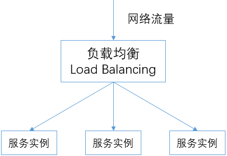
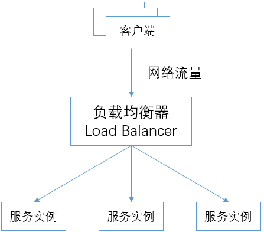
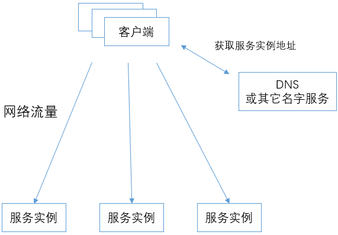
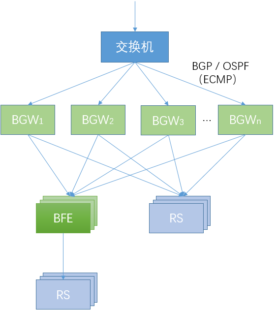

# 网络负载均衡技术简介

前面从“网络前端接入”的角度，介绍了BFE的背景。从系统分类的角度，BFE也属于“网络负载均衡”的范畴。为了便于大家理解，下面对网络负载均衡技术做一个简要的介绍。

## 概念

负载均衡，英文为Load Balancing，在计算机领域是指将一组任务分布到一组计算单元上来处理。负载均衡技术在分布式计算的场景有广泛的使用，只要计算单元大于一个，都需要考虑使用负载均衡技术。

在网络领域，负载均衡器负责将网络流量分发给下游的多个实例。

## 网络均衡器 vs 名字服务

### 机制说明

网络负载均衡功能的实现，可以基于两种方式：

+ 负载均衡器的方式

  所有的网络流量都先发送给负载均衡器（Load Balancer），再由负载均衡器转发给下游的服务实例。

  在这种方式下，负载均衡的功能都由负载均衡器来完成。

+ 名字服务 + 客户端策略的方式

  客户端通过DNS（或其它名字服务）获得服务实例的地址列表，然后客户端把网络流量直接发送给服务实例。

  在这种方式下，负载均衡的功能都由客户端和名字服务配合完成。名字服务在返回服务实例地址列表时，有一定的策略；客户端在获得服务实例的地址列表后，在发送网络流量时也可以有一定的策略。

### 方案对比

下表中对以上两种方案进行了对比。

**基于负载均衡器的方式**适用于对流量控制要求比较高的场景，可以实现单个连接/请求粒度的精细转发控制。而且这种方式对客户端的要求很低，客户端不需要实现任何策略，也不涉及客户端SDK的引入。这种方式的弊端是需要在负载均衡器方面投入额外的资源，在使用时需要计算一下所需要的资源成本。

**基于名字服务+客户端策略的方式**的好处是不需要额外的资源消耗，客户端直接访问服务。但是这种方式的执行效果强依赖于客户端的配合，在客户端上要实现较复杂的策略，通常要引入客户端SDK，从而引入了客户端升级的成本。对很多公司来说，客户端软件的种类很多，分属不同的团队，要做到及时的升级很困难。另外，这种方式的执行粒度比较粗，客户端和名字服务之间的交互不可能过于频繁，秒级的交互频度已经是很高的了，但即使这样也不可能做到单个连接/请求粒度的控制。

在某些场景下，无法使用负载均衡器，而只能使用名字服务+客户端策略的方式。如，在[外网调度场景](../../design/gslb/gslb.md)下，就只能使用DNS的方式。

| 方案                      | 对流量的控制力                                               | 资源消耗                                 | 对客户端的要求                                           | 适用场景                                                     |
| ------------------------- | ------------------------------------------------------------ | ---------------------------------------- | -------------------------------------------------------- | ------------------------------------------------------------ |
| 基于负载均衡器            | **强**。可以达到单个连接 / 请求的粒度。                      | **高**。负载均衡器引入了额外的资源消耗。 | **低**。客户端基本不需要实现策略。                       | 总体流量规模不大（从负载均衡器资源消耗的角度）；应用场景对流量控制要求高。 |
| 基于名字服务 + 客户端策略 | **弱**。客户端直接访问服务，没有可靠的卡控点，无法实现精细的流量控制测量。 | **低**。不需要额外的资源投入。           | **高**。客户端需要支持比较复杂的策略，且涉及升级的问题。 | 总体流量规模较大；应用场景对流量控制要求低；无法使用负载均衡器的场景。 |

## 四层负载均衡 vs 七层负载均衡

传统的硬件网络负载均衡器中，包含了比较综合的功能。从协议的角度，包含了对TCP、UDP流量的支持，也包含了对HTTP、HTTPS等协议的处理。

而在大多数互联网公司中，普遍使用软件形态的负载均衡器，并且基于所处理的协议区分为两种不同的系统：

+ 四层负载均衡：仅用于对TCP、UDP流量进行处理。也被称为网络负载均衡。

  四层负载均衡在转发中主要基于IP地址、端口等信息。

  四层负载均衡的开源软件包括LVS，DPVS等。

+ 七层负载均衡：支持HTTP、HTTPS、SSL、TLS等协议的处理。也被称为应用负载均衡。

  七层负载均衡在转发中可以利用应用层的信息（如：HTTP的请求头部），而这些信息对四层负载均衡来说是不可见的。

  七层负载均衡的开源软件包括Nginx, BFE, Traefik, Envoy等。

有一些软件同时支持了四层负载均衡和七层负载均衡，如Nginx和Haproxy。但是在大规模部署场景，一般会使用专用的四层负载均衡软件，主要原因是四层负载均衡和七层负载均衡两个场景存在较大的差异，适合使用不同的技术栈来实现。

+ 四层负载均衡软件：需要很高的处理能力，以实现较高的性价比，并用于抵御来自外网的DDoS攻击。

  在“[网络前端接入技术简介](../introduction/introduction.md)”中所介绍的BGW软件，它使用C语言，基于DPDK技术研发，在单台x86服务器上可以处理50Gbps的网络流量，每秒可以处理的新建连接超过100万。要获得更高的性能，就需要软件整体的逻辑比较简单，没有高资源消耗的功能。同时，因为性能和稳定性方面的高要求，这样的软件新功能研发的成本也比较高，开发新功能及变更上线的周期比较长。

+ 七层负载均衡软件：功能比较复杂，且需要不断增加新的功能。

  七层负载均衡软件可以“看到”应用层的信息，功能的空间比四层负载均衡软件要大很多。由于它更贴近业务，也会不断收到来自业务的需求，需要不断的开发出新的功能特性；由于互联网业务的特性，需要更快的开发和上线速度。七层负载均衡软件对于性能方面的要求比四层负载均衡软件要低，从带宽吞吐方面几乎差距一个量级。

下图以百度的BGW和BFE为例，说明了四层负载均衡软件和七层负载均衡软件混合使用的场景。

+ BGW和交换机的互连

  BGW通过BGP或OSPF路由协议和上游的交换机进行路由交互。交换机使用ECMP（等价路由）的机制，将流量哈希分发到多个BGW实例。

  对于某个VS（Virtual Server，由（IP地址，协议，端口）来标示）来说，所有的BGW实例都可以接收和处理其流量。通过这种方式，实现了BGW的分布式容错，在单个BGW实例故障的情况下，BGW集群仍能够继续处理流量转发。

+ BGW和下游服务的互连

  每个BGW实例按照Round Robin(或设定的其它策略)，将流量转发给下游的RS（Real Server，和VS相对应）。

+ BGW和BFE的互连

  在使用七层负载均衡的场景，BGW把BFE当作RS，将发往某个VS的流量转发给下游的BFE实例。在BFE实例出现故障的情况下，BGW可以将有故障的BFE实例自动摘除。

+ BFE和下游服务的互连

  每个BFE实例按照Round Robin(或设定的其它策略)，将流量转发给下游的RS。

## links
上一章：[第三章 网络前端接入技术的发展趋势](../../frontend_principle/trend/trend.md)  
下一章：[第五章 BFE的设计思想](../../design/ideas/ideas.md)