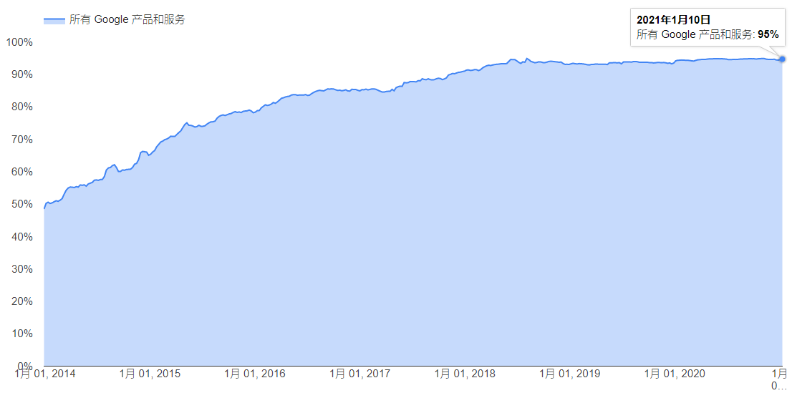

# 网络前端接入技术的发展趋势

## 网络传输的加密化

作为一种对网络访问进行加密的技术，HTTPS早在2000年就已经在RFC2818中被定义。但是在之后的十多年时间中，HTTPS在业界并没有被普遍的使用。

随着近年来互联网在人类生活领域的快速渗透，互联网所承载的经济利益越来越高，HTTP明文传输所导致的安全风险越来越大。对于未使用HTTPS技术的网站，可能会存在以下威胁：

+ 配合DNS劫持技术，网站可能被伪造。对于包含具有经济利益的账户的网站（如银行、电商），黑客可以通过这样的方式骗取到用户的账号名和密码。
+ 用户获得的访问内容可能被篡改。例如，对于一些高质量内容的网站，黑客可能在网站主没有感知的情况下通过广告内容来获取非法利益。
+ 用户的访问信息可能被嗅探。例如，通过嗅探用户对于搜索、电商等网站的访问情况，黑客可以将这些信息转卖给第三方公司用于广告投放的优化。

从保护搜索流量不被劫持和窃听的角度，谷歌从2014年起大力推动自身的HTTPS化改造，2014年至2020年谷歌的产品和服务HTTPS流量的覆盖率从50%提升至95%（见 https://transparencyreport.google.com/https/overview ）。同时，谷歌也通过Chrome浏览器的巨大影响力，推动第三方网站升级到HTTPS，对于未使用HTTPS的网站，在Chrome浏览器中会显示为“不安全”。几乎在同一时期，国内的各大互联网公司也都开始了全站HTTPS化改造的工作。

必须要说明，HTTPS化绝对不是“将HTTP访问加密”这么简单，HTTPS化给使用这个技术的公司带来了一系列的挑战：

+ 对网络资源管理的要求提高

  在HTTPS化中涉及到HTTPS证书的问题，而证书和域名紧密相关。在HTTPS改造过程中，部分企业可能会发现之前无序申请的大量域名可能会在证书的使用和成本方面带来很大的问题。

+ 对于外部的依赖增强

  在使用HTTPS后，由于技术更加复杂，服务器一侧对于客户端的兼容性难度增加。在服务端程序升级时，有可能由于部分客户端程序/代码库不兼容导致服务访问的异常。另外，在使用HTTPS后，对于CA（Certifi*ca*te Authority，证书颁发机构）产生了很大的依赖，CA成为网站稳定性、安全性的一个新的隐患。

+ 对性能方面的影响

  在HTTPS中由于使用到加解密技术，肯定会对性能产生一定的影响。尤其是其中使用的非对称加解密计算，会消耗大量的CPU计算资源，从而导致网站成本的提升，并增加了DDoS攻击的风险。

+ 对延迟方面的影响

  和HTTP相比，HTTPS会增加1到2轮的协议报文交互，从而增加用户的访问延迟。对于用户和网站之间本来网络延迟就比较大的场景，HTTPS会加倍的放大这种延迟。

对于以上这些挑战，都需要在技术和机制上采用一些措施来解决。

## 网络协议的技术门槛提高

在大约20年前，搭建一个网站可能是一个相对简单的事情。HTTP就是主流的网络协议。一个对网络可能没有太多了解的技术人员，根据一些简单的说明，下载一个Apache软件（后来是Nginx），安装并运行就可以了。

最近几年来，随着安全技术的升级、及针对移动互联网的网络协议的升级，HTTPS、SPDY、HTTP/2、QUIC等协议不断的出现、或被广泛的使用。相比HTTP协议，这些协议的复杂性要提高很多，已经不是任何人都可以快速掌握。如果对于相关协议技术没有深入的了解，可能会在安全、稳定性、性能等方面出现很多问题。这种情况推动了网络前端接入人员的专业化，在很多公司、尤其是规模较大的互联网公司，都建立专门的网络前端接入团队。

## 移动化对网络前端接入的影响

网络访问的移动化体现在两个方面。首先，从网络传输的介质来说，已经有相当大比例的流量是通过无线互联网（Wifi，3G/4G/5G）来访问的。另外一个方面，相当大比例的用户是通过移动终端/移动客户端来访问，而不是通过PC。早在2014年10月，百度搜索在移动客户端上的流量就超过了PC。

网络访问的移动化，对网络前端接入产生了重要的影响，表现在：

+ 传输协议的快速升级

  互联网最经常使用的TCP协议，其设计中包含的很多重要假设都是基于有线网络的。例如：报文的丢失，主要是由于网络中发生了拥塞，所以报文丢失可以作为拥塞发生的信号；端到端的延迟和带宽在一定时间内是相对稳定的，通过超时时钟的机制来发现丢失。在无线互联网场景下，以上的假设很多被打破了。由于无线链路的特点，很多报文的丢失并不是由于拥塞；端到端的延迟和带宽也是不稳定的。这种变化引发了对互联网协议的升级。

+ 传输协议的私有化

  众所周知，TCP位于操作系统的网络协议栈中。全世界只有3家公司可以对移动端的操作系统进行修改：谷歌（Android），苹果（iOS，Mac OS），微软（Windows）。对其它公司，在客户端一侧对TCP协议进行持续优化的可能性很低，之前的大量优化都只能从服务端想办法。移动端、尤其是Native App的广泛使用改变了这种情况。QUIC协议就是一个例子，它基于UDP协议，运行在APP中，任何公司都可以根据自己的需要对其进行修改和优化

+ HTTPDNS的兴起

  DNS是互联网的3大基础机制之一（另外2个分别是IP路由和TCP拥塞控制）。DNS容易被劫持、生效速度慢、解析准确性低等固有问题，在移动互联网时代迎来了解决的机会。

## 网络安全防护的重要性提高

由于互联网服务所具有的经济利益，也引来了各种攻击，如通过大压力使得网站无法服务的DDoS攻击，或利用网站的各种漏洞所实施的应用层攻击。网络攻击是被业务的价值所吸引的，公司的营收越大，受到攻击的可能性就越大。如果没有足够的安全防护能力，想平平安安的用互联网来从事经济活动或客户服务是不可能的。我们经常可以听到类似这样的新闻：某个游戏公司的游戏做的很好，玩家非常喜欢，用户量不断上升，但突然被恶意DDoS攻击，使正常的用户无法使用，导致用户大量流失，甚至公司倒闭；某个公司由于存在漏洞，被黑客从数据库中窃取隐私的客户信息，从而影响到公司的市场声誉。

对于一般的公司来说，DDoS防护和WAF防护等安全机制已经成为普遍需要的基础能力。

在DDoS攻击的防御方面，有两种可能的思路：

+ 对攻击流量进行过滤

  这适用于攻击流量小于带宽容量，或攻击流量小于负载均衡系统的场景

+ 通过调度进行应对

  当攻击流量大于带宽容量或负载均衡系统时，需要将流量调度到其它空闲的网络接入点

在应用层攻击防御方面，重点在于以下两点：

+ 检查规则的完备程度

  WAF的有效性，对检查规则的依赖很高。0 Day场景仍然是对WAF的巨大挑战。

+ 执行检查规则所需要的计算资源

  检查所需要的资源，随着规则数的增加而增长。在资源消耗和安全性之间，存在着权衡。

对攻击的防御，本质上是一种基于资源（包括带宽、计算能力等）的对抗。防攻击的能力，部分决定于资源动员的能力。在被攻击的时候，是否可以灵活调用所有的带宽资源、服务器资源参与对抗，这决定了攻击防御的结果。建设强大的资源调度能力，对于提升攻击的防御能力非常重要。

## 数据驱动的运营

在互联网最初出现的时候，有一种说法：互联网是尽力而为（Best Effort），和电信网络相比，无法保证非常高的稳定性。但是，目前很多互联网服务已经成为生活所必须的基础服务，重要性类似于水和电。这就对互联网服务的稳定性提出了极高的要求。

对应于网络前端接入来说，以前可能对于服务、流量、故障的情况并没有持续和精确的数据报表及监控。在很多公司，对于公司整体的每秒请求数、并发连接数、HTTPS握手成功率等是缺乏准确数据的，更不要说按照服务、域名、地域等维度对这些数据进行深入分析。

实现提升服务可靠性的目标（如，从99.9%提升到99.999%），肯定无法仅依靠人工运营的方式，而必须依靠技术手段。转向基于数据的运营是必由之路。前端接入网络数据方面的建设工作包括：

+ 建立相关的报表体系
+ 建立关键的监控
+ 为自动化/智能化控制提供所需要的数据

从数据内容的角度，可以考虑在以下3方面建立报表和监控体系：

+ 使用网络前端接入的业务的用户流量数据

+ 各服务的后端服务的状况

  网络前端接入作为调用方，可以发现后端服务在延迟、错误率等方面的异常

+ 外部网络的状况

  对于网络前端接入来说，外部网络是最难以控制的。需要尽可能的对Local DNS的解析情况、各地区到接入点的连通性等情况进行监控。

## 自动化/智能化的控制

前端网络接入中，有很多需要决策的地方，如：流量的调度，止损的处理等等。在很多公司里，这些问题仍然是依靠人工来处理的。

对于从人工升级到自动控制的目的，很多人的认识仍然停留在“节省人力成本”。其实，这还不是最重要的。在提升服务的可靠性方面，很多自动控制的能力是人工根本无法实现的。比如：在外网流量调度方面，百度的自动调度程序可以持续根据带宽资源、服务容量、网络连通性等信息，持续进行计算；在出现故障的情况下，在2分钟内实现自动的切换。这样的效果是人工完全无法完成的（即使一个人可以7*24小时的工作）。

在自动化控制角度，可以优化的方向包括：

+ 将以前靠人来执行的策略，固化为系统中的策略，从而减少对个人的依赖
+ 在建立模型的基础上，不断的优化模型和策略
+ 从定性的控制，升级为定量的控制。在这方面，人工是很难做到的

这里必须要说明，实现自动化的控制并不是那么容易的，对于系统设计提出了很高的要求。和之前基于人工控制的系统相比，自动控制的系统有两个基本的前提：

+ 清晰的模型

  自动化系统的难点不是系统和编码，而是模型的设计和优化。模型设计的质量，决定了系统最终的质量。而对很多软件工程师来说，模型的设计能力是一个亟待提高的短板。

+ 完备、可靠、可量化的数据

  控制算法的执行效果，严重依赖于所输入的数据。用于控制的数据，可靠性要求远高于报表数据。如果数据系统出现了故障，也会导致最终控制的失败。在自动控制的系统设计中，需要在数据采集和控制方面做出很多容错的设计。

## 网络前端接入的软件化/服务化/开源化

之前大部分的网络前端接入功能都是由硬件设备提供的。使用者需要购置相关的设备，部署在自己的数据中心中。

最近这些年来，这方面已经发生了很大的变化，表现为：

+ 软件化

  基于标准服务器部署软件来实现网络前端接入的功能（如，负载均衡，DNS）。这不仅可降低设备采购成本，而且增强了这些功能的弹性扩缩容能力。

+ 服务化

  对于某些功能，甚至不需要部署软件，而可以直接使用服务。包括公有云中的各种负载均衡服务、DNS，及CDN、网络代理接入等，都已经有服务可以购买。

+ 开源化

  在云计算领域，开源是重要的驱动力，在网络前端接入领域也是如此。开源增强了使用者对于软件的控制力，也增强了软件的进化能力。

## 网络前端接入的云原生化

云原生（Cloud Native）是目前云计算的重要方向。

网络前端接入系统一方面要支持业务的云原生化，支持业务的微服务化、多租户、弹性扩缩容等能力；另外也要实现自身的云原生化，自身具备微服务化、弹性扩缩容的特性。

## links
上一章：[第二章 网络前端接入技术简介](../../frontend_principle/introduction/introduction.md)  
下一章：[第四章 网络负载均衡技术简介](../../frontend_principle/load_balance/load_balance.md)