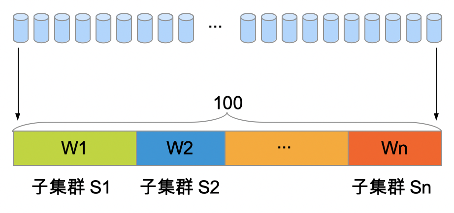

# 负载均衡

租户的后端集群一般包含了多个子集群，每个子集群分别部署在不同地域不同机房中。每个子集群包含了一组处理能力差异化的实例。

业务通常采用多个子集群方式, 可以带来如下好处：
1. 多个子集群同时提供服务提升整体容量, 以满足高并发的互联网用户请求
2. 多个子集群部署不同的故障隔离域，某个子集群出现故障（例如分级变更上线异常）, 可以快速切换流量止损，提升整体可用性
3. 多个子集群分布在离用户更近位置，可支持就近处理用户请求优化访问体验

相对应的，BFE的流量负载均衡包含了两个层级：
1. 全局负载均衡(GSLB)：BFE集群利用全量的用户流量、后端容量、网络情况, 在多个后端子集群之间实现负载均衡。实现全局近实时决策优化，满足就近分发、调度止损、过载保护等目标。

2. 分布式负载均衡(SLB)：BFE实例分别独立的，将到达的某个子集群的流量，在其多个后端实例之间实现负载均衡。实现细粒度实时负载均衡，满足实例均衡、故障屏蔽、重试容错等目标

## 全局负载均衡

BFE在后端集群的多个子集群之间，采用基于WRR算法的负载均衡策略。 算法实现详见 bfe_balance/bal_gslb/bal_gslb.go:subClusterBalance()。
全局负载均衡算法如下包括两个步骤：

步骤一：请求亲缘性及分桶处理

    由于用户请求可能具有亲缘性，需要常态需固定转发给某个子集群。例如:
1. 某个用户的请求，常态固定转发给某个子集群处理, 以实现用户分组管理；
2. 某个固定的查询，常态固定转发给某个子集群处理，以满足缓存友好性。

    BFE支持多种方式(基于请求Header或Cookie来)标识请求:
1. 基于请求指定Header或Cookie
2. 基于请求来源IP
3. 优先基于请求指定Header或Cookie，缺少情况下基于请求IP

```
	switch *bal.hashConf.HashStrategy {
	case cluster_conf.ClientIdOnly:
		hashKey = getHashKeyByHeader(req, *bal.hashConf.HashHeader)

	case cluster_conf.ClientIpOnly:
		hashKey = clientIP

	case cluster_conf.ClientIdPreferred:
		hashKey = getHashKeyByHeader(req, *bal.hashConf.HashHeader)
		if hashKey == nil {
			hashKey = clientIP
		}
	}

	// if hashKey is empty, use random value
	if len(hashKey) == 0 {
		hashKey = make([]byte, 8)
		binary.BigEndian.PutUint64(hashKey, rand.Uint64())
	}

	return hashKey

```

算法将用户的请求切分为100个桶, 并基于指定策略(例如基于请求Cookie中的用户ID), 将请求固定哈希到其中某个桶

```
func GetHash(value []byte, base uint) int {
	var hash uint64

	if value == nil {
		hash = uint64(rand.Uint32())
	} else {
		hash = murmur3.Sum64(value)
	}

	return int(hash % uint64(base))
}
```


步骤二：用户请求均衡及分配
算法将100个桶，分配给权重和为100的所有子集群。



例如包含3个子集群S1，S2，S3，其权重分别为W1，W2，W3 且 W1+W2+W3=100, 则:
- 子集群S1分配到桶号范围为 [0, W1-1]
- 子集群S2分配到桶号范围为 [W1, W1+W2-1]
- 子集群S3分配到桶号范围为 [W1+W2,99]


```
	// Calculate bucket number for incoming request
	w = bal_slb.GetHash(value, uint(bal.totalWeight))

	for i := 0; i < len(bal.subClusters); i++ {
		subCluster = bal.subClusters[i]

		// Find target subcluster for specified bucket
		w -= subCluster.weight
		if w < 0 {
			return subCluster, nil
		}
	}

	// Never come here
	return nil, err.News("subcluster balancing failure") 

```


## 分布式负载均衡

BFE在后端子集群的多个实例之间，支持多种负载均衡策略，包括:
- WRR: 加权轮训策略
- WLC: 加权最小连接数策略

算法实现详见 bfe_balance/bal_slb/bal_rr.go:Balance()。

