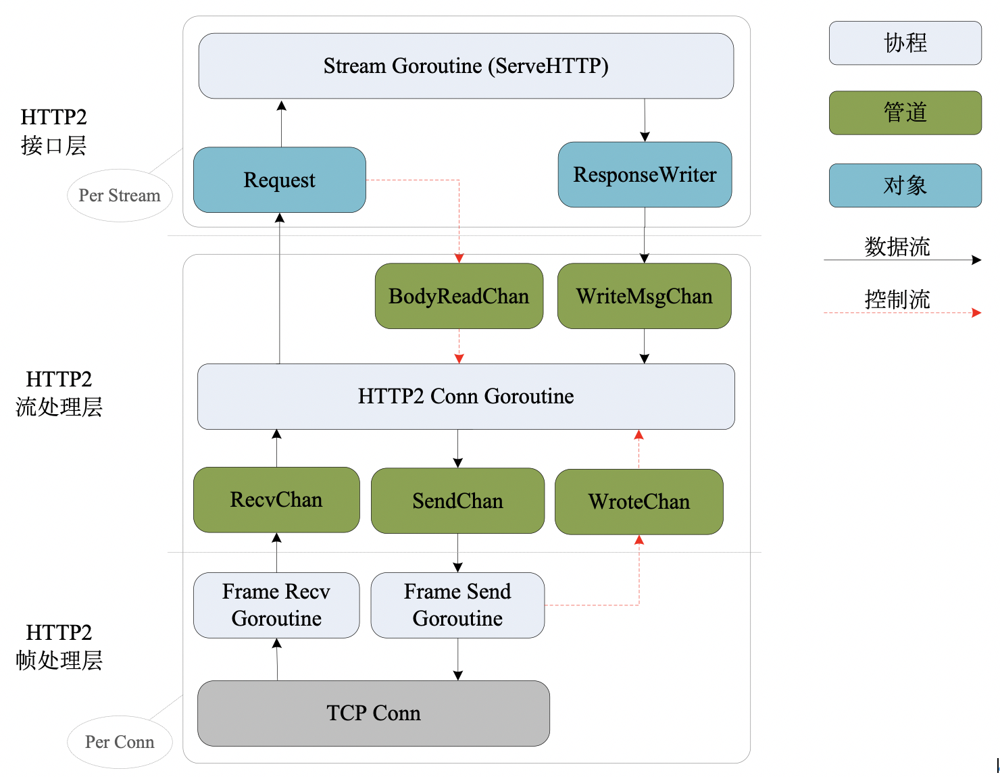

# 核心协议实现

BFE的HTTP/HTTP2/SPDY/WebSocket/TLS等网络协议一般基于golang官方开源协议库二次开发，并进行定制以更好满足反向代理的需求场景，例如性能优化、防攻击机制完善、兼容性改进、增加探针等。

本章将重点介绍HTTP/HTTP2协议的实现，SPDY的实现与HTTP2的实现非常相似，不再赘述。关于其它协议的实现，可参考代码结构说明章节查阅对应源码，也可在BFE开源社区提问交流。

## HTTP协议

### HTTP代码的组织

在bfe_http目录下可以看到包含了如下的代码：

```bash
$ ls bfe/bfe_http
chunked.go       cookie.go       header_test.go  readrequest_test.go   response.go            sniff.go     transfer_test.go
chunked_test.go  cookie_test.go  httputil        request.go            response_test.go       state.go     transport.go
client.go        eof_reader.go   lex.go          request_test.go       response_writer.go     status.go
common.go        header.go       lex_test.go     requestwrite_test.go  responsewrite_test.go  transfer.go
```

各文件的功能说明如下：

| 类别     | 文件名或目录       | 说明                                                         |
| -------- | ------------------ | ------------------------------------------------------------ |
| 基础类型 | common.go          | HTTP基础数据类型定义                                         |
|          | state.go           | HTTP协议内部状态指标                                         |
|          | eof_reader.go      | EofReader类型定义，实现了io.ReadCloser接口，并永远返回EOF    |
| 协议消息 | request.go         | HTTP请求类型的定义、读取及发送                               |
|          | response.go        | HTTP响应类型的定义、读取及发送                               |
|          | header.go          | HTTP头部类型定义及相关操作                                   |
|          | cookie.go          | HTTP Cookie字段的处理                                        |
|          | status.go          | HTTP响应状态码定义                                           |
|          | lex.go             | HTTP合法字符表                                               |
| 消息收发 | client.go          | RoundTrpper接口定义，支持并发的发送请求并获取响应            |
|          | transport.go       | HTTP连接池管理，实现了RoundTrpper接口，在反向代理场景用于管理与后端的HTTP通信 |
|          | transfer.go        | transferWriter/transfterReader类型定义，在反向代理场景用于向后端流式发送请求及读取响应 |
|          | response_writer.go | ResponseWriter类型定义，在反向代理场景用于构造响应并发送     |
| 辅助工具 | httputil           | HTTP相关辅助函数                                             |
|          | chunked.go         | HTTP Chunked编码处理                                         |
|          | sniff.go           | HTTP MIME检测算法实现(https://mimesniff.spec.whatwg.org)     |


### 从用户读取HTTP请求

在 bfe_http/request.go文件中实现了从HTTP连接上读取一个HTTP请求，包括以下步骤：

- 读取HTTP请求行并解析请求方法、URI及协议版本号
- 读取HTTP请求头部并解析
- 读取HTTP请求主体

```go
// bfe_http/request.go

// ReadRequest reads and parses a request from b.
func ReadRequest(b *bfe_bufio.Reader, maxUriBytes int) (req *Request, err error) {
  	tp := newTextprotoReader(b)
  	req = new(Request)
	  req.State = new(RequestState)

	  // Read first line (eg. GET /index.html HTTP/1.0)
	  var s string
	  if s, err = tp.ReadLine(); err != nil {
	    	return nil, err
	  }
    ...

  	// Parse request method, uri, proto
  	var ok bool
  	req.Method, req.RequestURI, req.Proto, ok = parseRequestLine(s)
  	if !ok {
	    	return nil, &badStringError{"malformed HTTP request", s}
   	}
  	rawurl := req.RequestURI
  	if req.ProtoMajor, req.ProtoMinor, ok = ParseHTTPVersion(req.Proto); !ok {
	    	return nil, &badStringError{"malformed HTTP version", req.Proto}
	  }
	  if req.URL, err = url.ParseRequestURI(rawurl); err != nil {
		    return nil, err
  	}
    ...

  	// Read and parser request header
  	mimeHeader, headerKeys, err := tp.ReadMIMEHeaderAndKeys()
  	if err != nil {
    		return nil, err
  	}
  	req.Header = Header(mimeHeader)
  	req.HeaderKeys = headerKeys
    ...

    // Read request body
  	err = readTransfer(req, b)
  	if err != nil {
	    	return nil, err
  	}

  	return req, nil
}

```

注意最后一个步骤中，readTransfer(req, b)并未直接将请求内容立即读取到内存中。因为这会大大增加反向代理的内存开销，同时也会增加请求转发延迟。

因此，在readTransfer函数中，根据请求方法、传输编码、请求主体长度，返回了不同的实现了io.ReadCloser接口的类型，用于按需读取请求内容。

```go
// bfe_http/transfer.go

// Prepare body reader. ContentLength < 0 means chunked encoding
// or close connection when finished, since multipart is not supported yet
switch {
case chunked(t.TransferEncoding):
		if noBodyExpected(t.RequestMethod) {
			  t.Body = EofReader
		} else {
			  t.Body = &body{src: newChunkedReader(r), hdr: msg, r: r, closing: t.Close}
		}
  
case realLength == 0:
		t.Body = EofReader
  
case realLength > 0:
		// set r for peek data from body
		t.Body = &body{src: io.LimitReader(r, realLength), r: r, closing: t.Close}
  
default:
		// realLength < 0, i.e. "Content-Length" not mentioned in header
		if t.Close {
			  // Close semantics (i.e. HTTP/1.0)
			  t.Body = &body{src: r, closing: t.Close}
		} else {
			  // Persistent connection (i.e. HTTP/1.1)
			  t.Body = EofReader
		}
}
```


### 向后端转发请求并获取响应

在 bfe_http/transport.go中Transport类型实现了RoundTripper接口，支持发送请求并获取响应。主要包括以下步骤：

- 检查请求的合法性
- 从连接池获取到目地后端的闲置连接，或新建连接（如无闲置连接）
- 使用该连接发送请求，并读取响应

连接的数据类型是persistConn，包含的核心成员如下：

```go
// bfe_http/transport.go

// persistConn wraps a connection, usually a persistent one
// (but may be used for non-keep-alive requests as well)
type persistConn struct {
	  t        *Transport
	  cacheKey string // its connectMethod.String()
	  conn     net.Conn
    closed   bool                // whether conn has been closed

	  reqch    chan requestAndChan // written by roundTrip; read by readLoop
	  writech  chan writeRequest   // written by roundTrip; read by writeLoop
	  closech  chan struct{}       // broadcast close when readLoop (TCP connection) closes
    ...
}
```

同时，persistConn包含两个相关协程 writeLoop()/readLoop()，分别用于向后端连接发送请求及读取响应。

```go
// bfe_http/transport.go

func (pc *persistConn) writeLoop() {
    defer close(pc.closech)
    ...
    for {
        select {
        case wr := <-pc.writech:
            ...
            // Write the HTTP request and flush buffer
            err := wr.req.Request.write(pc.bw, pc.isProxy, wr.req.extra)
            if err == nil {
                err = pc.bw.Flush()
            }
            if err != nil {
                err = WriteRequestError{Err: err}
                pc.markBroken()
            }
            // Return the write result
            wr.ch <- err
        case <-pc.closech:
            return
		}
	}
}

func (pc *persistConn) readLoop() {
    defer close(pc.closech)
    ...
    alive := true
    for alive {
        ...
        rc := <-pc.reqch
        var resp *Response
        if err == nil {
            // Read the HTTP response
            resp, err = ReadResponse(pc.br, rc.req)
            ...
        }
        ...
        if err != nil {
            pc.close()
        } else {
            ...
            // Wrapper the HTTP Body 
            resp.Body = &bodyEOFSignal{body: resp.Body}
        }
        ...
        
        // Return the read result
        if err != nil {
            err = ReadRespHeaderError{Err: err}
        }
        rc.ch <- responseAndError{resp, err}
        ...
	}
}
```


### 向用户回复HTTP响应

反向代理通过ResponseWriter接口来构造及发送响应。

- Header():  通过该方法设置响应头部
- WriteHeader(): 通过该方法设置响应状态码并发送响应头部
- Write(): 通过该方法发送响应主体数据


```go
// bfe_http/response_writer.go

// A ResponseWriter interface is used by an HTTP handler to
// construct an HTTP response.
type ResponseWriter interface {
	// Header returns the header map that will be sent by WriteHeader.
	// Changing the header after a call to WriteHeader (or Write) has
	// no effect.
	Header() Header

	// Write writes the data to the connection as part of an HTTP reply.
	// If WriteHeader has not yet been called, Write calls   
	// WriteHeader(http.StatusOK) before writing the data.  
	// If the Header does not contain a Content-Type line, Write adds a  
	// Content-Type set to the result of passing the initial 512 bytes of 
	// written data to DetectContentType.
	Write([]byte) (int, error)

	// WriteHeader sends an HTTP response header with status code.
	// If WriteHeader is not called explicitly, the first call to Write
	// will trigger an implicit WriteHeader(http.StatusOK).
	// Thus explicit calls to WriteHeader are mainly used to
	// send error codes.
	WriteHeader(int)
}
```

在bfe_server/response.go文件中 response.go 实现了ResponseWriter接口，并用于发送HTTP/HTTPS响应。


## HTTP2协议

### HTTP2代码的组织

在bfe_https目录下可以看到包含了如下代码：

```bash
$ls bfe/bfe_http2
errors.go       flow_test.go   headermap.go  http2_test.go     server_test.go  transport.go   z_spec_test.go
errors_test.go  frame.go       hpack         priority_test.go  state.go        write.go
flow.go         frame_test.go  http2.go      server.go         testdata        writesched.go
```

各文件的功能说明如下：

| 类别         | 文件名或子目录 | 说明                                    |
| ------------ | -------------- | --------------------------------------- |
| 流处理层     | server.go      | HTTP2协议连接核心处理逻辑               |
|              | flow.go        | HTTP2流量控制窗口                       |
|              | writesched.go  | HTTP2协议帧发送优先级队列               |
| 帧处理层     | frame.go       | HTTP2协议帧定义及解析                   |
|              | write.go       | HTTP2协议帧发送方法                     |
|              | hpack/         | HTTP2协议头部压缩算法HPACK              |
| 基础数据类型 | headermap.go   | HTTP2常见请求头部定义                   |
|              | errors.go      | HTTP2协议错误定义                       |
|              | state.go       | HTTP2协议内部状态指标                   |
| 辅助工具     | transport.go   | 封装了HTTP2客户端；仅用于与后端实例通信 |


### HTTP2连接处理模块

BFE在接收到一个HTTP2连接后，除了创建连接处理主协程, 还会创建多个子协程配合完成协议逻辑的处理。单个HTTP2协议连接处理模块结构如图所示。



模块内部结构自底向上划分为三个层级：

**帧处理层**

- 帧处理层实现HTTP2协议帧序列化、压缩及传输
- 帧处理层包含两个独立收发协程，分别负责协议帧的接收与发送
- 帧处理层与流处理层通过管道通信 (RecvChan/SendChan/WroteChan)

**流处理层**

- 流处理层实现协议核心逻辑，例如：流创建、流数据传输、流关闭; 多路复用、流优先级、流量控制等
- 流处理层为每流创建Request/ResponseWriter实例，并在独立协程中运行应用逻辑

**接口层**

- 为HTTP应用Handler提供标准Request/ResponseWriter4实现, 屏蔽HTTP2协议数据传输细节
- HTTP应用Handler运行在Stream Goroutine协程中
- HTTP应用Handler通过Request实例获取HTTP 请求（读取自特定HTTP2流）
- HTTP应用Handler通过ResponseWriter实例发送HTTP响应（发往特定HTTP2流）


### HTTP2连接相关协程及关系 

每个HTTP2连接的各协程，基于CSP(Communicating Sequential Processes)模型协作，具体如下：

**帧处理层的协程**

每个HTTP2连接包含两个读写协程，分别负责读取或发送HTTP2协议帧，其中：

 * 帧接收协程(Frame Recv Goroutine) 从连接上读取HTTP2协议帧并放入帧接收队列

```go
// bfe_http2/server.go

// readFrames is the loop that reads incoming frames.
// It's run on its own goroutine.
func (sc *serverConn) readFrames() {
    gate := make(gate)
    gateDone := gate.Done
    for {
        f, err := sc.framer.ReadFrame()
        ...

        // Send the frame to readFrameCh
        select {
        case sc.readFrameCh <- readFrameResult{f, err, gateDone}:
        case <-sc.doneServing:
            return
        }
        
        // Waiting for the frame to be processed
        select {
            case <-gate:
            case <-sc.doneServing:
                return
        }
        ...
    }
}
```

 * 帧发送协程(Frame Send Goroutine) 从帧发送队列获取帧，并写入连接，同时将写结果放入写结果队列WroteChan

```go
// bfe_http2/server.go

// writeFrames runs in its own goroutine and writes frame
// and then reports when it's done.
func (sc *serverConn) writeFrames() {
    var wm frameWriteMsg
    var err error

    for {
        // get frame from sendChan
        select {
        case wm = <-sc.writeFrameCh:
        case <-sc.doneServing:
            return
        }

        // write frame
        err = wm.write.writeFrame(sc)
        log.Logger.Debug("http2: write Frame: %v, %v", wm, err)

        // report write result
        select {
        case sc.wroteFrameCh <- frameWriteResult{wm, err}:
        case <-sc.doneServing:
            return
        }
    }
}
```


**流处理层的协程**

主协程与其它协程通过管道(golang Chan)进行通信, 例如:

 * BodyReadChan：请求处理协程读取请求Body后，通过BodyReadChan向主协程发送读结果消息，主协议接收到消息执行流量控制操作并更新流量控制窗口
 * WriteMsgChan: 请求处理协程发送响应后，通过WriteMsgChan向主协程发送写申请消息，主协议接收到消息后，转换为HTTP2数据帧并放入流发送队列。在合适到时机
 * ReadChan/SendChan/WroteChan：从连接上获取或发送HTTP2协议帧

```go
// bfe_http2/server.go

func (sc *serverConn) serve() {
    ...
  
  	// Write HTTP2 Settings frame and read preface.
    sc.writeFrame(frameWriteMsg{write: writeSettings{...}})
    err := sc.readPreface()
    ...

    // Start readFrames/writeFrames goroutines.
    go sc.readFrames()
    go sc.writeFrames()

    for {
        select {
        case wm := <-sc.wantWriteFrameCh:
            sc.writeFrame(wm)
        case res := <-sc.wroteFrameCh:
            sc.wroteFrame(res)
        case res := <-sc.readFrameCh:
            if !sc.processFrameFromReader(res) {
            return
            }
            ...
        case m := <-sc.bodyReadCh:
            sc.noteBodyRead(m.st, m.n)
        case <-sc.closeNotifyCh: // graceful shutdown
            sc.goAway(ErrCodeNo)
            sc.closeNotifyCh = nil
        ...
		}
	}
}
```

**接口层的协程**

每个HTTP2连接为应用层封装了Request对象及ResponseWriter对象，并创建独立的请求处理协程（Stream Goroutine）处理请求并返回响应
 * Stream Goroutine 从Request对象中获取请求
 * Stream Goroutine 向ResponseWriter对象发送响应

```go
// bfe_http2/server.go

func (sc *serverConn) processHeaders(f *MetaHeadersFrame) error {
    sc.serveG.Check()
    id := f.Header().StreamID
    ...

    // Create a new stream
    st = &stream{
        sc:    sc,
        id:    id,
        state: stateOpen,
        isw:   sc.srv.initialStreamRecvWindowSize(sc.rule),
    }
    ...

    // Create the Reqeust and ResponseWriter
    rw, req, err := sc.newWriterAndRequest(st, f)
    if err != nil {
        return err
    }
    st.body = req.Body.(*RequestBody).pipe // may be nil
    st.declBodyBytes = req.ContentLength
    ...

    // Process the request in a new goroutine
    handler := sc.handler.ServeHTTP
    go sc.runHandler(rw, req, handler)
    return nil
}
```

