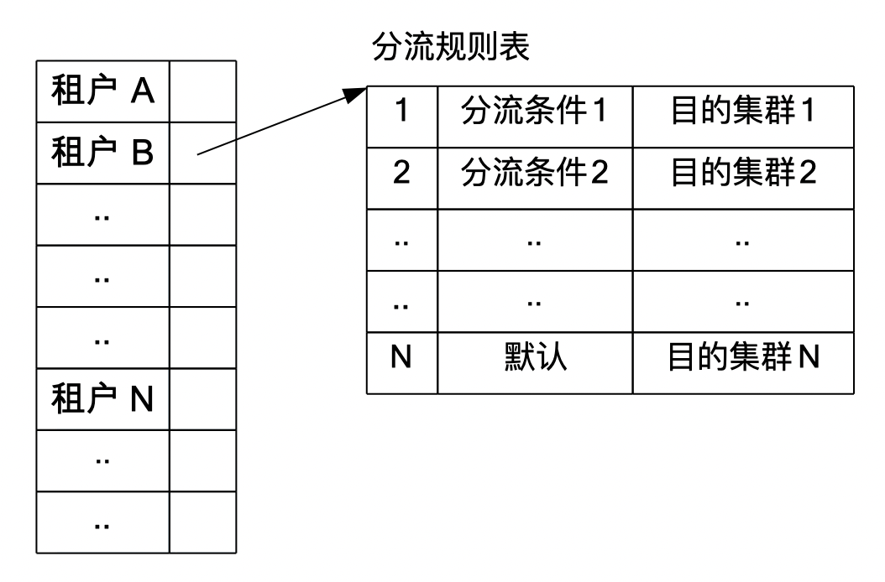
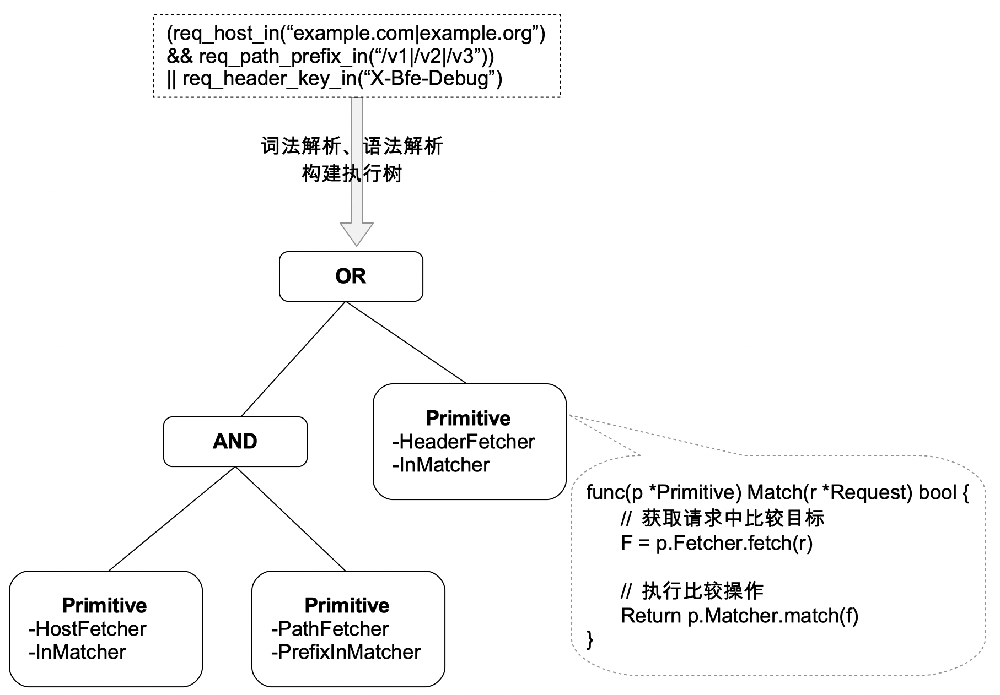

# 流量路由

BFE接入了多个租户的流量，每个租户包含多个集群，各集群分别处理不同类型业务的请求。**流量路由**指在BFE转发请求过程中，确定请求所属的租户及目标集群的过程。


## 关键数据结构

在路由模块 bfe_route/host_table.go 中定义了用于管理路由规则的数据结构。主要包含以下重要类型：

**域名表**(hostTable): 管理域名与租户标识的映射关系。
hostTable 是一个Trie树类型的数据结构，以便于支持泛域名查找。简单来说，该Trie树中每个叶子节点到根节点的路径代表了一个域名，叶子节点存有租户名称。

Trie树节点的数据类型如下：

- Children指向该节点的所有子节点
- Entry存放该节点到根节点路径所代表的域名(例x.example.com)，对应的租户名称
- Splat存放该节点到根节点路径所代表的泛域名(例*.x.example.com)，对应的租户名称

```go
// bfe_route/trie/trie.go 

type trieChildren map[string]*Trie

type Trie struct {
	Children   trieChildren 
	Entry      interface{}
	Splat      interface{}
}
```

**VIP表**(vipTable): 管理VIP与租户标识的映射关系。
vipTalbe 是一个哈希表类型的数据结构。其中键代表VIP，值代表租户名称。

```go
// bfe_config/bfe_route_conf/vip_rule_conf/vip_table_load.go

type Vip2Product map[string]string
```

**分流规则表**(productRouteTable): 管理了各租户的分流规则表。
productRouteTable 是一个哈希表类型的数据结构。其中的键代表租户名称, 值代表该租户的分流规则表。
各租户的分流规则表包含了一组有序的分流规则。每条规则由规则条件及目的集群组成。

```go
// bfe_config/bfe_route_conf/route_rule_conf/route_table_load.go

type ProductRouteRule map[string]RouteRules


// bfe_route/host_table.go

type HostTable struct {
	//...
	
	productRouteTable route_rule_conf.ProductRouteRule
}

```



**分流条件**(Condition): 分流条件是一个由条件原语及操作符组成的条件表达式。关于条件表达式的语法可详见对应设计章节。

条件表达式在BFE的内部数据结构，是一个中缀表达式形式的二叉树。二叉树的非叶子节点代表了操作符。叶子节点代表条件原语。对请求执行与分流条件匹配时，相当于对该中缀表达式进行求值。其返回值是布尔类型，代表请求是否匹配规则。




## 目的租户路由

HostTable的LookupHostTagAndProduct()实现了目的租户的查找。

查找的基本流程如下：

- 步骤一: 根据请求的Host字段值，尝试查找hostTable并返回命中的租户名称。
- 步骤二: 如果查找失败，根据请求的访问VIP值，尝试查找vipTable并返回命中的租户名称。
- 步骤三: 如果查找失败，返回缺省的租户名称。

```go
// bfe_route/host_table.go

// LookupHostTagAndProduct find hosttag and product with given hostname.
func (t *HostTable) LookupHostTagAndProduct(req *bfe_basic.Request) error {
    hostName := req.HttpRequest.Host

    // lookup product by hostname
    hostRoute, err := t.findHostRoute(hostName)

    // if failed, try to lookup product by visited vip
    if err != nil {
        if vip := req.Session.Vip; vip != nil {
            hostRoute, err = t.findVipRoute(vip.String())
        }
    }

    // if failed, use default proudct
    if err != nil && t.defaultProduct != "" {
        hostRoute, err = route{product: t.defaultProduct}, nil
    }

    // set hostTag and product
    req.Route.HostTag = hostRoute.tag
    req.Route.Product = hostRoute.product
    req.Route.Error = err

    return err
}
```

## 目的集群路由

HostTable的LookupCluster()实现了目的集群的查找。

查找的基本流程如下：

- 步骤一：根据请求的归属租户名称查找分流规则表。
- 步骤二：在上一步的分流规则表中，按顺序将请求与表中各规则的条件进行匹配。
- 步骤三：返回最先匹配到的规则中，所包含的目的集群。

注意分流规则表的最后一条规则是缺省规则，如果执行到最后一条规则，最终将返回缺省目的集群。

```go
// bfe_route/host_table.go

// LookupCluster find clusterName with given request.
func (t *HostTable) LookupCluster(req *bfe_basic.Request) error {
    var clusterName string
    // get route rules
    rules, ok := t.productRouteTable[req.Route.Product]
    if !ok {
        ...
    }

    // matching route rules
    for _, rule := range rules {
        if rule.Cond.Match(req) {
            clusterName = rule.ClusterName
            break
        }
    }
    ...

    // set clusterName
    req.Route.ClusterName = clusterName
    return nil
}
```

