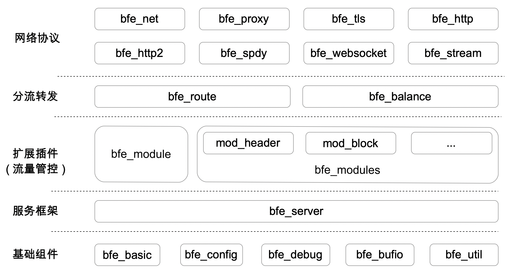

# BFE的代码组织

BFE最新的代码可以从BFE开源项目发布页面https://github.com/bfenetworks/bfe/releases/下载。本章将以BFE v1.0.0版本为例介绍BFE。

在代码目录的顶层可以看到BFE包含如下目录或文件：

```bash
$ ls bfe/
ADOPTERS.md		MAINTAINERS.md		bfe_basic		bfe_modules		bfe_util
CHANGELOG.md		Makefile		bfe_bufio		bfe_net			bfe_websocket
CODE_OF_CONDUCT.md	NOTICE			bfe_config		bfe_proxy		conf
CONTRIBUTING.md		README.md		bfe_debug		bfe_route		docs
CONTRIBUTORS.md		SECURITY.md		bfe_fcgi		bfe_server		go.mod
Dockerfile		VERSION			bfe_http		bfe_spdy		go.sum
GOVERNANCE.md		bfe.go			bfe_http2		bfe_stream		snap
LICENSE			bfe_balance		bfe_module		bfe_tls			staticcheck.conf
```

按逻辑关系各目录的层次结构如下：



按自顶向下顺序各目录对应的功能模块说明如下。

## 网络协议
- `bfe_net`: BFE网络相关基础库代码
- `bfe_http`: BFE HTTP协议基础代码
- `bfe_tls`: BFE TLS协议基础代码
- `bfe_http2`: BFE HTTP2协议基础代码
- `bfe_spdy`: BFE SPDY协议基础代码
- `bfe_stream`:	BFE TLS代理基础代码
- `bfe_websocket`: BFE WebSocket代理基础代码
- `bfe_proxy`: BFE Proxy协议基础代码

## 分流转发
- `bfe_route`: BFE分流转发相关代码
- `bfe_balance`: BFE负载均衡相关代码

## 扩展模块
- `bfe_module`: BFE模块框架相关代码
- `bfe_modules`: BFE扩展模块相关代码

## 服务框架
- `bfe_server`: BFE服务端主体部分

## 基础组件
- `bfe_basic`: BFE基础数据类型定义
- `bfe_config`: BFE配置加载相关代码
- `bfe_debug`: BFE模块调试开关相关代码
- `bfe_util`: BFE基础库相关代码

