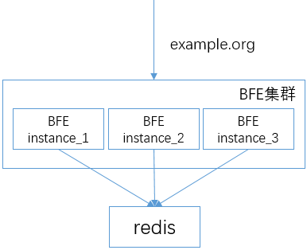

# 配置HTTPS服务
BFE可以支持TLS卸载（TLS offloading），将收到的加密的HTTPS流量进行解密后，再转发给后端服务。


## HTTPS基础配置

HTTPS配置包括加密套件、证书文件的配置、TLS协议相关参数的配置。使用HTTPS需要配置相应的证书文件，请提前准备好证书文件。

### 配置HTTPS端口
在bfe.conf中可以配置HTTPS的端口

```ini
[Server] 
... 

# listen port for https request
HttpsPort = 8443
```

### 配置加密套件
bfe.conf中包含了如下的加密套件，用户可以根据需要进行修改。这部分定义了TLS握手中支持的加密套件。

```ini
CipherSuites=TLS_ECDHE_RSA_WITH_AES_128_GCM_SHA256|TLS_ECDHE_RSA_WITH_CHACHA20_POLY1305_SHA256
CipherSuites=TLS_ECDHE_RSA_WITH_RC4_128_SHA
CipherSuites=TLS_ECDHE_RSA_WITH_AES_128_CBC_SHA
CipherSuites=TLS_ECDHE_RSA_WITH_AES_256_CBC_SHA
CipherSuites=TLS_RSA_WITH_RC4_128_SHA
CipherSuites=TLS_RSA_WITH_AES_128_CBC_SHA
CipherSuites=TLS_RSA_WITH_AES_256_CBC_SHA
```

### 配置服务端证书
bfe.conf中也包含了服务端证书的配置文件的的路径，可以直接使用缺省配置。

```ini
ServerCertConf = tls_conf/server_cert_conf.data
```

打开服务端证书配置文件tls_conf/server_cert_conf.data，可以看到如下证书信息：

```json
{
    "Version": "1",
    "Config": {
        "Default": "example.org.cert",
        "CertConf": {
            "example.org.cert": {
                "ServerCertFile": "tls_conf/certs/server.crt",
                "ServerKeyFile" : "tls_conf/certs/server.key"
            }
        }
    }
}
```

该例子中包含了名为"example.org.cert"的证书文件。可以根据需要填写多个证书和私钥文件，分别用不同的名字进行标识。

* ServerCertFile： 服务端证书文件
* ServerKeyFile：服务端私钥文件

注意，在上述配置中的"example.org.cert"为证书的名字，该名字将在后续的tls_rule_conf.data配置中使用。

缺省证书使用字段"default"标识。

### 配置TLS规则

准备好证书之后，需要设置TLS相关的规则，比如如何选择证书。

bfe.conf包含了TLS规则文件的路径：
```ini
TlsRuleConf = tls_conf/tls_rule_conf.data
```

下面示例是我们为租户"example_product"配置的规则。

```json
{
    "Version": "1",
    "DefaultNextProtos": ["http/1.1"],
    "Config": {
        "example_product": {
            "VipConf": [],
            "SniConf": "example.org",
            "CertName": "example.org.cert",
            "NextProtos": [
                "http/1.1"
            ],
            "Grade": "C"
        }
    }
}
```

其中"SniConf"指示了使用sni的域名。"NextProtos"标识了ALPN协商中使用的协议。安全等级"Grade"定义了TLS协商中服务端可以使用的加密套件的等级，具体描述见后续章节。

上述配置后，重启bfe让配置生效。就可以通过HTTPS访问配置的HTTPS端口。

## 配置TLS会话重用

对BFE可以配置使用TLS会话重用两种方式：Session Cache和Session Ticket。

### 配置Session Cache
BFE使用Redis进行集中的TLS Session信息存储。多个BFE实例可以连接共享的Redis服务。连接如下图：




为开启session cache，在bfe.conf中设置SessionCacheDisabled为false。
```ini
[SessionCache]
# disable tls session cache or not
SessionCacheDisabled = false

# tcp address of redis server
Servers = "example.redis.cluster"

# prefix for cache key
KeyPrefix = "bfe"

# connection params (ms)
ConnectTimeout = 50
ReadTimeout = 50
WriteTimeout = 50

# max idle connections in connection pool
MaxIdle = 20

# expire time for tls session state (second)
SessionExpire = 3600

```

上述配置中的"Servers"字段，指明了连接的redis服务器名字。该名字的具体地址，在
conf/server_data_conf/name_conf.data中指定：

```json
{
    "Version": "1",
    "Config": {
        "example.redis.cluster": [
            {
                "Host": "192.168.3.1",
                "Port": 6379,
                "Weight": 10
            }
        ]
    }
}
```

### 配置Session Ticket

如需支持TLS session ticket，在bfe.conf文件中，设置SessionTicketsDisabled 为 false：

```
[SessionTicket]
# disable tls session ticket or not
SessionTicketsDisabled = false
# session ticket key
SessionTicketKeyFile = tls_conf/session_ticket_key.data
```
在SessionTicketKeyFile指向的文件中，用户可以配置加密ticket的密钥，格式为包含字符a-z/0-9，长度为48的字符串。

开启上述配置后，如client支持session ticket，TLS握手中就可实现基于session ticket的会话重用。

## 配置双向认证
在一些场景，我们需要配置双向TLS，对客户端进行认证。BFE上可以支持配置客户端证书。

在bfe.conf中可以配置clientCA证书的目录：

```ini

# client ca certificates base directory
# Note: filename suffix for ca certificate file should be ".crt", eg. example_ca_bundle.crt
ClientCABaseDir = tls_conf/client_ca

# client certificate crl base directory
# Note: filename suffix for crl file should be ".crl", eg. example_ca_bundle.crl
ClientCRLBaseDir = tls_conf/client_crl

```

在conf/tls_conf/client_ca中放置客户端的CA证书，证书名需以.crt结尾，如下：
```
# ls conf/tls_conf/client_ca
example_ca.crt
```

修改conf/tls_conf/tls_rule_conf.data中租户"example_product"的配置，将
"ClientAuth"设置为true，"ClientCAName"为上述证书文件的名字，本例中为"example_ca"。

```json
{
    ...
    "Config": {
        "example_product": {
            ...
            "ClientAuth": true,
            "ClientCAName": "example_ca"
        }
    }
}
```

注意，当前实现中，BFE验证客户端证书必须在"Extended Key Usage"中开启"clientAuth"。可以查看证书信息进行确认。如下，查看client.crt的具体信息：

```
# openssl x509 -in client.crt -text -noout

Certificate:
    ...
        X509v3 extensions:
            X509v3 Basic Constraints: 
                CA:FALSE
            X509v3 Key Usage: 
                Digital Signature, Non Repudiation, Key Encipherment
            X509v3 Extended Key Usage: 
                TLS Web Server Authentication, TLS Web Client Authentication, Code Signing, E-mail Protection
    ...
```

配置完成后，客户端就可使用上述证书client.crt和相应的私钥访问HTTPS的服务端口了。

## 配置文件的具体描述

### server_cert_conf.data

| 配置项    | 描述                     |
| -------- | ---------------------- |
| Version  | String<br>配置文件版本                                       |
| Config   | Object<br>证书配置信息                                       |
| Config.Default  | String<br>默认证书名称; 必配选项, 默认证书须包含在证书列表(CertConf)中 |
| Config.CertConf | Object<br>所有证书列表 |
| Config.CertConf{k} | String<br>证书名称; 证书名称禁止命名为"BFE_DEFAULT_CERT" |
| Config.CertConf{v} | Object<br>证书相关文件路径 |
| Config.CertConf{v}.ServerCertFile | String<br>证书文件路径 |
| Config.CertConf{v}.ServerKeyFile | String<br>证书关联密钥文件路径 |
| Config.CertConf{v}.OcspResponseFile | String<br>证书关联OCSP Stple文件路径<br>可选配置 |


### tls_rule_conf.data

| 配置项                 | 描述        |
| ---------------------- | ---------- |
| Version                | String<br>配置文件版本                                        |
| Config                 | Object<br>所有TLS协议配置                                     |
| Config{k}              | String<br>标签                                                |
| Config{v}              | Object<br>TLS协议配置详情                                     |
| Config{v}.CertName     | String<br>服务端证书名称（注：在server_cert_conf.data文件中定义）|
| Config{v}.NextProtos   | Object<br>TLS应用层协议列表<br>默认值为["http/1.1"]               |
| Config{v}.NextProtos[] | String<br>TLS应用层协议, 合法值包括h2, spdy/3.1, http/1.1     |
| Config{v}.Grade        | String<br>TLS安全等级, 合法值包括A+，A，B，C                  |
| Config{v}.ClientAuth   | Bool<br>是否启用TLS双向认证                                   |
| Config{v}.ClientCAName | String<br>客户端证书签发CA名称                                |
| Config{v}.VipConf      | Object<br>VIP列表（注：优先依据VIP来确定TLS配置）             |
| Config{v}.VipConf[]    | String<br>VIP                                                 |
| Config{v}.SniConf      | Object<br>域名列表，可选（注：无法依据VIP确定TLS配置时，使用SNI确定TLS配置）|
| Config{v}.SniConf[]    | String<br>域名                                                |
| DefaultNextProtos      | Object<br>支持的TLS应用层协议列表                             |
| DefaultNextProtos[]    | String<br>TLS应用层协议, 合法值包括h2, spdy/3.1, http/1.1     |


## 安全等级说明
TLS协议配置文件中包含配置项“Grade”，该值指定了使用的加密套件的安全级别。

BFE支持多种安全等级（A+/A/B/C）。各安全等级差异在于支持的协议版本及加密套件。A+等级安全性最高、连通性最低；C等级安全性最低、连通性最高。

* 安全等级A+

| 支持协议 | 支持加密套件 |
| -------- | ------------ |
| TLS1.2  | TLS_ECDHE_RSA_WITH_CHACHA20_POLY1305_SHA256<br>TLS_ECDHE_RSA_WITH_CHACHA20_POLY1305_OLD_SHA256<br>TLS_ECDHE_RSA_WITH_AES_128_GCM_SHA256<br>TLS_ECDHE_RSA_WITH_AES_128_CBC_SHA<br>TLS_ECDHE_RSA_WITH_AES_256_CBC_SHA<br>TLS_RSA_WITH_AES_128_CBC_SHA<br>TLS_RSA_WITH_AES_256_CBC_SHA |


* 安全等级A

| 支持协议 | 支持加密套件 |
| -------- | ------------ |
| TLS1.2<br>TLS1.1<br>TLS1.0 | TLS_ECDHE_RSA_WITH_CHACHA20_POLY1305_SHA256<br>TLS_ECDHE_RSA_WITH_CHACHA20_POLY1305_OLD_SHA256<br>TLS_ECDHE_RSA_WITH_AES_128_GCM_SHA256<br>TLS_ECDHE_RSA_WITH_AES_128_CBC_SHA<br>TLS_ECDHE_RSA_WITH_AES_256_CBC_SHA<br>TLS_RSA_WITH_AES_128_CBC_SHA<br>TLS_RSA_WITH_AES_256_CBC_SHA |

* 安全等级B

| 支持协议 | 支持加密套件 |
| -------- | ------------ |
| TLS1.2<br>TLS1.1<br>TLS1.0 | TLS_ECDHE_RSA_WITH_CHACHA20_POLY1305_SHA256<br>TLS_ECDHE_RSA_WITH_CHACHA20_POLY1305_OLD_SHA256<br>TLS_ECDHE_RSA_WITH_AES_128_GCM_SHA256<br>TLS_ECDHE_RSA_WITH_AES_128_CBC_SHA<br>TLS_ECDHE_RSA_WITH_AES_256_CBC_SHA<br>TLS_RSA_WITH_AES_128_CBC_SHA<br>TLS_RSA_WITH_AES_256_CBC_SHA |
| SSLv3 | TLS_ECDHE_RSA_WITH_RC4_128_SHA<br>TLS_RSA_WITH_RC4_128_SHA |


* 安全等级C

| 支持协议 | 支持加密套件 |
| -------- | ------------ |
| TLS1.2<br>TLS1.1<br>TLS1.0 | TLS_ECDHE_RSA_WITH_CHACHA20_POLY1305_SHA256<br>TLS_ECDHE_RSA_WITH_CHACHA20_POLY1305_OLD_SHA256<br>TLS_ECDHE_RSA_WITH_AES_128_GCM_SHA256<br>TLS_ECDHE_RSA_WITH_AES_128_CBC_SHA<br>TLS_ECDHE_RSA_WITH_AES_256_CBC_SHA<br>TLS_RSA_WITH_AES_128_CBC_SHA<br>TLS_RSA_WITH_AES_256_CBC_SHA<br>TLS_ECDHE_RSA_WITH_RC4_128_SHA<br>TLS_RSA_WITH_RC4_128_SHA |
| SSLv3 | TLS_ECDHE_RSA_WITH_RC4_128_SHA<br>TLS_RSA_WITH_RC4_128_SHA |


