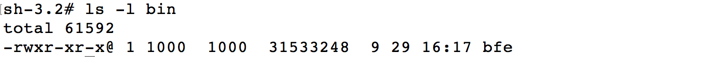
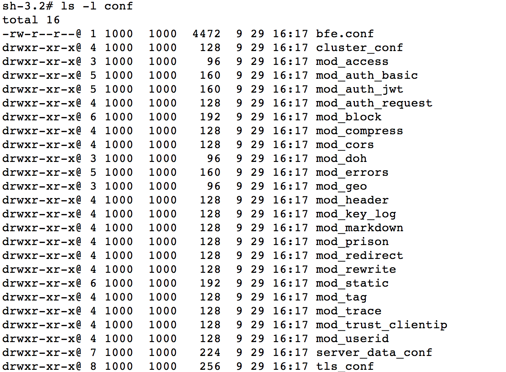
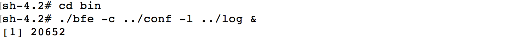
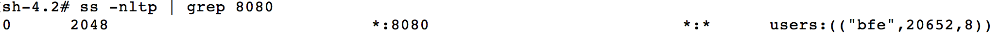
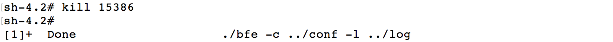

# 第十六章 BFE的安装部署
本章将对BFE的安装及运行方式进行具体介绍，帮助读者了解如何运行BFE服务。

## BFE安装方式
BFE支持多种方式进行安装部署，本章将介绍以下三种方式：
* 软件包下载安装
* 源代码编译安装
* docker方式安装

## 软件包方式下载安装

### 获取BFE软件安装包
BFE的安装软件包可以直接从BFE项目在github.com的页面中下载。
对于不同的操作系统(Linux/MacOS/windows)，页面上都提供了相应的软件包。
访问如下地址下载：

    https://github.com/bfenetworks/bfe/releases。

### 下载BFE软件包
读者可根据操作系统类型，选择所需的软件版本。
以Linux环境为例，下载BFE的0.12.0版本:

在下载页面上，找到"BFE v0.12.0"，点击展开“Asserts”，如下图：


点击下载名为"bfe_0.12.0_linux_amd64.tar.gz"的压缩包。对于Linux环境，下载地址为： *https://github.com/bfenetworks/bfe/releases/download/v0.12.0/bfe_0.12.0_linux_amd64.tar.gz*

### BFE软件包中的内容

解压下载的文件bfe_0.12.0_linux_amd64.tar.gz：


其中包括了两个主要目录：
* bin ： 该目录包含可执行程序bfe。



* conf： 该目录中包含了bfe的配置文件。其中，bfe.conf为BFE的主配置文件。



### 运行BFE服务

执行如下命令，在系统后台启动一个BFE实例。该实例使用了缺省配置启动。

检查端口8080，可以发现已经处于listen状态


### 停止BFE服务

如需要停止BFE服务，直接执行kill命令: 



### 在MacOs或windows中下载安装BFE
与Linux系统下安装过程相似：在下载页面 *https://github.com/bfenetworks/bfe/releases* 中下载对应操作系统版本的BFE安装包后，就可启动BFE服务。


## 源代码编译方式安装
BFE源代码完全在github.com上开源，用户也可以通过自行编译源代码的方式进行适配安装。

### 环境要求
- golang 1.13+
- git 2.0+

#### Go语言环境准备
下载地址为 *https://golang.org/dl/* 或者 *https://golang.google.cn/dl/*。

在下载页面，用户可以根据使用的操作系统环境，下载相应的版本。
下载后，按照 *https://golang.org/doc/install* 或者 *https://golang.google.cn/doc/install* 的说明，进行安装。

#### git安装
用户需要安装git命令，具体安装不再赘述。

### BFE源码下载
通过 *git clone* 命令，下载BFE源代码
```bash
$ git clone https://github.com/bfenetworks/bfe
```

### BFE源代码编译
进入目录*bfe*，执行*make*命令，编译BFE源代码:

```bash
$ cd bfe
$ make
```

> tips: 如果遇到超时错误"https fetch: Get ... connect: connection timed out", 请设置GO_PROXY代理后重试.

### 运行BEF
编译后完成后，可执行目标文件在目录*output/bin/*下:

```bash
$ file output/bin/bfe
output/bin/bfe: ELF 64-bit LSB executable, ...
```

执行如下命令，运行BFE服务:

```bash
$ cd output/bin/
$ ./bfe -c ../conf -l ../log
```

## docker方式安装运行
BFE也提供了基于docker的容器镜像，可以方便的通过docker进行安装部署。
BFE的镜像可以在docker hub中找到 *https://hub.docker.com/r/bfenetworks/bfe*

### docker环境设置
参考 *docker.com*，设置好系统的docker环境。

### 运行BFE容器:
执行以下命令可以启动一个BFE容器
```bash
# docker run -d -p 8080:8080 -p 8443:8443 -p 8421:8421 bfenetworks/bfe
```


上述命令将运行一个BFE容器，同时把BFE容器中的三个缺省端口映射到本地。

查看容器的运行状态，可以看到容器id为7e15304bb972


停止容器运行


## BFE命令行参数

在上面的章节中，我们使用了最常用的命令行参数 *-c* 和 *-l* 。BFE支持的命令行参数如下。

|选项|说明|
|---|----|
|-c \<config dir>   |配置文件的根目录，默认路径./conf   |
|-l \<log dir>      |日志文件的根目录，默认路径./log    |
|-s                 |打印log到stdout                |
|-d                 |打印debug日志                  |
|-v                 |显示bfe的版本号                 | 
|-V                 |显示bfe的版相关的详细信息        |
|-h                 |显示帮助                       |
---


## 查看BFE服务的运行状态

BFE提供了接口，可以通过改接口查看服务运行的各种数据指标。端口缺省为8421。用户可以直接使用浏览器访问该端口，如下图：


